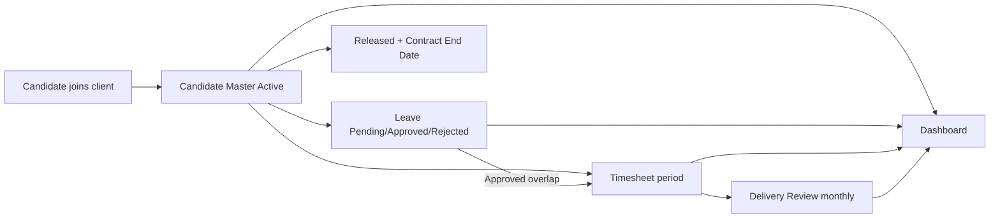

# Source Understanding — Client Delivery & Resource Tracker

## Purpose

Condense the Word understanding document (§§1–27) into a durable product-domain baseline for CDT documentation and implementation.

## Audience

Product, BA, architects, engineers, QA.

## Scope

Functional understanding derived from `Client_Delivery_Tracker_In-Depth_Understanding_Document.docx` (itself based on the Excel tracker + workflow guide). Upstream SST and downstream Timesheet & Billing Tracker are **referenced only**. Locked defaults from the Project Charter close Section 19 gaps.

## Definitions

| Term | Definition |
|------|------------|
| CDT | Client Delivery & Resource Tracker |
| Candidate Master | SoR for a deployed person at a client |
| Engagement Health | Human judgment: On Track / At Risk / Escalated |
| Attendance % | Days Worked ÷ Working Days in Period |
| Public ID | Human-readable ID (`CD-`, `LV-`, `TSH-`, `DEL-`) |
| SST | Service Staffing Tracker (upstream Joined handoff) |

---

## 1. Purpose of the source (§1)

The source translates the Excel tracker and workflow guide into a functional understanding of the application the organization intends to build: actors, data, relationships, workbook automation, dashboard expectations, business rules, and derived application requirements.

**Source boundary:** The workflow begins after a candidate has joined a client, alongside SST and a Timesheet & Billing Tracker. Those systems’ schemas are not in the supplied files.

## 2. Executive understanding (§2)

CDT is a **post-placement delivery-control** system. It is not recruitment and not billing. For every deployed person it answers:

| Dimension | What is measured | Primary source |
|-----------|------------------|----------------|
| Presence | Approved leave, leave status, attendance | Leave + Timesheet |
| Work delivery | Days worked and Attendance % / utilization | Timesheet |
| Engagement health | Client feedback + On Track / At Risk / Escalated | Delivery Review |
| Portfolio visibility | Active headcount, pending approvals, health, clients | Dashboard |
| Lifecycle | Active → Released while preserving history | Candidate Master |

## 3. End-to-end lifecycle (§3)



1. Candidate is added to Candidate Master (client, project/account, role, managers, start date, work location, Active).
2. Leave records start Pending; become Approved or Rejected.
3. Timesheet: Working Days and Days Worked entered; approved overlapping leave calculated; Attendance % derived.
4. Delivery Review (normally monthly): utilization from matching timesheet month; Client Feedback + Engagement Health; escalation notes when needed.
5. Dashboard for portfolio filters, approvals, and risk.
6. Roll-off: status → Released, Contract End Date set; history retained.

**Core dependency:** Candidate Master must exist before Leave, Timesheet, or Delivery Review.

## 4. Actors (§4)

| Actor | Source responsibilities | Application implication |
|-------|-------------------------|-------------------------|
| Delivery Manager | Maintain deployments; review health; dashboard; feedback/health | Portfolio, candidate detail, reviews, escalation |
| HR / approver | Leave and timesheet approval | Approval queues and actions |
| Internal Manager | Stored on candidate for escalation | Visibility / association; role = `INTERNAL_MANAGER` |
| Client Reporting Manager | Client-side contact context | Field on candidate; no comms workflow in MVP |
| Anyone tracking onboarded candidates | Stated audience | Covered by RBAC roles below |

**Locked roles (MVP):** `ADMIN`, `DELIVERY_MANAGER`, `HR`, `INTERNAL_MANAGER`.

## 5. Functional modules (§5)

| Module | Purpose | Key data | Automation / dependency |
|--------|---------|----------|-------------------------|
| Candidate Master | SoR for deployed candidates | Identity, client, project, role, managers, dates, location, status | Public ID `CD-`; requires Client |
| Leave | Requests/taken leave + approval | Type, dates, days, status, approver | Days = inclusive calendar; only Approved feeds Timesheet |
| Timesheet | Period work | Working/days worked, leave days, attendance, approval | Leave Days from approved overlap; Attendance % formula |
| Delivery Review | Periodic engagement health | Utilization, feedback, health, notes, reviewer | Utilization by Candidate + calendar month |
| Dashboard | Portfolio monitoring | Filters + KPIs + charts | Server-side aggregates |
| Setup / Master Data | Controlled vocabulary | Statuses, leave types, feedback, health, location | Dropdowns from setup |
| Clients | Normalized client entity | Client name (unique normalized) | Fixes free-text BR-11 |
| Data Dictionary | Field semantics | Documentation only | Not a runtime module |

## 6. Logical data model (§6)

| Entity | Identity | Important attributes | Relationships |
|--------|----------|----------------------|---------------|
| Candidate | `CD-xxxxx` | Name, client, project/account, role, managers, dates, location, status | 1 → many Leave, Timesheet, Delivery Review |
| Leave | `LV-xxxxx` | Type, from/to, days, status, approver, remarks | Belongs to Candidate; Timesheet only if Approved + overlap |
| Timesheet | `TSH-xxxxx` | Period, working days, days worked, leave days, attendance, approval | Belongs to Candidate; unique per candidate+month |
| Delivery Review | `DEL-xxxxx` | Review period, utilization, feedback, health, notes, reviewer | Belongs to Candidate; unique per candidate+month |
| Client | Stable ID | Normalized name | Referenced by Candidate |
| Setup / Lookup | Category + value | Active flag | Dropdowns and filters |

## 7. Candidate Master (§7)

Created when the person is confirmed joined at a client.

| Field | Input / derived | Rule |
|-------|-----------------|------|
| Candidate ID | Derived | System-generated; not editable (BR-02) |
| Candidate Name | Input | Required |
| Client | Input (FK) | Normalized Clients entity |
| Project/Account | Input | Candidate-level |
| Role | Input | Surfaced on Delivery Review |
| Client Reporting Manager | Input | Escalation context |
| Internal Manager | Input (user FK preferred) | Escalation context |
| Client Start Date | Input | Placement start |
| Contract End Date | Input | Required when Released |
| Work Location | Lookup | Onsite / Remote / Hybrid |
| Employment Status | Lookup | Active on entry; Released on roll-off; Setup may also list On Leave / Backup-Bench |

**Historical rule:** Released candidates are soft-lifecycle (not deleted).

## 8. Leave (§8)

1. Select Candidate → Name/Client populated.  
2. Leave Type: Casual, Sick, Earned, Unpaid, Maternity, Paternity.  
3. From/To dates → **Number of Days = To − From + 1** (inclusive calendar days).  
4. Status Pending → Approved / Rejected with approver/remarks.  

**Critical:** Only Approved leave contributes to Timesheet Leave Days.

## 9. Timesheet (§9)

| Field | Behavior |
|-------|----------|
| Candidate | From Candidate Master |
| Period Start / End | User-entered; MVP cadence = **monthly** |
| Working Days | Manual entry (business days available) |
| Days Worked | Manual entry |
| Leave Days | Auto-sum Approved leave overlapping period |
| Attendance % | Days Worked ÷ Working Days; blank if working days zero/blank |
| Approval | Pending → Approved / Rejected |

Worked example: 23 working, 21 worked → **91.3%** attendance.

## 10. Delivery Review (§10)

1. Select Candidate → Name, Client, Role populated.  
2. Any date in the review month.  
3. Utilization % from Timesheet for matching calendar month (blank if missing).  
4. Client Feedback: Good / Average / Poor.  
5. Engagement Health: On Track / At Risk / Escalated (**human judgment**).  
6. Escalation Notes **required** if not On Track.  
7. Reviewer + review date.

## 11. Dashboard (§11)

| Element | Behavior |
|---------|----------|
| Client filter | All or one client |
| Engagement Health filter | All / On Track / At Risk / Escalated |
| Month filter | Date in month; blank = all-time for most metrics |
| On Leave Today | Current date; **ignores** month filter (BR-10) |
| Active Candidates | Status = Active |
| Pending Leave / Timesheet Approvals | Pending counts, scoped |
| Avg Utilization % | Average attendance for scope |
| Health breakdown / chart | On Track / At Risk / Escalated |
| Released (Selected Month) | Contract End Date in month (current month if blank) |
| Good Client Feedback | Count of Good reviews |
| Client chart | Top-five active clients by headcount + avg utilization |

## 12. Source-of-truth & data flow (§12)

```text
SST Joined → Candidate Master → Leave → Timesheet → Delivery Review → Dashboard
                                      ↘________________↗
```

Companion Timesheet & Billing Tracker = billing/hours → invoices (out of MVP detail). CDT focuses on engagement health.

## 13. Business rules BR-01–BR-12 (§13)

| ID | Rule |
|----|------|
| BR-01 | Candidate must exist before Leave, Timesheet, or Delivery records |
| BR-02 | Candidate IDs system-generated; not manually editable |
| BR-03 | Roll-off → Released; record not deleted |
| BR-04 | Only Approved leave affects Timesheet Leave Days |
| BR-05 | Leave Days = approved leave overlapping Timesheet period |
| BR-06 | Attendance % = Days Worked / Working Days; blank if WD zero/blank |
| BR-07 | Delivery utilization matched by Candidate + calendar month |
| BR-08 | Missing matching Timesheet → utilization blank / explicit missing state |
| BR-09 | Escalation Notes required when health is At Risk or Escalated |
| BR-10 | On Leave Today uses current date, not Month filter |
| BR-11 | Free-text client matching is fragile → **normalized Clients** in MVP |
| BR-12 | Dropdown values maintained via Setup Lists |

Additional MVP uniqueness/status rules: see [../01-business-analysis/BUSINESS_RULES.md](../01-business-analysis/BUSINESS_RULES.md).

## 14. Workflow states (§14)

| Process | Initial | Other states |
|---------|---------|--------------|
| Candidate | Active | Released (MVP primary); On Leave / Backup-Bench in Setup (display/optional) |
| Leave | Pending | Approved / Rejected |
| Timesheet | Pending | Approved / Rejected |
| Engagement Health | — | On Track / At Risk / Escalated |

## 15. Suggested screens (§15)

Dashboard · Candidates · Candidate Detail · Leave · Timesheets · Delivery Reviews · Master Data / Setup · Audit / History (recommended) · plus Approvals and Clients as navigation concepts.

## 16. Recommended navigation (§16)

Dashboard · Resources/Candidates · Leave · Timesheets · Delivery Reviews · Approvals · Clients · Reports · Settings / Master Data.

## 17. Database relationship model (§17)

Normalized `clients`; FK integrity; uniqueness for candidate+month on timesheets and delivery reviews; real month/period keys; public IDs separate from UUID PKs.

## 18. API capability map (§18)

Candidates, Clients, Leave, Timesheets, Delivery Reviews, Dashboard aggregates, Master Data, Audit read — REST under `/api/v1` (detailed in engineering docs).

## 19. Gaps closed by assumed defaults (§19)

| Gap | Locked default |
|-----|----------------|
| Multi-client engagement | One active client engagement per candidate |
| Leave day counting | Inclusive calendar days |
| Cadence | Monthly timesheet + delivery review |
| Duplicate period rows | Unique per candidate + calendar month |
| Roles | ADMIN, DELIVERY_MANAGER, HR, INTERNAL_MANAGER |
| Clients | Normalized entity |
| Attendance formula | Days Worked / Working Days |
| Engagement Health | Human judgment; notes if At Risk/Escalated |
| SST | Import seam MVP; live sync Future |
| Notifications / half-days / hours | Future |
| Audit | Full for approvals + health = MVP |

## 20–22. Workbook & quality notes (§§20–22)

Workbook uses formulas, named ClientList, fixed row ranges (capacity limits). Application must use FKs, UUID + public IDs, server-side calculation, normalized clients, audit trail, soft release, and explicit “Timesheet missing” UX.

## 23. Management questions (§23)

Active headcount · On leave today · Pending leave/timesheet approvals · Avg utilization · Health distribution · Client headcount · Utilization by client · Monthly roll-offs · Poor feedback · **Missing monthly Timesheets/Reviews** (enhancement).

## 24. Build sequence (§24)

Rules → masters → Candidate → Leave → Timesheet → Delivery Review → Dashboard → reporting/360 → audit/overdue → Excel migration → UAT → retire spreadsheet.

## 25. UAT scenarios (§25)

1. Create Active candidate → available in Leave/Timesheet/Delivery selectors.  
2. Pending leave does not affect Timesheet Leave Days.  
3. Approve leave → included when period overlaps.  
4. Reject leave → remains excluded.  
5. July timesheet 23 WD / 21 worked → 91.3% attendance.  
6. July Delivery Review pulls July utilization.  
7. Poor + At Risk → escalation notes required.  
8. Dashboard client+month filters scope KPIs/charts.  
9. On Leave Today ignores Month filter.  
10. Release → Active headcount down; history remains.  
11. Duplicate client spellings prevented.  
12. Second timesheet/review same candidate+month blocked.

## 26. Traceability (§26)

| Source | Contribution |
|--------|--------------|
| Workflow guide | Purpose, order, fields, approvals, dashboard, scenarios |
| Excel workbook | Sheets, columns, formulas, validations, charts, setup |

## 27. Final understanding (§27)

CDT is a **post-placement delivery-control** system centered on the deployed candidate/client engagement. Dependency chain: **Candidate → Leave/Timesheet → Delivery Review → Dashboard**. Approvals control what is authoritative downstream; history survives release.

## Trade-offs

| Choice | Pros | Cons |
|--------|------|------|
| Condensed markdown vs keep only Word | Searchable, linkable, versioned with repo | Must stay synced if Word updates |
| Locked defaults for §19 | Unblocks concrete specs | Stakeholders must confirm Charter table |

## References

- Brickred root: `Client_Delivery_Tracker_In-Depth_Understanding_Document.docx`  
- [VISION.md](./VISION.md)  
- [PROJECT_CHARTER.md](./PROJECT_CHARTER.md)  
- [../01-business-analysis/BUSINESS_RULES.md](../01-business-analysis/BUSINESS_RULES.md)  
