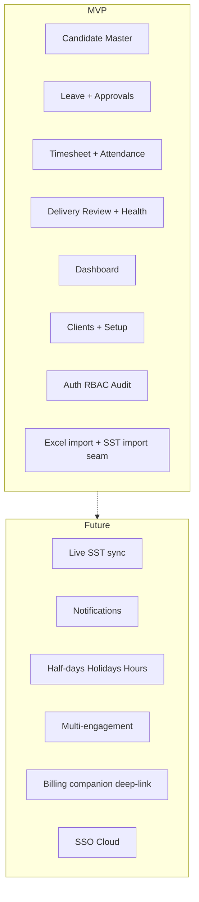

# Vision Document — Client Delivery & Resource Tracker

## Purpose

Define product vision, north star, and strategic boundaries for CDT.

## Audience

Sponsors, product, engineering leads, future contributors.

## Scope

Vision and goals only. Detailed requirements live in BA / SRS / PRD.

## Definitions

| Term | Definition |
|------|------------|
| Post-placement | After SST Joined / client start |
| Delivery control | Presence, work delivery, engagement health |
| Health RAG | Visual language for On Track / At Risk / Escalated (not SST hiring SLA RAG) |

---

## Vision statement

> **Client Delivery & Resource Tracker (CDT)** is the system of record for **post-placement delivery control**. It replaces fragile Excel tracking of deployed people with a secure, multi-user web application that answers—for every client engagement—whether the person is present, delivering expected time, and whether the engagement is healthy, with an architecture that can later connect live to SST and billing companions without rewriting the core.

## North star

Give Delivery Managers, HR approvers, and Internal Managers a shared, auditable view of deployed headcount, leave/timesheet approvals, utilization, and engagement risk—eliminating spreadsheet capacity limits, free-text client drift, and silent blank utilization.

## Business goals

| ID | Goal | Priority |
|----|------|----------|
| BG-1 | Replace Excel as SoR for post-placement delivery tracking | P0 |
| BG-2 | Enforce Candidate → Leave → Timesheet → Delivery Review dependency chain | P0 |
| BG-3 | Dashboard KPIs ≥ Excel parity (filters, health, approvals, clients) | P0 |
| BG-4 | Auth, RBAC, and full audit for approvals + engagement health | P0 |
| BG-5 | Normalized Clients entity (eliminate BR-11 spelling splits) | P0 |
| BG-6 | Excel/CSV import path + SST Joined import seam | P0 |
| BG-7 | Live SST sync, notifications, half-days/hours, multi-engagement | P1 / Future |
| BG-8 | Candidate 360° history after release | P0 |
| BG-9 | Pluggable architecture for billing companion & future modules | P0 (arch only) |
| BG-10 | Distinct operational UI (slate + amber health language), not an SST clone | P0 |

## Problem statement

Deployed-candidate presence, attendance, and engagement health are tracked in a sophisticated Excel workbook that cannot safely support concurrent multi-user editing, authentication, authorization, durable identifiers, normalized clients, full approval/health audit, or clean extension into SST live handoff and billing.

## Stakeholders

| Stakeholder | Interest |
|-------------|----------|
| Delivery leadership | Portfolio health, utilization, escalation visibility |
| Delivery Managers | Candidate master, monthly reviews, dashboard |
| HR approvers | Leave and timesheet approval queues |
| Internal Managers | Escalation context and read visibility |
| Ops / IT | Access control, PII, local deployability |
| Engineering | Maintainability, parity with SST platform patterns |
| Upstream SST owners | Clean Joined → CDT handoff seam |

## Success metrics

| Metric | Target |
|--------|--------|
| Adoption | ≥95% new deployments tracked in CDT (not Excel) |
| Concurrent editing | Safe multi-user on shared portfolio |
| Auth coverage | 100% protected APIs |
| Audit | Approvals + engagement-health mutations logged |
| Dashboard | Filterable KPI parity with workbook |
| Client integrity | No duplicate clients from casing/whitespace |
| Uniqueness | One timesheet and one delivery review per candidate+month |
| UAT | All §25 scenarios pass |

## MVP vs Future

## Decision rationale

Excel-parity MVP maximizes continuity with live delivery operations. Locked defaults (§19) remove ambiguity so engineers can enforce uniqueness, leave math, and roles deterministically. Visual identity is intentionally distinct from SST so operators recognize delivery-control context at a glance.

## Trade-offs

| Choice | Pros | Cons |
|--------|------|------|
| Delivery-control first | Fast Excel replacement for post-join ops | Billing/hours deferred |
| One active engagement | Simpler model, clear Active headcount | Multi-client people need Future model |
| Human health judgment | Matches source intent | No auto-threshold from utilization |
| Full platform now | One big vision | High delay / risk |

**Recommendation:** Delivery-control MVP with assumed defaults; Future modules additive.

## References

- [SOURCE_UNDERSTANDING.md](./SOURCE_UNDERSTANDING.md)  
- [PROJECT_CHARTER.md](./PROJECT_CHARTER.md)  
- [../03-prd/PRD.md](../03-prd/PRD.md)  
- [../05-ux/DESIGN_SYSTEM.md](../05-ux/DESIGN_SYSTEM.md)  
