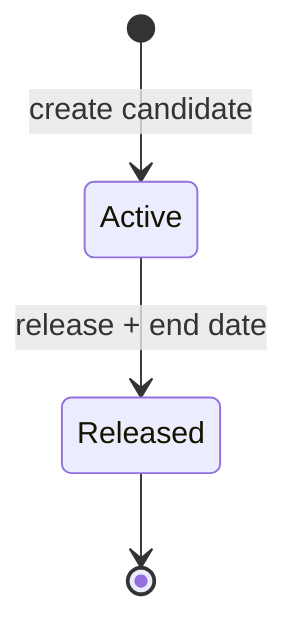
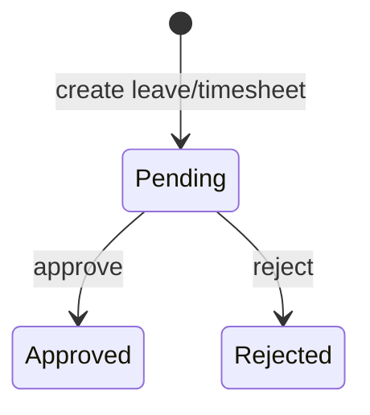

# Business Rules — CDT MVP

## Purpose

Codify operational logic from the Excel workbook, workflow guide, and locked defaults so API/UI behave deterministically.

## Audience

Backend engineers, QA, product.

## Scope

MVP delivery-control rules. Future module rules are out of scope except explicit pointers.

## Definitions

| Term | Definition |
|------|------------|
| Derived field | Server-computed; not user-editable as source of truth |
| Calendar month | Year-month of a period/review date |
| Inclusive calendar days | `toDate − fromDate + 1` (date-only) |
| Overlap | Leave `[from,to]` intersects timesheet `[periodStart, periodEnd]` (inclusive) |

---

## BR-01 … BR-12 — Source rules

| ID | Rule |
|----|------|
| BR-01 | A candidate must exist in Candidate Master before Leave, Timesheet, or Delivery Review records can be created. |
| BR-02 | Candidate public IDs (`CD-#####`) are system-generated and must not be manually editable. Leave/Timesheet/Delivery public IDs (`LV-`, `TSH-`, `DEL-`) are likewise system-generated. |
| BR-03 | A candidate rolling off a client is marked **Released**; the record is not hard-deleted. Historical leave, timesheets, and reviews remain. |
| BR-04 | **Only Approved** leave affects Timesheet Leave Days. Pending and Rejected leave are excluded. |
| BR-05 | Leave Days on a timesheet equals the sum of **approved** leave day contributions whose dates **overlap** the timesheet period. (MVP: for each overlapping leave, count inclusive calendar days of the intersection with the period.) |
| BR-06 | Attendance % = `Days Worked / Working Days in Period`. If Working Days is null or zero, Attendance % is **blank/null** (not zero, not error crash). |
| BR-07 | Delivery Review utilization is matched by **Candidate + calendar month** of the review period to the Timesheet for that same Candidate + calendar month. |
| BR-08 | If a matching Timesheet is missing, Delivery Review utilization is blank and the UI/API must expose an explicit **Timesheet missing for this month** state. |
| BR-09 | Engagement Health requires **Escalation Notes** when set to **At Risk** or **Escalated**. Notes optional when On Track. |
| BR-10 | Dashboard **On Leave Today** is based on the **current date**, not the Month filter. A candidate counts if there exists Approved leave with `from ≤ today ≤ to` and candidate is not excluded by product policy (default: include Active; Released excluded unless still overlapping—MVP: Active only). |
| BR-11 | Client identity must not rely on free-text equality. Clients are a **normalized entity**; matching uses stable `clientId`. Display names may differ from storage normalization key. |
| BR-12 | Dropdown values are maintained through Setup / Lookup lists; transactional forms may only use active values (historical rows may retain inactive labels). |

---

## BR-13+ — MVP additions (locked defaults & integrity)

### Uniqueness & engagement

| ID | Rule |
|----|------|
| BR-13 | At most **one Active** client engagement per candidate person key (MVP: one Active Candidate Master row per unique person identity as defined by product—default unique on normalized name+client is insufficient; enforce **one Active row per person**—implement via `personKey` or unique partial index on Active status). Practical MVP: a Candidate row represents one engagement; creating a second Active engagement for the same person is blocked until the first is Released. |
| BR-14 | At most **one Timesheet** per `candidateId + calendarMonth`. |
| BR-15 | At most **one Delivery Review** per `candidateId + calendarMonth`. |
| BR-16 | Timesheet and Delivery Review cadence for MVP is **monthly**; `periodStart`/`periodEnd` must fall in the same calendar month (or be normalized to that month key). |

### Leave math & status

| ID | Rule |
|----|------|
| BR-17 | Leave days = inclusive calendar days: `days = toDate - fromDate + 1`. Weekends/holidays are **not** excluded in MVP. |
| BR-18 | Leave status ∈ {Pending, Approved, Rejected}. Allowed transitions: Pending→Approved, Pending→Rejected. Approved/Rejected are terminal in MVP (Admin reverse = Future). |
| BR-19 | Timesheet approval status ∈ {Pending, Approved, Rejected} with the same Pending→Approved/Rejected transitions. |
| BR-20 | Leave spanning two calendar months contributes partial overlapping days to each month’s timesheet via intersection (BR-05). |

### Delivery health & release

| ID | Rule |
|----|------|
| BR-21 | Engagement Health is **human judgment**; utilization and Client Feedback inform but **do not auto-set** health. |
| BR-22 | Client Feedback ∈ {Good, Average, Poor} (from Setup). |
| BR-23 | Releasing a candidate requires `contractEndDate`; status becomes Released; candidate drops from Active headcount. |
| BR-24 | Released candidates remain searchable in history views; they cannot receive new Leave/Timesheet/Delivery Review unless Admin override (MVP: **block** new operational records for Released). |

### Dashboard & clients

| ID | Rule |
|----|------|
| BR-25 | Active Candidates KPI counts employment status = Active only. |
| BR-26 | Pending approval KPIs count status = Pending, scoped by Client filter and Month filter where applicable (On Leave Today exempt from Month). |
| BR-27 | Client names are unique on normalized form: trim + collapse internal whitespace + case-insensitive compare. |
| BR-28 | Avg Utilization for a scope averages non-null Attendance % (or utilization) values of timesheets in scope; define empty scope as blank. |

### Public IDs

| ID | Rule |
|----|------|
| BR-29 | Public ID formats: Candidate `CD-#####`, Leave `LV-#####`, Timesheet `TSH-#####`, Delivery Review `DEL-#####` (zero-padded monotonic per type). Internal PK remains UUID. |

### Audit

| ID | Rule |
|----|------|
| BR-30 | Every leave/timesheet approval transition and every engagement-health (and feedback) change writes an audit record (actor, at, before, after). |

---

## Status transition diagrams





```mermaid
stateDiagram-v2
  note right of OnTrack
    Health is set on each Delivery Review
    not a persistent candidate state machine
  end note
  [*] --> OnTrack
  [*] --> AtRisk
  [*] --> Escalated
```

## Worked examples

| Scenario | Expected |
|----------|----------|
| Leave 1–3 Jul (Approved), Timesheet Jul 1–31 | Leave Days includes 3 |
| Leave Pending same dates | Leave Days excludes |
| WD=23, Worked=21 | Attendance = 91.3% (display round half-up to 1 decimal) |
| DR Jul, TS Jul attendance 91.3% | Utilization = 91.3% |
| DR Jul, no TS | Utilization null + missing flag |
| Health At Risk, notes empty | Validation error (BR-09) |

## Trade-offs

| Choice | Pros | Cons |
|--------|------|------|
| Inclusive calendar leave | Matches Excel | Inflates days vs working-day policy |
| Terminal approve/reject | Simple audit story | Corrections need Admin Future flow |
| Block ops on Released | Clean Active portfolio | Rehire needs new engagement Future |

## References

- [SOURCE_UNDERSTANDING.md](../00-initiation/SOURCE_UNDERSTANDING.md)  
- [PROJECT_CHARTER.md](../00-initiation/PROJECT_CHARTER.md)  
- [FUNCTIONAL_REQUIREMENTS.md](./FUNCTIONAL_REQUIREMENTS.md)  
- [../04-domain/DOMAIN_MODEL.md](../04-domain/DOMAIN_MODEL.md)  
