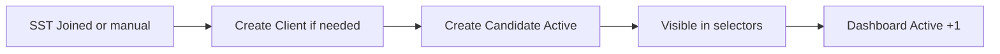
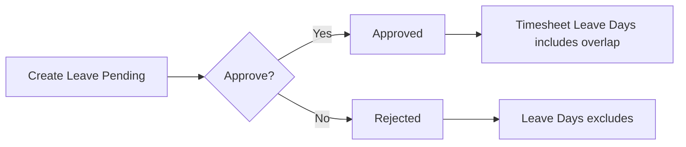

# Personas and User Journeys — CDT

## Purpose

Describe who uses CDT and primary journeys for UX and acceptance design.

## Audience

UX, product, frontend, QA.

## Scope

MVP personas mapped from source actors (§4) and locked roles. Future external client portal personas out of scope.

## Definitions

| Persona | Role mapping |
|---------|--------------|
| Drew (Delivery Manager) | `DELIVERY_MANAGER` |
| Alex (Account Manager) | `ACCOUNT_MANAGER` |
| Riley (Admin) | `ADMIN` |
| Lane (Leadership viewer) | Often Admin or read-only dashboard use |

---

## Personas

### Drew — Delivery Manager

- **Goals:** Keep Candidate Master accurate; run monthly delivery reviews; watch portfolio health and utilization.
- **Pain today:** Excel row limits; blank utilization; client name duplicates fragment filters.
- **MVP needs:** Candidates CRUD/release; Delivery Reviews; Dashboard; Candidate 360°.

### Alex — Account Manager

- **Goals:** Approve leave and timesheets quickly; review monthly invoices for billing accuracy.
- **Pain today:** Unclear pending work; manual budget calculations in spreadsheets.
- **MVP needs:** Approvals inbox; leave/timesheet approve/reject; invoice review queue; dashboard visibility.

### Riley — System Admin

- **Goals:** Users/roles, Clients, Setup lists, import, audit inspection.
- **Pain today:** Setup Lists drift; no true audit trail.
- **MVP needs:** Settings, Clients, Users, Import, Audit.

### Lane — Leadership (dashboard consumer)

- **Goals:** Active headcount, risk distribution, client concentration, pending backlog.
- **MVP needs:** Filtered Dashboard and charts; optional CSV export.

---

## Journeys

### J-1 — Place a joined candidate (Drew / Riley)

**Acceptance cues:** Public ID `CD-`; BR-01 unlocks Leave/TS/DR; UAT §25.1.

### J-2 — Leave request to timesheet impact (Alex + Drew)

**Acceptance cues:** UAT §25.2–4; BR-04/05/17/18.

### J-3 — Monthly timesheet & attendance (Drew / Alex)

1. Create July timesheet: WD=23, Worked=21.  
2. System derives Leave Days + Attendance 91.3%.  
3. Alex approves.  

**Acceptance cues:** UAT §25.5; BR-06/14/19.

### J-4 — Monthly delivery review & escalation (Drew)

1. Create July Delivery Review.  
2. Utilization pulled from July timesheet.  
3. Feedback Poor, Health At Risk → must enter escalation notes.  
4. Dashboard health counts update.  

**Acceptance cues:** UAT §25.6–7; BR-07/08/09/21.

### J-5 — Portfolio morning check (Lane / Drew)

1. Open Dashboard; filter client + month.  
2. Inspect pending approvals, avg utilization, health chart.  
3. Confirm On Leave Today ignores month.  
4. Drill into Approvals or Candidate Detail.  

**Acceptance cues:** UAT §25.8–9; BR-10/25/26.

### J-6 — Release & history (Drew)

1. Set Contract End Date; status Released.  
2. Active headcount decreases.  
3. Historical leave/TS/DR remain on Candidate Detail.  
4. New operational records blocked.  

**Acceptance cues:** UAT §25.10; BR-03/23/24.

### J-7 — Client integrity (Riley)

1. Attempt clients `"Acme"` and `"acme "`.  
2. System rejects duplicate normalized identity.  

**Acceptance cues:** UAT §25.11; BR-11/27.

### J-8 — Duplicate month guard (Drew)

1. Second timesheet or review same candidate+month → validation error.  

**Acceptance cues:** UAT §25.12; BR-14/15.

---

## Journey → FR map (summary)

| Journey | Primary FRs |
|---------|-------------|
| J-1 | FR-CAN-*, FR-CLI-*, FR-IMP-02 |
| J-2 | FR-LV-*, FR-APPR-* |
| J-3 | FR-TS-*, FR-APPR-* |
| J-4 | FR-DR-* |
| J-5 | FR-DASH-*, FR-APPR-03 |
| J-6 | FR-CAN-04/07 |
| J-7 | FR-CLI-02 |
| J-8 | FR-TS-06, FR-DR-07 |

## Trade-offs

| Choice | Pros | Cons |
|--------|------|------|
| INTERNAL_MANAGER mostly read | Matches source ambiguity safely | Replaced by Account Manager approvals |
| Single Approvals inbox | Faster ops | Mixed entity types in one list |

## References

- [WORKFLOWS.md](./WORKFLOWS.md)  
- [FUNCTIONAL_REQUIREMENTS.md](./FUNCTIONAL_REQUIREMENTS.md)  
- [../05-ux/USER_FLOWS.md](../05-ux/USER_FLOWS.md)  
- [SOURCE_UNDERSTANDING.md](../00-initiation/SOURCE_UNDERSTANDING.md)  
