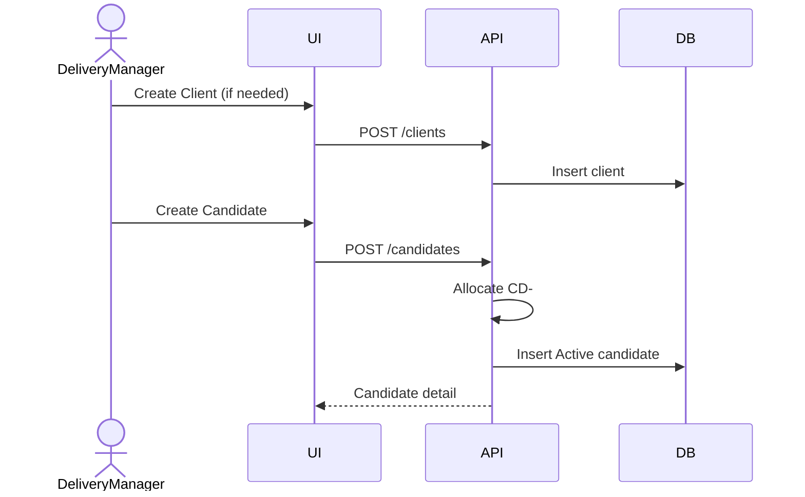
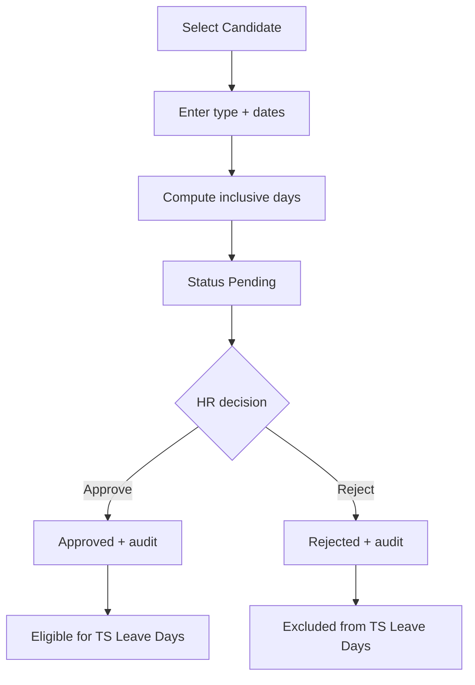
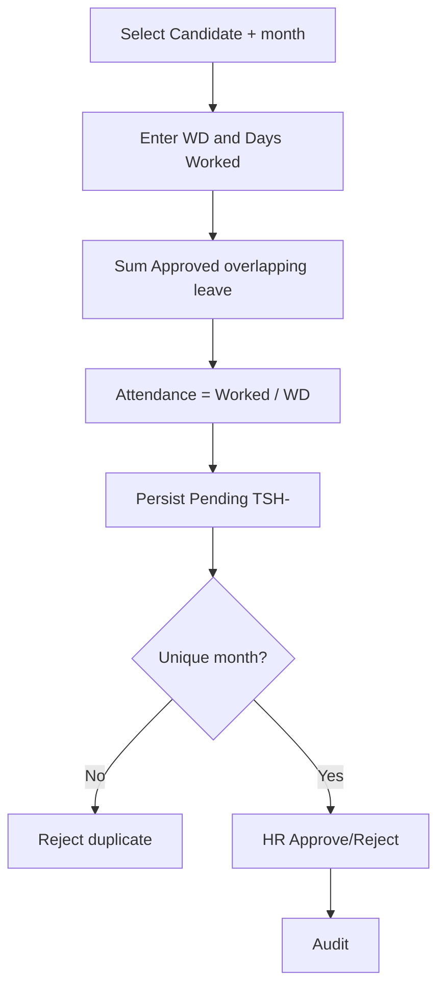
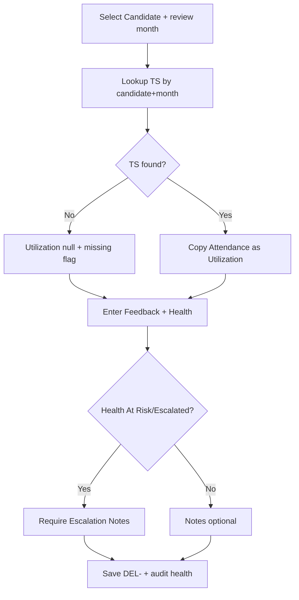
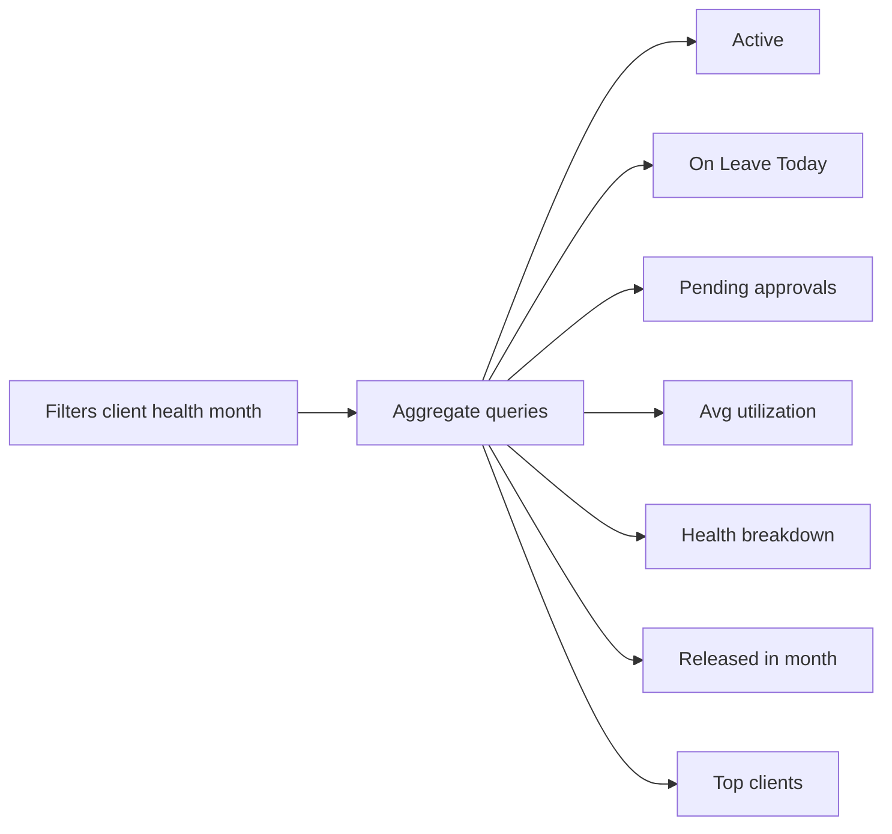
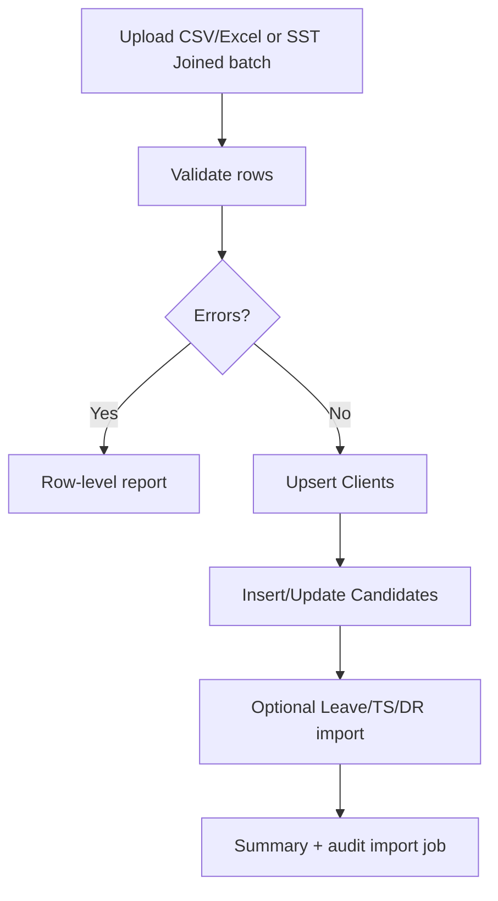

# Workflows — CDT MVP

## Purpose

Describe end-to-end operational workflows, gates, and system side effects for CDT MVP.

## Audience

Product, engineers, QA.

## Scope

MVP workflows only. Live SST sync and notifications are Future.

## Definitions

| Term | Definition |
|------|------------|
| Gate | Validation that blocks progression |
| Side effect | Derived recalc, KPI impact, or audit write |

---

## W-1 — Candidate onboarding into CDT

**Gates:** Valid clientId; required name/start date/role; one Active engagement rule (BR-13).  
**Side effects:** Active headcount +1; appears in Leave/TS/DR selectors.

## W-2 — Leave create & approve

**Gates:** BR-01; from ≤ to; active lookup type; candidate not Released (BR-24).  
**Side effects:** Pending Leave KPI; on approve, overlapping open timesheets recalculate Leave Days (FR-TS-08).

## W-3 — Timesheet create, derive, approve

**Gates:** BR-01, BR-14, BR-16; WD ≥ 0; Days Worked ≥ 0; Days Worked ≤ WD recommended warning (not hard fail unless product tightens).  
**Side effects:** Pending Timesheet KPI; unlocks DR utilization for month.

## W-4 — Delivery review

**Gates:** BR-01, BR-15, BR-09, BR-21.  
**Side effects:** Health charts; Good feedback count; audit.

## W-5 — Dashboard refresh (read model)

**Special:** On Leave Today ignores month (BR-10).

## W-6 — Release candidate

1. DM opens Candidate Detail → Release.  
2. Must supply Contract End Date.  
3. Status → Released; audit.  
4. Block new Leave/TS/DR (BR-24).  
5. Active KPI −1; history intact.

## W-7 — SST / Excel import seam

**Gates:** Schema validation; BR-11 client normalize; uniqueness BR-14/15 on operational imports.  
**Future:** Replace batch with live SST sync worker.

## W-8 — Approvals inbox

HR opens Approvals → filtered Pending Leave and Pending Timesheets → approve/reject with remarks → audit → KPI decrement → downstream recalc as needed.

---

## Workflow → BR / FR index

| Workflow | Key BRs | Key FRs |
|----------|---------|---------|
| W-1 | BR-02, BR-13, BR-29 | FR-CAN-*, FR-CLI-* |
| W-2 | BR-01, BR-04, BR-17, BR-18, BR-30 | FR-LV-*, FR-APPR-* |
| W-3 | BR-05, BR-06, BR-14, BR-19, BR-20 | FR-TS-* |
| W-4 | BR-07, BR-08, BR-09, BR-15, BR-21 | FR-DR-* |
| W-5 | BR-10, BR-25, BR-26, BR-28 | FR-DASH-* |
| W-6 | BR-03, BR-23, BR-24 | FR-CAN-04 |
| W-7 | BR-11, BR-27 | FR-IMP-* |
| W-8 | BR-18, BR-19, BR-30 | FR-APPR-* |

## Trade-offs

| Choice | Pros | Cons |
|--------|------|------|
| Recalc leave on approve | Accurate Leave Days | Need concurrency care on open TS |
| Block Released writes | Clean ops | Rehire = Future multi-engagement |

## References

- [BUSINESS_RULES.md](./BUSINESS_RULES.md)  
- [PERSONAS_AND_JOURNEYS.md](./PERSONAS_AND_JOURNEYS.md)  
- [../04-domain/BUSINESS_PROCESSES.md](../04-domain/BUSINESS_PROCESSES.md)  
- [../05-ux/USER_FLOWS.md](../05-ux/USER_FLOWS.md)  
