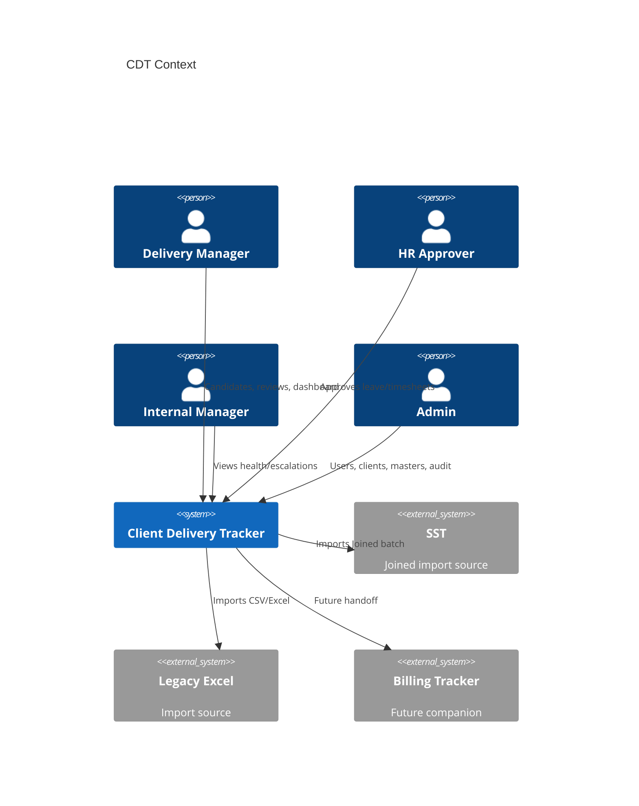
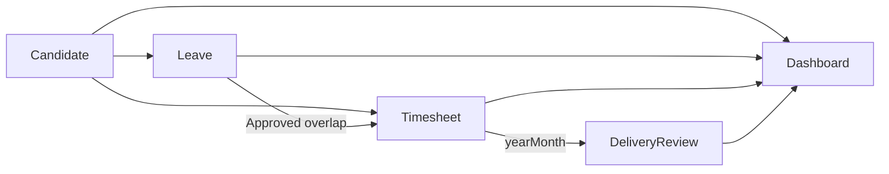

# Software Requirements Specification (SRS) — CDT

## Purpose

IEEE-inspired SRS for Client Delivery & Resource Tracker MVP.

## Audience

Engineering, QA, architects, future teams.

## Scope

MVP post-placement delivery-control application. Future modules referenced but not fully specified.

## Definitions

See [../README.md](../README.md). Additional:

| Term | Definition |
|------|------------|
| SoR | System of Record |
| SPA | Single Page Application |
| yearMonth | `YYYY-MM` key for uniqueness and joins |

---

## 1. Introduction

### 1.1 Purpose

Specify software requirements for implementing CDT MVP.

### 1.2 Product perspective

CDT is a modular monolith: React SPA + NestJS API + PostgreSQL, observed via Prometheus/Grafana/Loki in local Compose. Upstream SST provides Joined candidates via an **import seam** (live sync Future). Downstream billing companion is out of MVP detail.

### 1.3 Product functions (summary)

Auth & users · Clients · Master data · Candidate Master · Leave · Timesheet · Delivery Review · Approvals · Dashboard · Audit · Import/export.

### 1.4 User characteristics

Internal delivery/HR operators comfortable with dense tabular UIs and KPI dashboards; expect Excel parity plus safer concurrency and IDs.

### 1.5 Constraints

Stack locked (Turborepo/pnpm/React/NestJS/Prisma/PostgreSQL). Single-tenant. Local-first. Visual system distinct from SST (slate + amber).

### 1.6 Assumptions and dependencies

See [PROJECT_CHARTER.md](../00-initiation/PROJECT_CHARTER.md) assumed defaults. Depends on Node LTS, pnpm, Docker, PostgreSQL 16.

---

## 2. Overall description

### 2.1 Product interfaces

| Interface | Detail |
|-----------|--------|
| UI | HTTP(S) SPA |
| API | REST `/api/v1` JSON |
| DB | PostgreSQL |
| Metrics | `/metrics` Prometheus |
| Docs | Swagger UI |

### 2.2 User interfaces (screens)

Login · Dashboard · Candidates · Candidate Detail · Leave · Timesheets · Delivery Reviews · Approvals · Clients · Settings (Users, Lookups, Import, Audit).

### 2.3 System interfaces

SST Joined import contract (file/API stub); Excel/CSV import; no live SST webhook in MVP.

### 2.4 Memory / operations

Compose-based local ops; backup via Postgres volume/dump runbooks (ops docs).

### 2.5 Site adaptation

English UI; IST-primary date-only business dates.

### 2.6 Design constraints

Enforce BR-01–BR-30; unique month constraints; full audit for approvals + health; normalized clients.

### 2.7 External packages

See stack in README; ShadCN + TanStack Query + RHF + Zod on web; Passport JWT on API.

---

## 3. Specific requirements

### 3.1 External interfaces

REST JSON; error envelope conventions (engineering API docs); pagination/filtering on list resources.

### 3.2 Functional requirements

Normative list: [../01-business-analysis/FUNCTIONAL_REQUIREMENTS.md](../01-business-analysis/FUNCTIONAL_REQUIREMENTS.md).

Summary by capability:

| Area | Must capabilities |
|------|-------------------|
| Auth | Login, refresh, logout, user admin, 4 roles |
| Clients | CRUD, normalized uniqueness |
| Lookups | Setup lists for statuses/types/health/feedback/location |
| Candidates | CRUD, public ID, release, 360°, SST import seam |
| Leave | CRUD, inclusive days, approve/reject, Approved-only to TS |
| Timesheets | Monthly unique, Leave Days + Attendance derive, approve/reject |
| Delivery Reviews | Monthly unique, utilization join, health + required notes |
| Dashboard | Filters + KPIs/charts per §11 including On Leave Today |
| Approvals | Unified pending queue |
| Audit | Approvals + health mutations |
| Import | Excel/CSV + validation report |

### 3.3 Performance / NFRs

See [../01-business-analysis/NON_FUNCTIONAL_REQUIREMENTS.md](../01-business-analysis/NON_FUNCTIONAL_REQUIREMENTS.md).

### 3.4 Logical database requirements

Entities: User, Role, Client, LookupType/Value, Candidate, Leave, Timesheet, DeliveryReview, AuditLog, ImportJob. Public IDs + UUID PKs. Partial/unique indexes for Active engagement and candidate+yearMonth.

### 3.5 Design constraints (security)

Server-side RBAC; password hashing; no secrets in git; PII-aware logging; append-only audit policy.

### 3.6 Software system attributes

Maintainable modular monolith; observable; testable against UAT §25 and BR golden cases.

---

## 4. Supporting information

### 4.1 Domain chain

### 4.2 Roles & access (summary)

| Role | Typical access |
|------|----------------|
| ADMIN | Full + users/masters/import/audit |
| DELIVERY_MANAGER | Candidates, reviews, dashboard, read leave/TS |
| HR | Leave/TS approve; related read |
| INTERNAL_MANAGER | Dashboard + candidate 360° read; escalations |

Detailed matrix in security docs (engineering pass).

### 4.3 Acceptance

UAT scenarios in source §25 / RTM checklist must pass before Excel retirement.

### 4.4 Future

Live SST sync, notifications, half-days/holidays/hours, multi-engagement, SSO, cloud — [../04-domain/FUTURE_MODULES.md](../04-domain/FUTURE_MODULES.md).

---

## Trade-offs

| Choice | Pros | Cons |
|--------|------|------|
| IEEE-lite structure | Familiar to enterprise readers | Not a full 830 boilerplate dump |
| Import seam in SRS Must | Unblocks SST dependency | Not real-time |

## References

- [../00-initiation/VISION.md](../00-initiation/VISION.md)  
- [../00-initiation/PROJECT_CHARTER.md](../00-initiation/PROJECT_CHARTER.md)  
- [../01-business-analysis/FUNCTIONAL_REQUIREMENTS.md](../01-business-analysis/FUNCTIONAL_REQUIREMENTS.md)  
- [../01-business-analysis/BUSINESS_RULES.md](../01-business-analysis/BUSINESS_RULES.md)  
- [../01-business-analysis/REQUIREMENT_TRACEABILITY_MATRIX.md](../01-business-analysis/REQUIREMENT_TRACEABILITY_MATRIX.md)  
- [../03-prd/PRD.md](../03-prd/PRD.md)  
