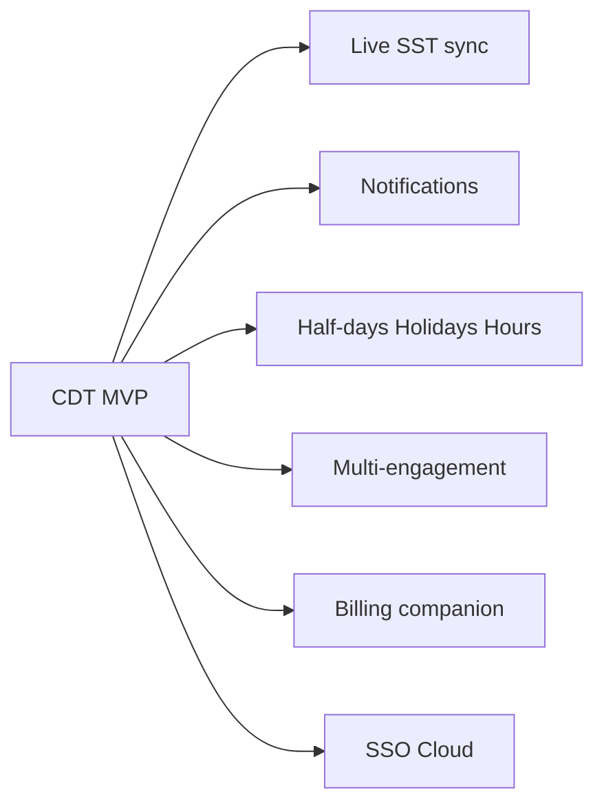

# Product Requirements Document (PRD) — CDT MVP

## Purpose

Product-facing specification of what to build, why, and how success is measured for CDT MVP.

## Audience

Product, engineering, QA, stakeholders.

## Scope

MVP release. Future modules summarized for roadmap only.

## Definitions

See [../README.md](../README.md).

---

## 1. Summary

CDT MVP replaces `Client_Delivery_Tracker` Excel with a multi-user web application covering **Candidate Master → Leave → Timesheet → Delivery Review → Dashboard**, plus Clients, Setup, Approvals, Auth/RBAC, and audit for approvals and engagement health.

## 2. Problem

Post-placement delivery tracking in Excel lacks safe concurrency, authZ, durable IDs, normalized clients, full approval/health audit, and explicit handling of missing timesheets—while operators still need presence, utilization, and engagement-risk visibility.

## 3. Goals / non-goals

### Goals

- Excel process parity for delivery sheets and dashboard KPIs  
- Deterministic attendance and leave-overlap math  
- One timesheet and one delivery review per candidate/month  
- Trustworthy portfolio filters and health visualization  
- Secure access and audit on sensitive transitions  

### Non-goals (MVP)

- Live SST synchronization  
- Billing/invoicing correctness  
- Notifications  
- Half-days, holiday calendars, hours  
- Multi-active engagements  
- Cloud production / SSO  

## 4. Users

Delivery Managers, HR approvers, Internal Managers, Admins, Leadership dashboard consumers — see [../01-business-analysis/PERSONAS_AND_JOURNEYS.md](../01-business-analysis/PERSONAS_AND_JOURNEYS.md).

## 5. User stories (executive)

| ID | Story |
|----|-------|
| US-1 | As a Delivery Manager, I create an Active candidate so leave/timesheet/reviews can be recorded |
| US-2 | As HR, I approve leave knowing only Approved leave affects attendance math |
| US-3 | As a Delivery Manager, I submit a monthly timesheet and see Attendance % = Worked/WD |
| US-4 | As a Delivery Manager, I record monthly engagement health with required escalation notes when At Risk/Escalated |
| US-5 | As Leadership, I filter the dashboard by client/health/month and trust On Leave Today is live |
| US-6 | As Admin, I manage users, clients, setup lists, imports, and inspect audit |

Detailed stories: planning epics (engineering/ops pass).

## 6. Features (MVP)

| Feature | Description | Priority |
|---------|-------------|----------|
| Auth | Login, refresh, logout | P0 |
| Users & roles | Four roles | P0 |
| Clients | Normalized unique clients | P0 |
| Master data | Setup lists | P0 |
| Candidates | Master + release + 360° | P0 |
| Leave | Inclusive days + approval | P0 |
| Timesheets | Monthly unique + derived metrics | P0 |
| Delivery Reviews | Monthly unique + utilization + health | P0 |
| Approvals | Pending leave/TS queue | P0 |
| Dashboard | KPI/chart parity + missing period Should | P0 |
| Audit | Approvals + health | P0 |
| Import/Export | Excel/CSV + SST seam | P0 |
| Notifications | — | Future |
| Dark mode | Theme toggle | P2 |

## 7. UX principles

- Dense, table-first, Excel-familiar  
- **Health as first-class visual language** (On Track / At Risk / Escalated)  
- Cool **slate + amber** operational accent; **Fraunces + DM Sans** — not teal SST clone  
- Explicit empty/missing states  
- Approval queues one click from Dashboard  

See [../05-ux/DESIGN_SYSTEM.md](../05-ux/DESIGN_SYSTEM.md).

## 8. Release criteria

- All FR Must items implemented or waived in writing  
- BR-01–BR-30 enforced in API validation/tests  
- UAT §25 scenarios pass  
- Dashboard KPI spot-check vs Excel sample  
- Auth/RBAC smoke + audit samples for approve and health change  
- Stakeholder confirmation of Charter assumed defaults  

## 9. Metrics

| Metric | Target |
|--------|--------|
| Excel replacement | New deployments in CDT |
| Duplicate month rows | Zero in production data |
| Duplicate clients | Zero normalized collisions |
| Approval cycle visibility | Pending KPIs match queue counts |
| UAT | 12/12 scenarios |

## 10. Roadmap (Future)

## 11. Open decisions

Closed by [PROJECT_CHARTER.md](../00-initiation/PROJECT_CHARTER.md) assumed defaults table. Any change is a product change request.

## Trade-offs

| Choice | Pros | Cons |
|--------|------|------|
| Monthly uniqueness P0 | Clean DR↔TS join | Less flexible cadence |
| Human health judgment | Matches source | No auto RAG from utilization |

## References

- [../00-initiation/VISION.md](../00-initiation/VISION.md)  
- [../02-srs/SRS.md](../02-srs/SRS.md)  
- [../01-business-analysis/FUNCTIONAL_REQUIREMENTS.md](../01-business-analysis/FUNCTIONAL_REQUIREMENTS.md)  
- [../05-ux/INFORMATION_ARCHITECTURE.md](../05-ux/INFORMATION_ARCHITECTURE.md)  
