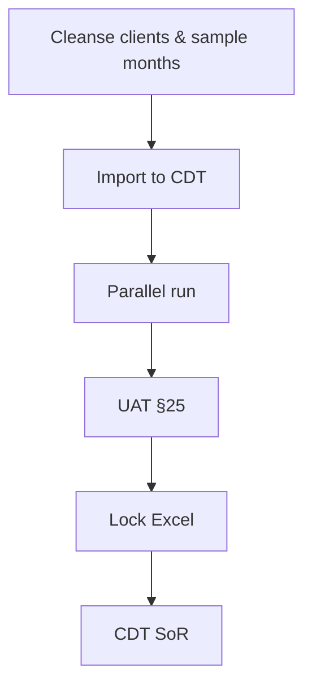
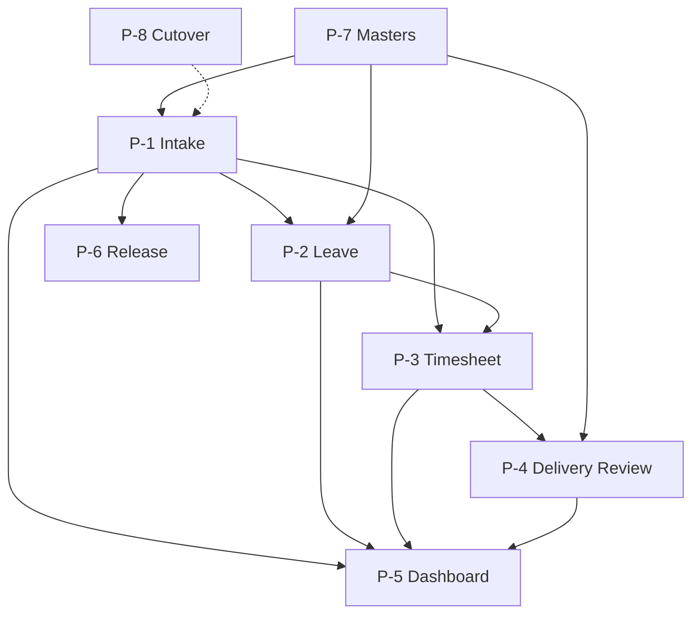

# Business Processes — CDT MVP

## Purpose

Describe business processes spanning people, systems, and controls for post-placement delivery operations.

## Audience

Product, operations leads, engineers, QA.

## Scope

MVP processes. Future sync/notification processes outlined as stubs.

## Definitions

| Term | Definition |
|------|------------|
| Control | Validation, approval, or audit checkpoint |
| Parallel run | Excel + CDT coexistence before cutover |

---

## P-1 — Deployed candidate intake

**Trigger:** Person reaches Joined in SST (or manual ops intake).  
**Actors:** Admin/DM; SST import operator.  
**Steps:** Ensure Client exists → Create Candidate Active → Verify selectors.  
**Controls:** BR-01/02/13; import validation.  
**Output:** `CD-` record; Active headcount +1.

## P-2 — Leave management

**Trigger:** Leave requested or recorded.  
**Actors:** DM (create), HR (decide).  
**Steps:** Create Pending → Approve/Reject → Recalc overlapping timesheets.  
**Controls:** Inclusive day math; Approved-only downstream; audit.  
**Output:** `LV-` with terminal status.

## P-3 — Monthly attendance (timesheet)

**Trigger:** End of calendar month (or during month for early close).  
**Actors:** DM submit; HR approve.  
**Steps:** Create unique month row → Derive Leave Days & Attendance → Approve.  
**Controls:** BR-06/14/16; pending KPI.  
**Output:** Authoritative utilization input for reviews.

## P-4 — Monthly engagement review

**Trigger:** Delivery review cadence (monthly).  
**Actors:** Delivery Manager.  
**Steps:** Create review → Pull utilization → Capture feedback/health/notes → Save.  
**Controls:** BR-07/08/09/15/21; health audit.  
**Output:** Portfolio health signal.

## P-5 — Daily portfolio monitoring

**Trigger:** Start of day / anytime.  
**Actors:** DM, Internal Manager, Leadership.  
**Steps:** Open Dashboard → Apply filters → Act on pending/risk → Drill to 360°.  
**Controls:** BR-10 On Leave Today; scoped KPIs.  
**Output:** Operational actions (approvals, escalations).

## P-6 — Roll-off / release

**Trigger:** Assignment ends.  
**Actors:** Delivery Manager.  
**Steps:** Enter end date → Release → Confirm history retained.  
**Controls:** BR-03/23/24.  
**Output:** Active −1; Released-in-month KPI when filtered.

## P-7 — Master data governance

**Trigger:** New leave type, feedback label, etc.  
**Actors:** Admin.  
**Steps:** Add lookup value → Activate → Forms consume.  
**Controls:** BR-12; no silent free-text.  
**Output:** Controlled vocabulary.

## P-8 — Cutover from Excel

**Controls:** Reconciliation of Active headcount, pending counts, sample attendance 91.3% case.  
**Future:** Automate continuous SST feed replacing batch.

---

## Process dependency map

## Trade-offs

| Choice | Pros | Cons |
|--------|------|------|
| HR owns approvals | Clear accountability | DM may want self-approve Future |
| Parallel run required | Safer cutover | Temporary dual entry |

## References

- [DOMAIN_MODEL.md](./DOMAIN_MODEL.md)  
- [../01-business-analysis/WORKFLOWS.md](../01-business-analysis/WORKFLOWS.md)  
- [../00-initiation/SOURCE_UNDERSTANDING.md](../00-initiation/SOURCE_UNDERSTANDING.md)  
