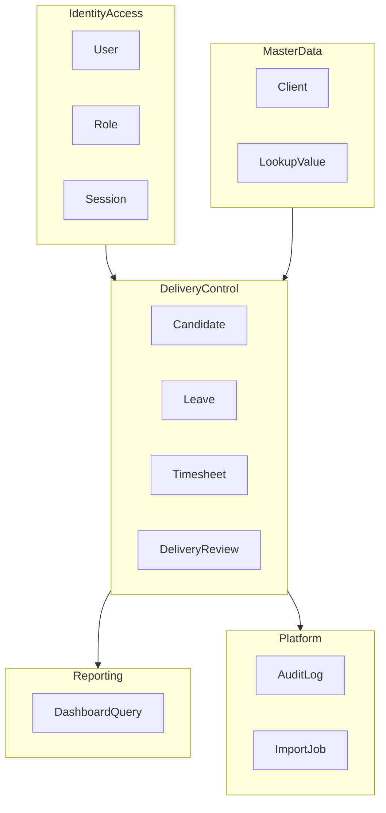
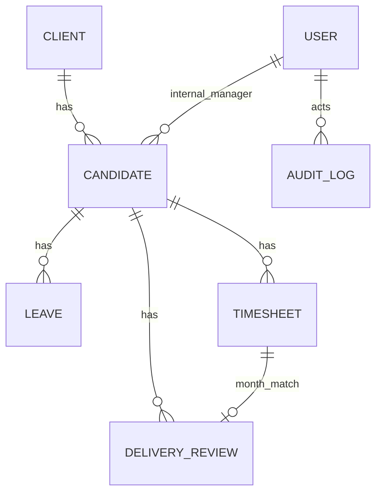

# Domain Model — CDT MVP

## Purpose

Define bounded contexts, aggregates, entities, value objects, and relationships for post-placement delivery control.

## Audience

Backend engineers, architects, data modelers.

## Scope

MVP domain. Future contexts sketched in [FUTURE_MODULES.md](./FUTURE_MODULES.md).

## Definitions

| Term | Definition |
|------|------------|
| Aggregate | Consistency boundary with root entity |
| VO | Immutable value object |
| yearMonth | Value object `YYYY-MM` |
| Public ID | Human-readable sequential ID per type |

---

## 1. Bounded contexts (MVP)

| Context | Responsibility |
|---------|----------------|
| Identity & Access | Users, credentials, roles, tokens |
| Master Data | Clients and controlled vocabularies |
| Delivery Control | Candidate engagement, leave, timesheet, delivery review |
| Reporting | Read-model dashboard aggregations |
| Platform | Audit, import jobs |

---

## 2. Aggregates & entities

### Client (aggregate root)

| Field | Type | Notes |
|-------|------|-------|
| id | UUID | PK |
| name | string | Display |
| nameNormalized | string | Unique (trim/casefold) |
| active | boolean | Soft deactivate |
| createdAt/updatedAt | timestamps | |

**Invariants:** BR-11, BR-27.

### Candidate (aggregate root)

| Field | Notes |
|-------|-------|
| id | UUID |
| publicId | `CD-#####` |
| name | required |
| clientId | FK Client |
| projectAccount | string |
| role | string |
| clientReportingManager | string |
| internalManagerUserId | FK User nullable |
| internalManagerName | string nullable (fallback) |
| clientStartDate | date |
| contractEndDate | date nullable; required if Released |
| workLocationId | FK Lookup |
| employmentStatus | Active / Released (+ optional lookups) |
| personKey | optional stable key for one-Active rule |
| timestamps / soft flags | |

**Invariants:** BR-01 consumers; BR-02; BR-03; BR-13; BR-23; BR-24.

### Leave (aggregate root)

| Field | Notes |
|-------|-------|
| publicId | `LV-#####` |
| candidateId | FK |
| leaveTypeId | FK Lookup |
| fromDate, toDate | date-only |
| days | derived inclusive |
| status | Pending/Approved/Rejected |
| approvedByUserId | nullable |
| remarks | text |
| decidedAt | timestamptz nullable |

**Invariants:** BR-04, BR-17, BR-18, BR-20.

### Timesheet (aggregate root)

| Field | Notes |
|-------|-------|
| publicId | `TSH-#####` |
| candidateId | FK |
| periodStart, periodEnd | date |
| yearMonth | generated unique with candidate |
| workingDays | decimal/int |
| daysWorked | decimal/int |
| leaveDays | derived |
| attendancePct | derived nullable |
| approvalStatus | Pending/Approved/Rejected |
| approvedByUserId | nullable |
| remarks | text |

**Invariants:** BR-05, BR-06, BR-14, BR-16, BR-19.

### DeliveryReview (aggregate root)

| Field | Notes |
|-------|-------|
| publicId | `DEL-#####` |
| candidateId | FK |
| reviewDate | date in month |
| yearMonth | unique with candidate |
| utilizationPct | derived nullable |
| timesheetMissing | boolean |
| clientFeedback | Good/Average/Poor |
| engagementHealth | On Track/At Risk/Escalated |
| escalationNotes | required if not On Track |
| reviewedByUserId | FK |
| reviewDateTime | timestamptz |

**Invariants:** BR-07, BR-08, BR-09, BR-15, BR-21, BR-22.

### LookupType / LookupValue

Categories: employment_status, leave_type, approval_status, work_location, client_feedback, engagement_health.

### User / Role / AuditLog / ImportJob

Standard identity and platform entities; audit stores entityType, entityId, action, actorId, before/after JSON, createdAt.

---

## 3. Relationships

Note: DeliveryReview↔Timesheet is a **logical** month join, not necessarily a stored FK.

---

## 4. Value objects & derived policies

| VO / policy | Definition |
|-------------|------------|
| DateRange | Inclusive from/to |
| yearMonth | From any date in period |
| Attendance | `daysWorked / workingDays` or null |
| LeaveOverlapDays | Intersection length in inclusive calendar days |
| HealthNotePolicy | Notes required unless On Track |

---

## 5. Ubiquitous language

| Say | Don't say |
|-----|-----------|
| Candidate (deployed) | Applicant / pipeline candidate (SST) |
| Engagement Health | Hiring SLA RAG |
| Attendance % / Utilization | Billable hours (billing tracker) |
| Released | Deleted |
| Approved leave | Any leave |

---

## Trade-offs

| Choice | Pros | Cons |
|--------|------|------|
| Separate aggregates per sheet | Clear consistency boundaries | Cross-aggregate recalc for leave→TS |
| Logical month join vs FK | Flexible if TS created after DR draft | Must handle missing TS explicitly |
| personKey for one-Active | Enforces Charter rule | Needs definition in import mapping |

## References

- [BUSINESS_PROCESSES.md](./BUSINESS_PROCESSES.md)  
- [FUTURE_MODULES.md](./FUTURE_MODULES.md)  
- [../01-business-analysis/BUSINESS_RULES.md](../01-business-analysis/BUSINESS_RULES.md)  
- [../00-initiation/SOURCE_UNDERSTANDING.md](../00-initiation/SOURCE_UNDERSTANDING.md)  
