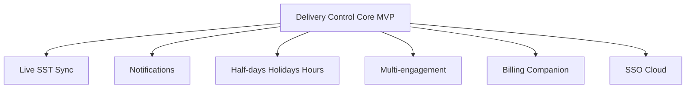

# Future Modules — CDT

## Purpose

Capture intentional non-MVP capabilities so architecture remains open without expanding MVP scope.

## Audience

Architects, product, engineering leads.

## Scope

**Future** only. Do not implement in MVP unless Charter is revised.

## Definitions

| Term | Definition |
|------|------------|
| Seam | Documented integration boundary without full automation |
| Module | Bounded feature area additive to Delivery Control core |

---

## 1. Live SST synchronization

| Aspect | Detail |
|--------|--------|
| Intent | Continuous or event-driven Joined → Candidate upsert |
| MVP | Batch/file/API **import seam** only |
| Needs | Idempotent personKey, conflict policy, webhook auth |
| Risk | Coupling to SST availability |

## 2. Notifications & overdue controls

| Aspect | Detail |
|--------|--------|
| Intent | Remind pending leave/TS approvals; overdue monthly reviews |
| Channels | In-app first; email later |
| MVP | Dashboard pending KPIs + missing period Should indicator only |

## 3. Half-days, holidays, hours

| Aspect | Detail |
|--------|--------|
| Intent | Working-day leave math; public holiday calendar; hours fields |
| MVP | Inclusive calendar days; days-only timesheets |
| Impact | BR-17/06 revision; migration of historical days |

## 4. Multi-engagement

| Aspect | Detail |
|--------|--------|
| Intent | Multiple concurrent active client engagements per person |
| MVP | One Active engagement (BR-13) |
| Model | Engagement entity separate from Person |

## 5. Timesheet & Billing Tracker companion

| Aspect | Detail |
|--------|--------|
| Intent | Hand off approved attendance/hours to billing/invoicing |
| MVP | Out of detail; conceptual downstream only |
| Boundary | CDT remains engagement-health SoR |

## 6. Rich reporting & exports

| Aspect | Detail |
|--------|--------|
| Intent | Scheduled reports, leadership packs, BI warehouse |
| MVP | Dashboard + CSV export Should |

## 7. Identity & platform

| Aspect | Detail |
|--------|--------|
| Intent | SSO/SAML/OIDC; cloud deploy; multi-region |
| MVP | Email/password; local Compose |

## 8. Advanced leave lifecycle

| Aspect | Detail |
|--------|--------|
| Intent | Cancel/reverse Approved leave with compensating audit; partial day |
| MVP | Terminal Approved/Rejected |

---

## Extension map

## Guardrails

1. Label every story **MVP** or **Future** in planning.  
2. Do not weaken BR-14/15 uniqueness without product change.  
3. Keep public ID schemes stable.  
4. Preserve audit for approvals/health when extending.

## Trade-offs

| Choice | Pros | Cons |
|--------|------|------|
| Document Future now | Prevents accidental scope | May stale if strategy shifts |
| Defer billing deep-link | Faster MVP | Dual systems temporarily |

## References

- [DOMAIN_MODEL.md](./DOMAIN_MODEL.md)  
- [../00-initiation/PROJECT_CHARTER.md](../00-initiation/PROJECT_CHARTER.md)  
- [../03-prd/PRD.md](../03-prd/PRD.md)  
