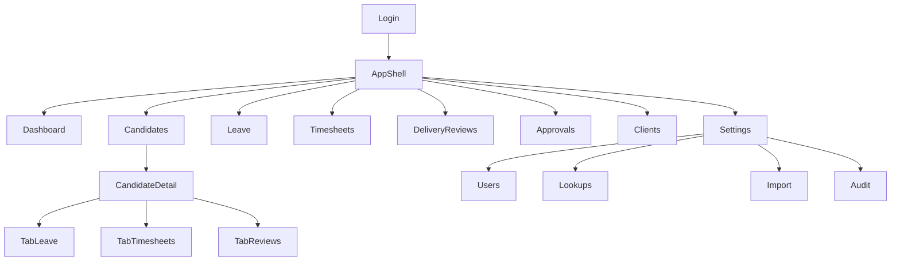

# Information Architecture & Navigation — CDT

## Purpose

Define IA, primary navigation, and information hierarchy for the CDT SPA.

## Audience

UX, frontend engineers.

## Scope

MVP screens from source §§15–16 plus Approvals/Clients. Future nav items hidden/disabled.

## Definitions

| Term | Definition |
|------|------------|
| Shell | App chrome: nav, header, user menu |
| Route module | Feature area under React Router |
| Health chrome | Persistent visual treatment for engagement health |

---

## 1. Sitemap

## 2. Primary navigation

| Item | Route | Roles (default) |
|------|-------|-----------------|
| Dashboard | `/` | All authenticated |
| Candidates | `/candidates` | ADMIN, DELIVERY_MANAGER, INTERNAL_MANAGER (read), HR (read) |
| Leave | `/leaves` | ADMIN, DELIVERY_MANAGER, HR |
| Timesheets | `/timesheets` | ADMIN, DELIVERY_MANAGER, HR |
| Delivery Reviews | `/delivery-reviews` | ADMIN, DELIVERY_MANAGER, INTERNAL_MANAGER (read) |
| Approvals | `/approvals` | ADMIN, HR (+ DM read) |
| Clients | `/clients` | ADMIN, DELIVERY_MANAGER |
| Settings | `/settings/*` | ADMIN (subset read for others as needed) |

**Reports:** MVP satisfied by Dashboard + CSV exports; dedicated `/reports` reserved Future.

## 3. Information hierarchy

1. **Portfolio signal** — Dashboard health + pendings  
2. **Engagement record** — Candidate Detail 360°  
3. **Operational queues** — Leave, Timesheets, Reviews, Approvals  
4. **Reference data** — Clients, Lookups, Users  

## 4. Object identity in UI

Always show public IDs (`CD-`, `LV-`, `TSH-`, `DEL-`) in lists and headers; copy-to-clipboard optional.

## 5. Cross-links

| From | To |
|------|----|
| Dashboard pending KPI | Approvals filtered |
| Dashboard health slice | Delivery Reviews filtered |
| On Leave Today | Leave list filtered today |
| Any row | Candidate Detail |
| DR missing timesheet | Create Timesheet CTA |

## 6. Settings IA

| Subnav | Purpose |
|--------|---------|
| Users | Create/disable; assign roles |
| Master Data | Lookup categories |
| Import | Excel/CSV + SST seam |
| Audit | Search by entity/actor |

## Trade-offs

| Choice | Pros | Cons |
|--------|------|------|
| Approvals top-level | Matches HR daily work | Extra nav item vs Excel |
| No separate Reports MVP | Less chrome | Power users wait for Future |

## References

- [USER_FLOWS.md](./USER_FLOWS.md)  
- [WIREFRAMES.md](./WIREFRAMES.md)  
- [DESIGN_SYSTEM.md](./DESIGN_SYSTEM.md)  
- [../03-prd/PRD.md](../03-prd/PRD.md)  
