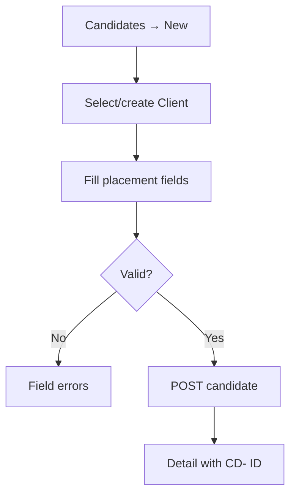

# User Flows — CDT MVP

## Purpose

Specify primary UI user flows with steps, decisions, and empty/error states.

## Audience

UX, frontend, QA.

## Scope

MVP flows aligned to journeys J-1…J-8. Notifications flows are Future.

## Definitions

| Term | Definition |
|------|------------|
| F-* | User flow ID |
| Happy path | Successful primary path |
| Guard | Client-side + server-side validation |

---

## F-1 — Login

1. User opens `/login`.  
2. Submits email/password.  
3. On success → Dashboard; on failure → inline error; on rate limit → cool-down message.

## F-2 — Create candidate

**Guards:** Required fields; one Active engagement; client active.  
**Empty:** No clients → CTA to Clients.

## F-3 — Record & approve leave

1. Leave → New → select candidate → type + dates → days auto.  
2. Save Pending.  
3. Approvals → Approve/Reject + remarks.  
4. Toast + audit; list status updates.

**Error:** Released candidate blocked; invalid date range.

## F-4 — Monthly timesheet

1. Timesheets → New → candidate + July period.  
2. Enter WD=23, Worked=21.  
3. UI shows Leave Days (derived) + Attendance 91.3%.  
4. Save; optional approve via Approvals.  

**Error:** Duplicate month → show existing `TSH-` link.  
**Empty leave:** Leave Days = 0.

## F-5 — Delivery review with escalation

1. Delivery Reviews → New → candidate + month.  
2. If TS missing → warning banner + link to create timesheet; utilization empty.  
3. If TS present → utilization shown read-only.  
4. Feedback/Health; if At Risk/Escalated → notes required.  
5. Save `DEL-`.

## F-6 — Dashboard triage

1. Land on Dashboard.  
2. Set Client + Month + Health filters.  
3. Read KPIs/charts.  
4. Click Pending Leave → Approvals.  
5. Confirm On Leave Today unchanged when Month changes.

## F-7 — Candidate 360°

1. Open Candidate Detail.  
2. Tabs: Overview, Leave, Timesheets, Reviews.  
3. Health badge from latest review.  
4. Release action on Overview.

## F-8 — Release candidate

1. Detail → Release.  
2. Require Contract End Date.  
3. Confirm dialog.  
4. Status Released; disable New Leave/TS/DR.

## F-9 — Client create (normalization)

1. Clients → New → name.  
2. Server normalizes; conflict → error “Client already exists: Acme”.  

## F-10 — Import seam

1. Settings → Import → choose template type (Candidates / SST Joined / operational).  
2. Upload → validation report.  
3. Commit successful rows; download error CSV.

## F-11 — Audit inspect

1. Settings → Audit → filter entity type/public ID/actor.  
2. Expand before/after JSON for health or approval change.

---

## Flow → screen map

| Flow | Primary screens |
|------|-----------------|
| F-1 | Login |
| F-2 | Candidates, Candidate Detail, Clients |
| F-3 | Leave, Approvals |
| F-4 | Timesheets, Approvals |
| F-5 | Delivery Reviews |
| F-6 | Dashboard, Approvals |
| F-7/F-8 | Candidate Detail |
| F-9 | Clients |
| F-10/F-11 | Settings |

## Trade-offs

| Choice | Pros | Cons |
|--------|------|------|
| Warn on missing TS but allow DR draft | Matches BR-08 blank utilization | Risk of incomplete reviews |
| Hard block duplicate month | Data integrity | User must edit existing |

## References

- [INFORMATION_ARCHITECTURE.md](./INFORMATION_ARCHITECTURE.md)  
- [WIREFRAMES.md](./WIREFRAMES.md)  
- [../01-business-analysis/PERSONAS_AND_JOURNEYS.md](../01-business-analysis/PERSONAS_AND_JOURNEYS.md)  
- [../01-business-analysis/WORKFLOWS.md](../01-business-analysis/WORKFLOWS.md)  
