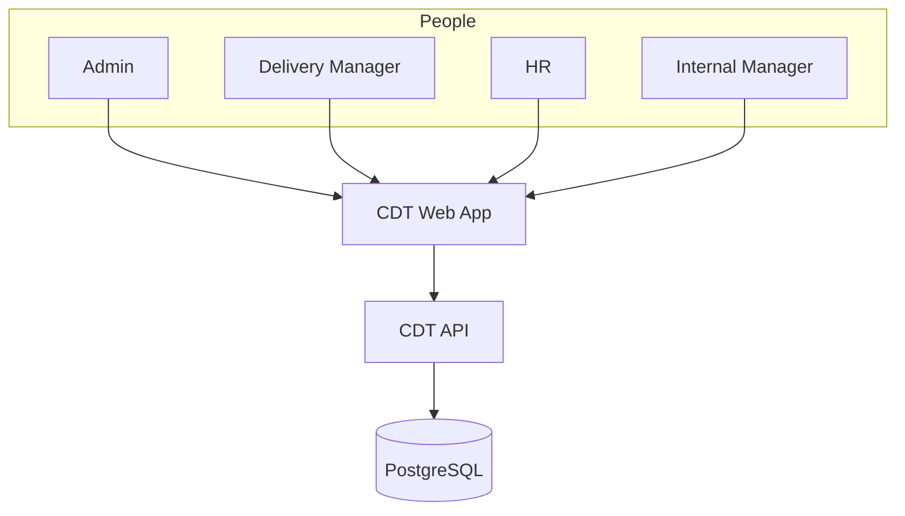
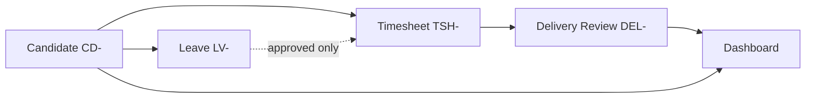
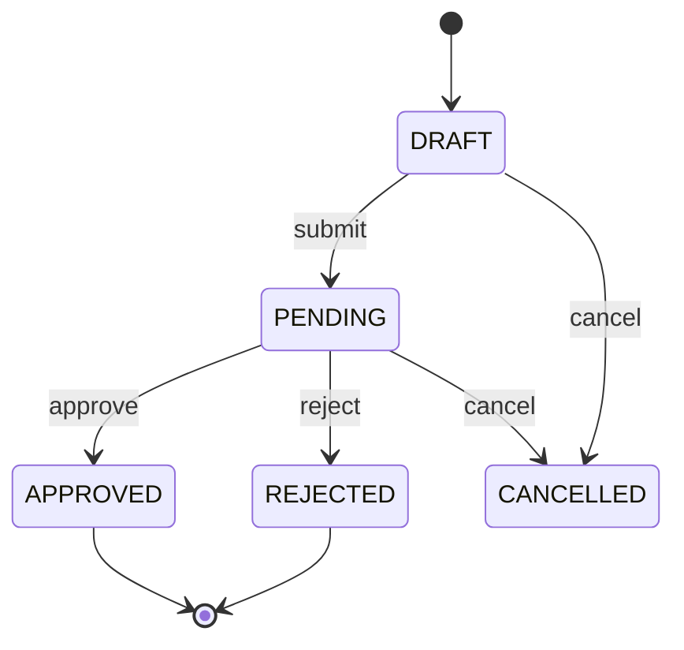
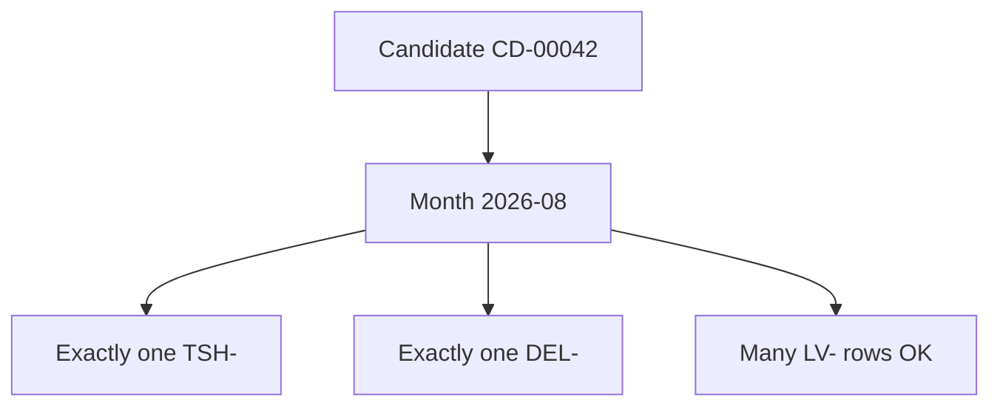
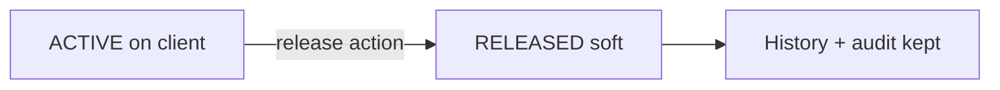
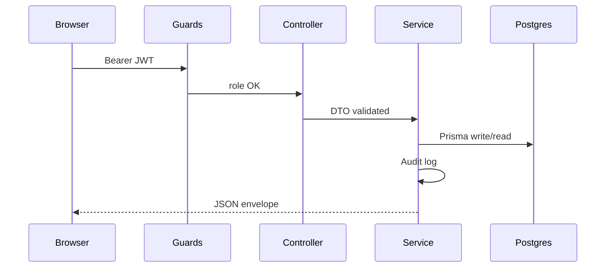
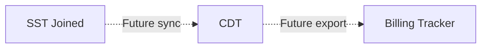

# Beginner Architecture Diagrams — CDT

## Purpose

Talk-track Mermaid diagrams for onboarding sessions and walkthroughs.

## Audience

New engineers, mentors running architecture intros, product partners.

## Scope

MVP diagrams only. Future systems drawn as dashed optional boxes.

## Definitions

| Term | Definition |
|------|------------|
| Talk-track | Diagram meant to be narrated live, not a formal C4 substitute |
| Domain chain | Candidate → Leave/Timesheet → Delivery Review → Dashboard |

---

## 1. Big picture (2 minutes)

**Say:** Four roles, one SPA, one API, one database.

## 2. Domain chain (5 minutes)

**Say:** Leave feeds timesheet attendance; timesheet + judgment become review; dashboard reads all.

## 3. Leave approval gate

**Say:** Only APPROVED leave reduces available working presence for the month.

## 4. Monthly uniqueness

**Say:** Many leave rows; at most one timesheet and one review per candidate-month.

## 5. Soft release

**Say:** Released candidates disappear from “active bench” views but stay queryable for history.

## 6. Request path through the API

## 7. Future neighbors (optional slide)

## MVP vs Future

| Diagram topic | MVP | Future |
|---------------|-----|--------|
| People → SPA → API → DB | Yes | Same + SSO IdP |
| Domain chain | Yes | Multi-engagement edges |
| SST / Billing boxes | Shown dashed | Solid integrations |

## Trade-offs

| Diagram choice | Why |
|----------------|-----|
| Few boxes first | Avoid cognitive overload in onboarding |
| State diagram for leave | Approval is the hardest BR for juniors |
| Sequence for JWT path | Clarifies “UI is not trusted” |

## Recommendations

Use this pack for day-1; graduate to [C4_MODEL.md](./C4_MODEL.md) and [ENTERPRISE_HIGH_LEVEL_DIAGRAMS.md](./ENTERPRISE_HIGH_LEVEL_DIAGRAMS.md) for design reviews.

## References

- [BEGINNER_HIGH_LEVEL_ARCHITECTURE.md](./BEGINNER_HIGH_LEVEL_ARCHITECTURE.md)
- [SEQUENCE_DIAGRAMS.md](./SEQUENCE_DIAGRAMS.md)
- [C4_MODEL.md](./C4_MODEL.md)
