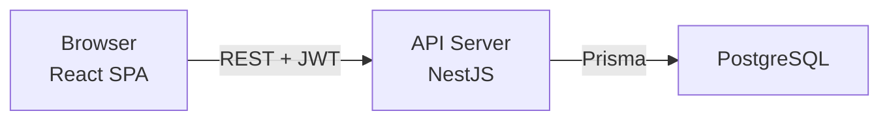

# Beginner High-Level Architecture — CDT

## Purpose

Explain CDT architecture in plain language for engineers new to the stack or domain.

## Audience

New joiners, junior engineers, product readers who want the technical picture without deep Nest/Prisma jargon.

## Scope

MVP mental model only. Cloud and SST live sync are called out as Future.

## Definitions

| Term | Plain meaning |
|------|---------------|
| SPA | The website in the browser (React) |
| API | The NestJS server that enforces rules and talks to the database |
| PostgreSQL | The database that stores candidates, leave, timesheets, reviews |
| JWT | A short-lived “badge” proving you logged in |
| Soft release | Mark a candidate as released without erasing history |

---

## 1. What CDT does

After SST marks someone **Joined**, CDT tracks whether they are **present**, **working**, and **healthy** at the client.

Think of one chain:

```text
Candidate → Leave + Timesheet → Delivery Review → Dashboard
```

1. **Candidate** — the person at a client (`CD-00001`).
2. **Leave** — approved absences only count (`LV-00001`).
3. **Timesheet** — monthly work record; attendance = days worked ÷ working days (`TSH-00001`).
4. **Delivery Review** — monthly health: On Track / At Risk / Escalated (`DEL-00001`).
5. **Dashboard** — rolls everything up for managers.

## 2. Three boxes



| Box | Job |
|-----|-----|
| Browser | Forms, tables, charts; never trusts itself for security |
| API | Login, roles, business rules, calculations, audit |
| Database | Durable truth |

## 3. Who can do what (roles)

| Role | Everyday job in CDT |
|------|---------------------|
| **ADMIN** | Users, lookups, full access, audit |
| **DELIVERY_MANAGER** | Candidates, leave approval, timesheets, reviews, dashboard |
| **HR** | Candidate master, leave, releases; limited review ops |
| **INTERNAL_MANAGER** | Read-heavy dashboard and status views |

Exact matrix: [../11-security/PERMISSION_MATRIX.md](../11-security/PERMISSION_MATRIX.md).

## 4. Important rules (remember these)

| Rule | Why it matters |
|------|----------------|
| Only **approved** leave affects attendance | Draft/rejected leave must not reduce days worked |
| One timesheet per candidate per month | Prevents double-counting utilization |
| One delivery review per candidate per month | Single health judgment |
| Escalated ⇒ escalation notes required | Forces accountability |
| Release is soft | History and audit stay |

## 5. Monorepo (folders you will see)

```text
CDT_v1_monorepo/
  apps/web     → React UI
  apps/api     → NestJS API
  packages/    → shared types, config
  docker/      → Postgres + local stack
  docs/        → this documentation
```

Turborepo runs builds/tests across apps with one command surface.

## 6. Login in one sentence

You send email/password → API checks hash → returns **access token** (short) and sets/returns **refresh token** (longer) → SPA sends access token on every API call → when expired, refresh silently.

## 7. MVP vs Future (beginner)

| Now (MVP) | Later |
|-----------|-------|
| Enter candidates (or import) manually | Auto-sync from SST Joined |
| Full leave → approve → timesheet calc | Half-days, holiday calendars |
| Delivery reviews in UI | Alerts / notifications |
| Docker on laptop | Cloud + SSO |

## Trade-offs (simple)

| We chose | Instead of | Because |
|----------|------------|---------|
| One API app | Many microservices | Faster to ship and operate |
| SPA → API direct | BFF layer | Less moving parts |
| Soft release | Delete rows | Keep history |

## Recommendations

- Read [BEGINNER_ARCHITECTURE_DIAGRAMS.md](./BEGINNER_ARCHITECTURE_DIAGRAMS.md) next for talk-track pictures.
- Then skim [SEQUENCE_DIAGRAMS.md](./SEQUENCE_DIAGRAMS.md) for leave → timesheet → review flows.
- When coding, treat the API as the boss of business rules — never “fix” attendance only in the UI.

## References

- [HIGH_LEVEL_ARCHITECTURE.md](./HIGH_LEVEL_ARCHITECTURE.md)
- [BEGINNER_ARCHITECTURE_DIAGRAMS.md](./BEGINNER_ARCHITECTURE_DIAGRAMS.md)
- [../docs/README.md](../README.md)
