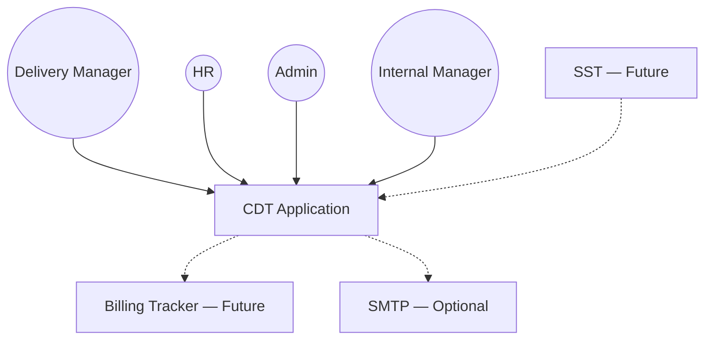
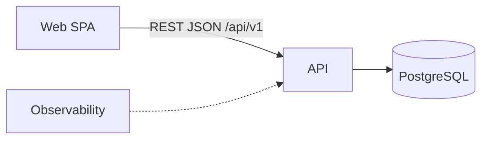
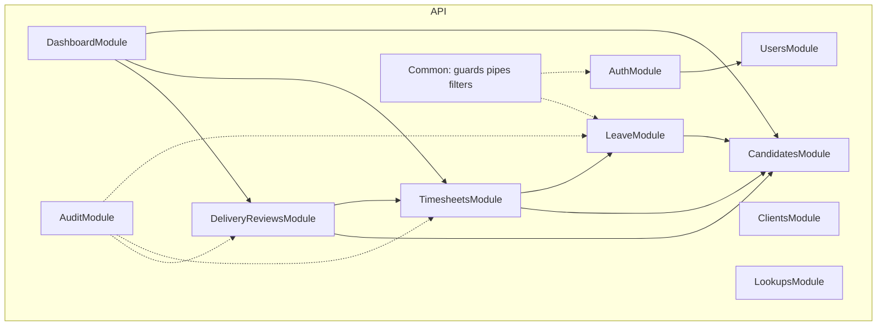

# C4 Model — CDT

## Purpose

Formal C4 views (Context, Container, Component, Code-level notes) for CDT MVP.

## Audience

Architects, senior engineers, reviewers who prefer Simon Brown’s C4 model.

## Scope

MVP system. External SST/Billing shown as future neighboring systems.

## Definitions

| Level | Focus |
|-------|-------|
| L1 Context | People + systems |
| L2 Container | Deployable/runtime units |
| L3 Component | Major modules inside API/SPA |
| L4 Code | Illustrative class/function notes only |

---

## L1 — System Context



**Responsibilities of CDT:** maintain candidate delivery roster; gate leave approvals; compute attendance/utilization; capture monthly delivery health; enforce RBAC and audit.

## L2 — Containers

| Container | Technology | Responsibility |
|-----------|------------|----------------|
| Web SPA | React, Vite, ShadCN, TanStack Query, React Router | UX for all roles |
| API | NestJS, Passport JWT, Prisma, Pino, Swagger | Business APIs, BR, RBAC, audit |
| Database | PostgreSQL 16+ | SoR |
| Observability (local) | Prometheus, Grafana, Loki | Metrics/logs |



## L3 — API Components



### Component notes

| Component | Key behaviors |
|-----------|---------------|
| LeaveModule | Submit/approve/reject; status machine |
| TimesheetsModule | Upsert monthly sheet; recalc daysWorked from approved leave + inputs; attendance % |
| DeliveryReviewsModule | Upsert monthly review; require notes if ESCALATED |
| CandidatesModule | CRUD + soft release; publicId `CD-` |
| DashboardModule | Read aggregations only |

## L3 — SPA Components

| Area | Responsibility |
|------|----------------|
| `features/auth` | Login, token store, session restore |
| `features/candidates` | List/detail/release |
| `features/leave` | Create/submit/approve |
| `features/timesheets` | Monthly entry + recalc display |
| `features/delivery-reviews` | Health judgment forms |
| `features/dashboard` | Charts/tables |
| `features/admin` | Users + lookups |
| `shared/ui` | ShadCN wrappers |
| `shared/api` | Axios client + interceptors |

## L4 — Code (illustrative)

```text
TimesheetsService.recalculate(candidateId, yearMonth):
  workingDays = calendarService.workingDays(yearMonth)          // MVP: input or config
  approvedLeaveDays = leaveRepo.sumApprovedDays(...)
  daysWorked = max(0, workingDays - approvedLeaveDays ± adjustments)
  attendancePct = daysWorked / workingDays
  persist timesheet + audit
```

```text
DeliveryReviewsService.upsert(...):
  assert unique (candidateId, yearMonth)
  if health === ESCALATED and !escalationNotes → 400 BR violation
  persist + audit
```

## MVP vs Future

| C4 element | MVP | Future |
|------------|-----|--------|
| Containers | SPA, API, PG | + Worker, Redis, Object store |
| Context neighbors | Optional SMTP | SST, Billing, IdP |
| Components | Listed modules | SyncModule, NotificationModule |

## Trade-offs

| Choice | Rationale |
|--------|-----------|
| Modular monolith as one container | Matches team size; C4 L3 shows seams |
| Dashboard as separate module | Prevents write leakage into analytics |
| L4 as pseudocode | Avoid coupling docs to unstable class names pre-code |

## Recommendations

- Keep L3 module boundaries aligned with Nest module folders and Prisma ownership.
- When splitting services later, promote L3 components to L2 containers with explicit anti-corruption layers for SST/Billing.

## References

- [HIGH_LEVEL_ARCHITECTURE.md](./HIGH_LEVEL_ARCHITECTURE.md)
- [../08-backend/MODULE_CATALOG.md](../08-backend/MODULE_CATALOG.md)
- [SEQUENCE_DIAGRAMS.md](./SEQUENCE_DIAGRAMS.md)
