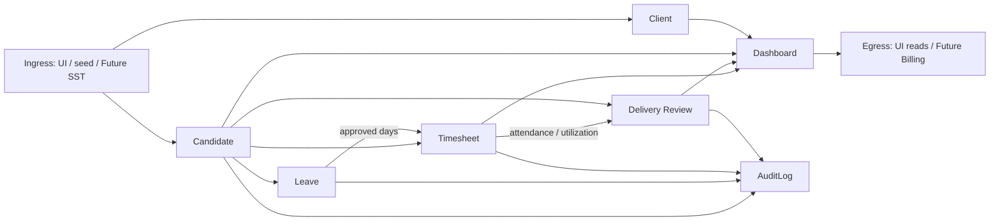
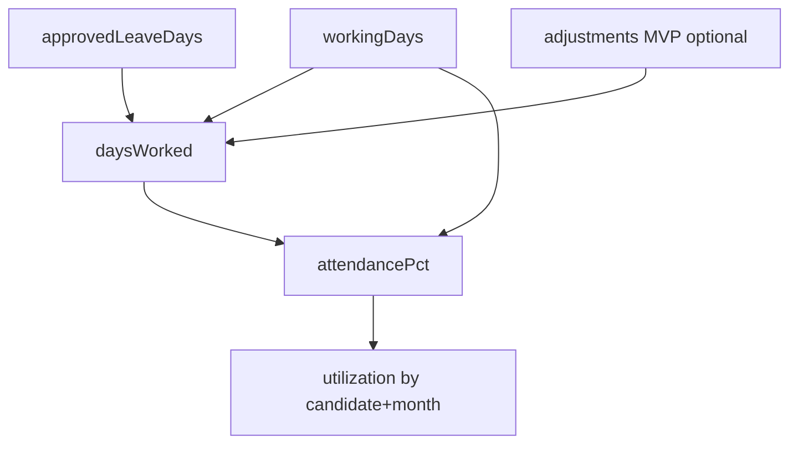

# Data Flow — CDT

## Purpose

Describe how data moves through CDT for the core delivery chain and supporting masters.

## Audience

Backend/frontend engineers, data stakeholders, QA.

## Scope

MVP synchronous REST flows. Async integrations are Future.

## Definitions

| Term | Definition |
|------|------------|
| Ingress | Data entering CDT (UI forms, seed, future SST) |
| Egress | Data leaving CDT (exports, future billing) |
| Derived field | Computed server-side (attendance %, utilization) |
| yearMonth | `YYYY-MM` period key |

---

## 1. End-to-end domain flow

## 2. Write paths

| Flow | Producer | Consumer stores | Side effects |
|------|----------|-----------------|--------------|
| Create client | ADMIN / DM | `clients` | Audit |
| Create candidate | ADMIN / DM / HR | `candidates` + `CD-` | Audit |
| Create/submit leave | HR / DM / ADMIN | `leaves` + `LV-` | Audit |
| Approve leave | DM / ADMIN | `leaves.status` | Audit; may trigger UI to recalc TS |
| Upsert timesheet | DM / ADMIN | `timesheets` + `TSH-` | Read approved leave; set attendancePct; Audit |
| Upsert delivery review | DM / ADMIN | `delivery_reviews` + `DEL-` | Validate escalation notes; Audit |
| Soft release | DM / HR / ADMIN | `candidates.status` | Audit; block new period docs |
| Lookup mutate | ADMIN | `lookup_values` | Audit |
| User mutate | ADMIN | `users` | Audit |

## 3. Read paths

| Consumer | Reads | Notes |
|----------|-------|-------|
| Candidate detail | candidate + recent leave/TS/DR | Role-filtered |
| Timesheet form | candidate, approved leave sum, existing TS | Prefill workingDays |
| Delivery review form | candidate, timesheet snapshot | Show attendance |
| Dashboard | aggregates by client/candidate/month | Read-only SQL/Prisma groupBy |
| Audit UI | `audit_logs` | ADMIN |

## 4. Derived data

**Invariant:** SPA may display derived fields but API recalculates and persists authoritative values on write.

## 5. Identity & correlation

| Entity | Internal PK | Public ID | Natural uniqueness |
|--------|-------------|-----------|--------------------|
| Candidate | UUID | `CD-#####` | Optional SST ref (Future) |
| Leave | UUID | `LV-#####` | — |
| Timesheet | UUID | `TSH-#####` | `(candidateId, yearMonth)` |
| DeliveryReview | UUID | `DEL-#####` | `(candidateId, yearMonth)` |
| Client | UUID | — / optional code | `name_normalized` |
| User | UUID | — | `email` |
| AuditLog | UUID | — | append-only |

## 6. Cross-system (MVP vs Future)

| Direction | MVP | Future |
|-----------|-----|--------|
| SST → CDT | Manual entry / one-time import | Live Joined sync with correlation id |
| CDT → Billing | None | Push attendance/days worked |
| CDT → Email | Optional SMTP hooks | Notification service |

## 7. Failure & consistency

| Scenario | Behavior |
|----------|----------|
| Duplicate timesheet month | `409 UNIQUE_PERIOD` |
| Approve leave then TS not updated | Stale attendance until next TS upsert/recalc |
| Release mid-month | Existing TS/DR retained; new creates blocked |
| Partial audit failure | Prefer transactional write: domain + audit same TX |

## Trade-offs

| Decision | Why |
|----------|-----|
| Sync REST only | Matches Excel operator mental model |
| Persist derived attendance | Stable dashboard history if leave later changes policy |
| Optional auto-recalc on approve deferred | Keeps transactions small for MVP |

## Recommendations

- Document recalc endpoint `POST /timesheets/:id/recalculate` for explicit refresh after late leave approvals.
- Never accept client-supplied `attendancePct` as authoritative without server recompute (ignore or overwrite).

## References

- [SEQUENCE_DIAGRAMS.md](./SEQUENCE_DIAGRAMS.md)
- [../07-database/ER_AND_SCHEMA.md](../07-database/ER_AND_SCHEMA.md)
- [../10-api/API_CATALOG.md](../10-api/API_CATALOG.md)
