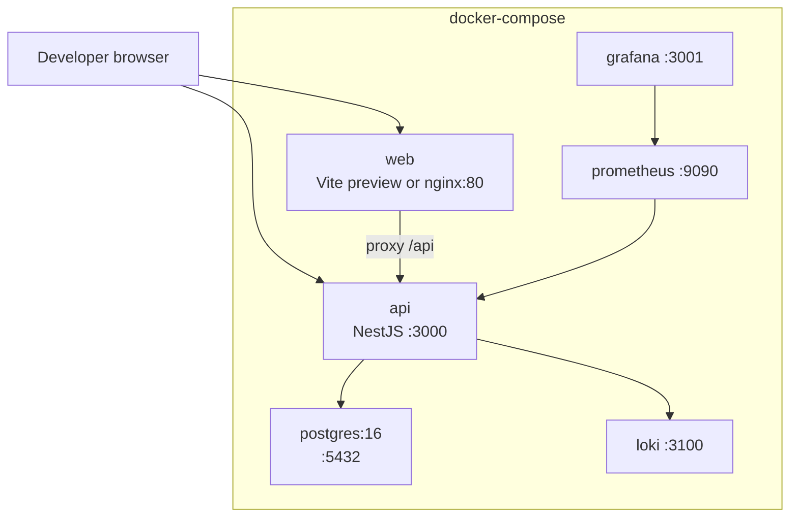
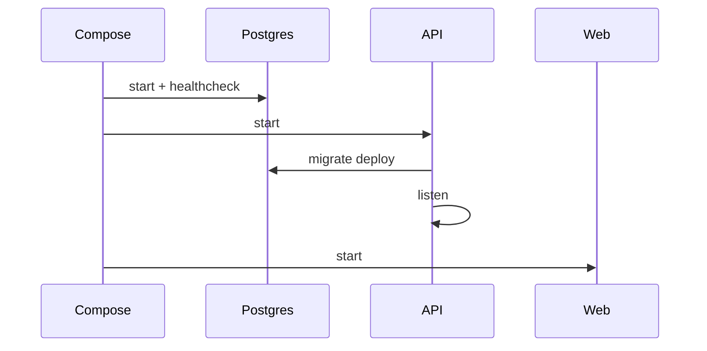

# Deployment — CDT

## Purpose

Define how CDT is packaged and run for local MVP and the path toward packaged/cloud deployment.

## Audience

DevOps, backend engineers, tech leads.

## Scope

| Label | Meaning |
|-------|---------|
| **MVP** | Docker Compose local: `web`, `api`, `postgres`, optional observability |
| **Future** | Cloud VMs/K8s, managed Postgres, secrets manager, TLS edge |

## Definitions

| Term | Definition |
|------|------------|
| Compose stack | Multi-container local runtime |
| Twelve-factor | Config via env; ephemeral processes |
| Health | Liveness `/health`; readiness `/ready` (DB ping) |

---

## 1. MVP topology



## 2. Processes & ports (defaults)

| Service | Port | Notes |
|---------|------|-------|
| `apps/web` (dev) | 5173 | Vite HMR |
| `apps/api` | 3000 | `/api/v1`, `/metrics` |
| PostgreSQL | 5432 | Volume `cdt_pg_data` |
| Prometheus | 9090 | Scrape api |
| Grafana | 3001 | Dashboards |
| Loki | 3100 | Log sink |

## 3. Build artifacts

| Artifact | How | Used for |
|----------|-----|----------|
| `apps/web` static | `pnpm --filter web build` | nginx/spa image |
| `apps/api` dist | `pnpm --filter api build` | Node image |
| Prisma migrations | `prisma migrate deploy` | DB schema |
| Seed | `prisma db seed` | Dev/demo data |

## 4. Configuration (env)

| Variable | Owner | Purpose |
|----------|-------|---------|
| `DATABASE_URL` | api | Postgres connection |
| `JWT_ACCESS_SECRET` | api | Access token signing |
| `JWT_REFRESH_SECRET` | api | Refresh signing |
| `JWT_ACCESS_TTL` | api | e.g. `15m` |
| `JWT_REFRESH_TTL` | api | e.g. `7d` |
| `CORS_ORIGIN` | api | SPA origin |
| `VITE_API_BASE_URL` | web | API base |
| `LOG_LEVEL` | api | Pino level |

Secrets never committed; use `.env` locally and secret store in Future cloud.

## 5. Startup sequence

```text
1. postgres healthy
2. api: migrate deploy → (optional seed) → listen :3000
3. web: serve static / vite
4. observability scrapers
```



## 6. Health & readiness

| Endpoint | Checks |
|----------|--------|
| `GET /health` | Process up |
| `GET /ready` | DB connectivity |
| `GET /metrics` | Prometheus exposition |

Orchestrators should route traffic only when `/ready` is 200.

## 7. MVP vs Future deployment

| Concern | MVP | Future |
|---------|-----|--------|
| Hosting | Developer laptop / single VM | Cloud (see `19-cloud`) |
| TLS | Optional local | Terminated at LB / ingress |
| Secrets | `.env` files | Vault / cloud secrets |
| DB HA | Single Postgres volume | Managed HA + PITR |
| Scaling | One API container | N replicas, shared DB |
| CI deploy | Manual / Actions build | Promote images by tag |

## Trade-offs

| Decision | Why |
|----------|-----|
| Compose-first | Matches SST sister product; fast onboarding |
| SPA + API separate containers | Independent scale and release |
| Migrations in API boot job / init | Schema always aligned before traffic |

## Recommendations

- Run migrations as an init container/job, not raced by multiple API replicas.
- Keep web→api path versioned (`/api/v1`) for rolling upgrades.
- Document backup of `cdt_pg_data` volume before any destructive migrate (see [../07-database/MIGRATION_AND_BACKUP.md](../07-database/MIGRATION_AND_BACKUP.md)).

## References

- [SCALABILITY.md](./SCALABILITY.md)
- [HIGH_LEVEL_ARCHITECTURE.md](./HIGH_LEVEL_ARCHITECTURE.md)
- [../17-local-deployment/](../17-local-deployment/) (when authored)
- [../16-cicd/](../16-cicd/) (when authored)
