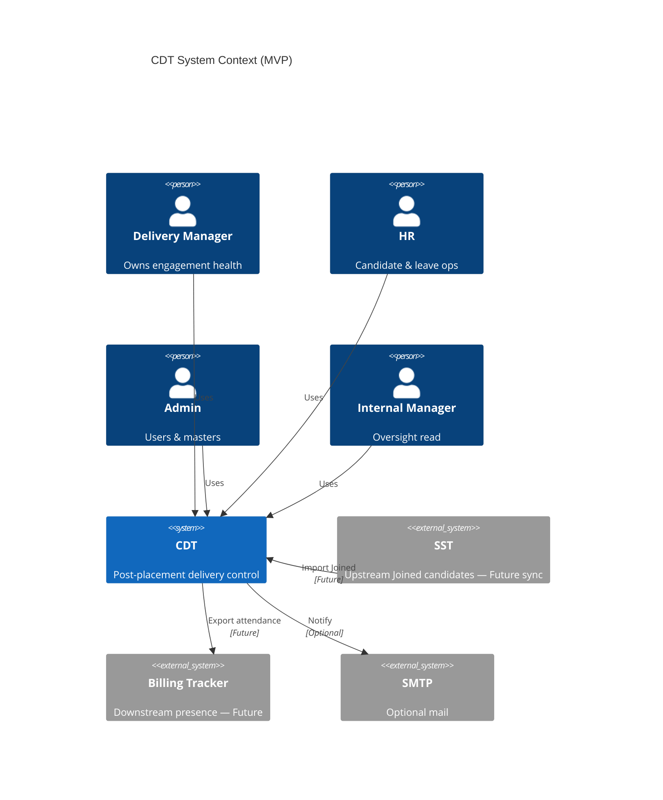
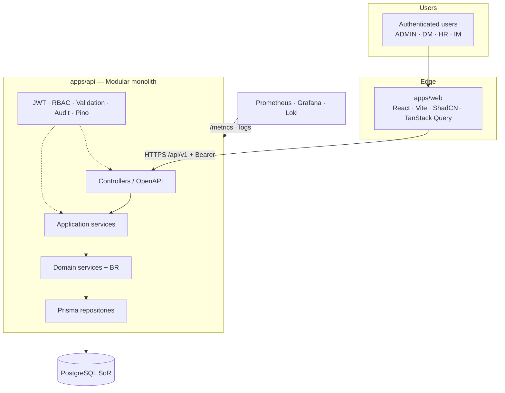
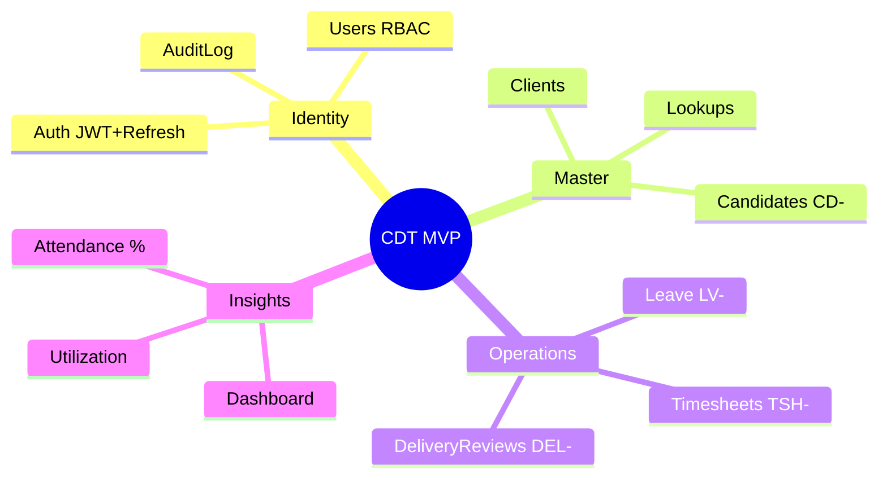
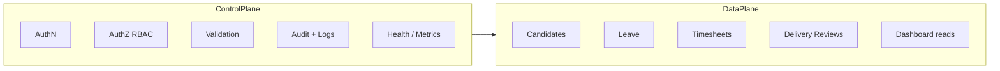
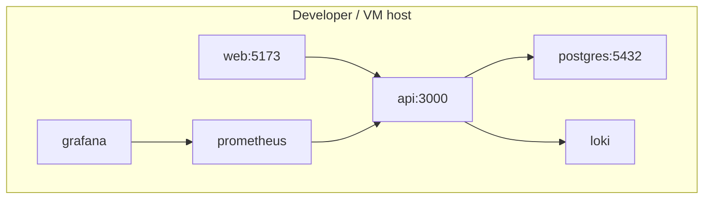
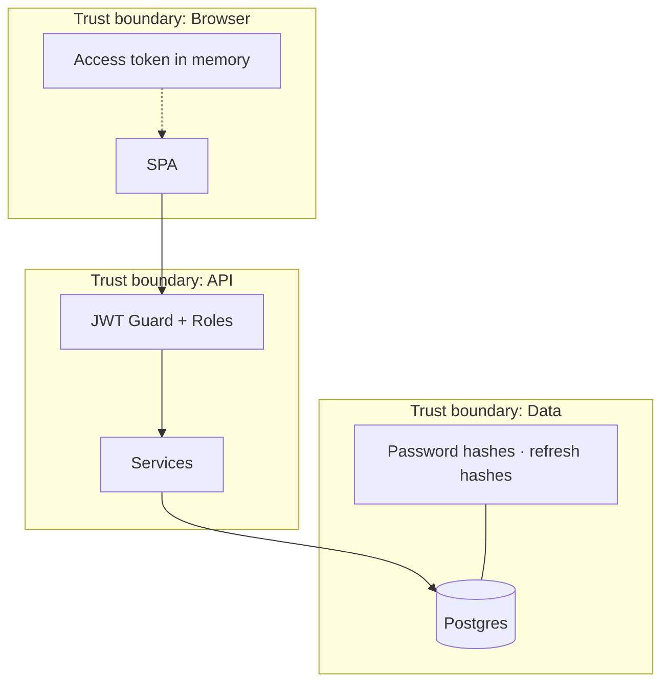

# Enterprise High-Level Diagrams — CDT

## Purpose

Clean enterprise diagram pack for architecture reviews, stakeholder decks, and design sign-off.

## Audience

Architects, tech leads, security, DevOps, senior stakeholders.

## Scope

MVP runtime topology and logical enterprise views. Cloud target architecture lives in `19-cloud` (Future).

## Definitions

| Term | Definition |
|------|------------|
| HLA | High-level architecture view |
| SoR | System of record |
| Control plane | Auth, RBAC, audit, config, observability |
| Data plane | Domain CRUD and calculations |

---

## Fig 1 — Context (enterprise)

## Fig 2 — Container HLA (main)

## Fig 3 — Domain capability map

## Fig 4 — Control vs data plane

## Fig 5 — Deployment (local MVP)

## Fig 6 — Security trust boundaries

## MVP vs Future overlays

| Figure aspect | MVP | Future |
|------------|-----|--------|
| Containers | web + api + postgres | + Redis, object storage, workers |
| External systems | SMTP optional | SST sync, Billing, IdP SSO |
| Observability | Prom/Grafana/Loki local | Managed APM + centralized SIEM |
| Scale-out | Single API | N API replicas behind LB |

## Trade-offs

| View | Intentionally omits |
|------|---------------------|
| Fig 2 | Package-level folder trees (see monorepo docs) |
| Fig 5 | Production TLS termination / WAF |
| C4Context | Internal module edges (see C4 Container/Component) |

## Recommendations

- Use **Fig 2** as the default HLA slide in design reviews.
- Pair with [C4_MODEL.md](./C4_MODEL.md) when reviewers ask for formal C4 levels.
- Keep Future edges dashed until integration ADRs exist.

## References

- [HIGH_LEVEL_ARCHITECTURE.md](./HIGH_LEVEL_ARCHITECTURE.md)
- [C4_MODEL.md](./C4_MODEL.md)
- [DEPLOYMENT.md](./DEPLOYMENT.md)
- [../11-security/AUTH_RBAC.md](../11-security/AUTH_RBAC.md)
