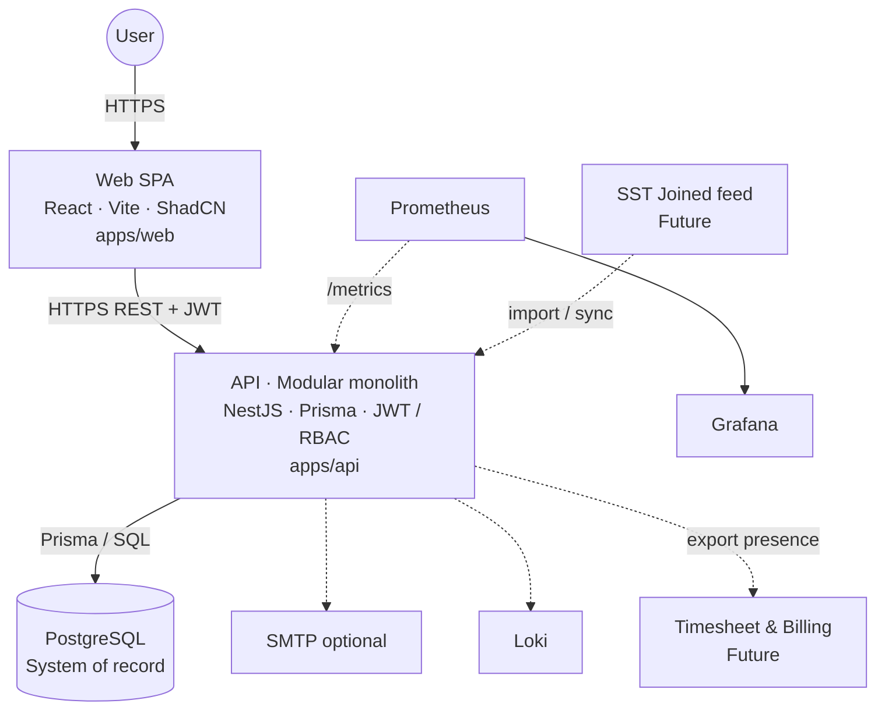

# High Level Architecture — CDT

## Purpose

Describe the system architecture for Client Delivery & Resource Tracker (CDT) MVP and extension points for post-placement delivery control.

## Audience

Architects, senior engineers, DevOps.

## Scope

| Label | Meaning |
|-------|---------|
| **MVP** | Local/Docker modular monolith: Candidate Master, Leave, Timesheet, Delivery Review, Dashboard, Clients, Lookups, Auth/RBAC/Audit |
| **Future** | Cloud (see `19-cloud`), live SST sync, billing tracker integration, notifications, Redis, SSO |

## Definitions

| Term | Definition |
|------|------------|
| Modular monolith | Single deployable NestJS API with bounded modules |
| SoR | System of record — PostgreSQL via Prisma |
| Soft release | Candidate marked released without hard delete; history retained |
| Public ID | Business key: `CD-#####`, `LV-#####`, `TSH-#####`, `DEL-#####` |
| BFF | Not used; SPA talks REST directly |

---

## 1. Architecture style

- Enterprise monorepo (Turborepo + pnpm)
- Modular monolith NestJS API (`apps/api`)
- React SPA (`apps/web`) — Vite, Tailwind, ShadCN
- PostgreSQL SoR
- Clean / layered architecture inside modules
- JWT access + rotatable refresh tokens
- Future Redis / object storage / message bus adapters

**Primary visual boards:** [ENTERPRISE_HIGH_LEVEL_DIAGRAMS.md](./ENTERPRISE_HIGH_LEVEL_DIAGRAMS.md).



## 2. Domain chain (logical)

```text
SST Joined (upstream) → Candidate (CD-) → Leave (LV-) / Timesheet (TSH-)
                                              ↓
                                    Delivery Review (DEL-)
                                              ↓
                                          Dashboard
```

Business rules enforced in domain services:

| Rule | Enforcement |
|------|-------------|
| Approved leave only | Timesheet calc uses `Leave.status = APPROVED` |
| Attendance % | `daysWorked / workingDays` for period |
| Utilization | Aggregated by `candidateId + yearMonth` |
| Escalation notes | Required when health = `ESCALATED` |
| Soft release | `releasedAt` / `status = RELEASED`; no hard delete |
| Uniqueness | One timesheet and one delivery review per candidate+month |

## 3. Logical layers (API)

```text
Controllers (HTTP)
    → Application Services (orchestration, transactions)
        → Domain Services (BR rules, state transitions)
            → Repositories (Prisma)
                → PostgreSQL
         ↘ Guards / Interceptors / Pipes / Filters / Audit
```

## 4. Applications

| App / package | Tech | Responsibility |
|---------------|------|----------------|
| `apps/web` | Vite React + ShadCN | Delivery UI SPA |
| `apps/api` | NestJS + Prisma | Business APIs, RBAC, audit |
| `packages/shared-types` | TS | DTOs, enums, Zod schemas |
| `packages/config` | TS | Shared ESLint/TSConfig |
| `docker/*` | Compose | Local / packaged runtime |

## 5. Bounded modules (MVP)

| Module | Owns |
|--------|------|
| Auth | Login, refresh, logout, JWT strategy |
| Users | User CRUD (ADMIN) |
| Clients | Client master |
| Candidates | Candidate master + soft release |
| Leave | Leave request lifecycle + approval |
| Timesheets | Monthly timesheet + attendance calc |
| DeliveryReviews | Monthly engagement health |
| Dashboard | Aggregations / RAG views |
| Lookups | Master / lookup values |
| Audit | Append-only audit log |

## 6. Cross-cutting

AuthN/Z (Passport JWT + `@Roles`), validation (class-validator + shared Zod), logging (Pino), config (`@nestjs/config`), OpenAPI/Swagger, pagination envelope, error envelope, audit interceptor, health/metrics.

## 7. Scalability strategy (MVP → next)

| Stage | Approach |
|-------|----------|
| MVP | Single API replica + Postgres |
| Growth | Stateless horizontal API; connection pool; read indexes on candidate+month |
| Later | Redis for dashboard caches; read replicas; SST/billing adapters |

## 8. MVP vs Future

| Capability | MVP | Future |
|------------|-----|--------|
| Manual candidate entry / CSV seed | Yes | Live SST Joined sync |
| Leave approval gate | Yes | Half-days / holiday calendar |
| Timesheet + attendance % | Yes | Billing tracker push |
| Delivery review + escalation notes | Yes | Multi-engagement per candidate |
| Soft release | Yes | Workforce reassignment workflows |
| JWT + refresh | Yes | SSO / OIDC |
| Docker Compose local | Yes | Cloud K8s / managed Postgres |

## Trade-offs

| Decision | Why |
|----------|-----|
| Modular monolith | Solo/small-team speed; clear module seams for later split |
| No BFF | Simpler ops; shared types package |
| Sync REST | Matches CRUD Excel mental model from source workbook |
| Soft release over hard delete | Preserves audit + historical utilization |
| Calc attendance in service (not only UI) | Single source of truth for BR |

## Recommendations

- Keep Prisma models owned by one module; cross-module writes go through application services.
- Allocate public IDs via `id_sequences` (or equivalent) in the same transaction as insert.
- Dashboard remains read-only; never mutate leave/timesheet/review from dashboard endpoints.

## References

- [ENTERPRISE_HIGH_LEVEL_DIAGRAMS.md](./ENTERPRISE_HIGH_LEVEL_DIAGRAMS.md)
- [BEGINNER_HIGH_LEVEL_ARCHITECTURE.md](./BEGINNER_HIGH_LEVEL_ARCHITECTURE.md)
- [C4_MODEL.md](./C4_MODEL.md)
- [SEQUENCE_DIAGRAMS.md](./SEQUENCE_DIAGRAMS.md)
- [DATA_FLOW.md](./DATA_FLOW.md)
- [../07-database/ER_AND_SCHEMA.md](../07-database/ER_AND_SCHEMA.md)
- [../13-monorepo/](../13-monorepo/) (when authored)
