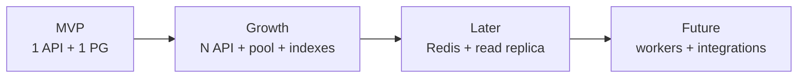

# Scalability — CDT

## Purpose

Describe how CDT scales from MVP single-node to growth-stage horizontal capacity without premature microservices.

## Audience

Architects, backend engineers, DevOps.

## Scope

MVP sizing assumptions and staged scale-out. Multi-region active-active is out of scope (Future/cloud).

## Definitions

| Term | Definition |
|------|------------|
| Stateless API | No in-process session; JWT + DB-backed refresh |
| Hot path | Dashboard aggregates, timesheet list by month |
| Write contention | Unique `(candidateId, yearMonth)` upserts |

---

## 1. MVP capacity model

| Dimension | Assumption |
|-----------|------------|
| Concurrent users | Tens (internal) |
| Candidates | Hundreds → low thousands |
| Leave/TS/DR rows | Low tens of thousands / year |
| API | 1 replica |
| DB | 1 Postgres, connection pool modest |

Adequate for Excel-replacement workloads.

## 2. Scale stages



| Stage | Changes |
|-------|---------|
| **S0 MVP** | Modular monolith; indexes on FKs and period keys |
| **S1 Growth** | Horizontal API behind LB; tune Prisma/pg pool; read-only dashboard SQL review |
| **S2 Later** | Redis cache for dashboard tiles; Postgres read replica for heavy reports |
| **S3 Future** | Async workers for SST sync / billing export; object storage for attachments |

## 3. Statelessness & sessions

- Access tokens are self-contained → any API replica can validate.
- Refresh tokens stored hashed in Postgres → sticky sessions not required.
- File uploads (Future) must use shared object storage, not local disk.

## 4. Database scalability

| Technique | MVP | Growth |
|-----------|-----|--------|
| Indexes on `candidate_id`, `year_month`, `status` | Yes | Yes |
| Unique `(candidate_id, year_month)` on TS/DR | Yes | Yes |
| Partial indexes for `ACTIVE` candidates | Optional | Recommended |
| Partitioning by month | No | Consider if history >> millions |
| Read replicas | No | Yes for dashboard |

### Hot queries

```text
-- timesheets by month
WHERE year_month = $1 AND deleted_at IS NULL

-- utilization join candidate + timesheet + review
WHERE c.client_id = $1 AND t.year_month = $2
```

## 5. Application scalability

| Concern | Approach |
|---------|----------|
| CPU (attendance calc) | O(leave rows in month); keep leave indexed by candidate+dates |
| N+1 Prisma | Use `include`/`select` carefully in list endpoints |
| Dashboard fan-out | Prefer SQL aggregation endpoints over chatty SPA loops |
| Idempotent upserts | `PUT` timesheet/review by natural key |

## 6. Caching strategy

| Data | MVP | Future |
|------|-----|--------|
| Lookups | SPA memory / TanStack cache | Redis shared |
| Dashboard tiles | TanStack staleTime | Redis + short TTL + tag invalidate |
| Candidate detail | Query cache | Same |

Invalidate on write of leave/TS/DR for affected `candidateId+yearMonth`.

## 7. Bottleneck watchlist

| Symptom | Likely cause | Mitigation |
|---------|--------------|------------|
| Slow dashboard | Full table scans | Composite indexes; pre-agg table (Future) |
| 409 storms on TS | Double-submit | Idempotent PUT; UI disable |
| Pool exhaustion | Too many API replicas | Cap pool per replica; PgBouncer |
| Lock waits | Long TX with audit+calc | Narrow transactions |

## MVP vs Future

| Capability | MVP | Future |
|------------|-----|--------|
| Horizontal API | Documented, optional | Standard |
| Redis | No | Yes |
| CQRS / event sourcing | No | Not required unless audit analytics explode |
| Multi-tenant sharding | No | Only if product expands orgs |

## Trade-offs

| Decision | Why |
|----------|-----|
| Delay microservices | Operational cost > benefit at internal scale |
| Persist derived % | Cheaper dashboard reads vs always recompute |
| Unique period constraints | Correctness over write parallelism |

## Recommendations

- Load-test dashboard and timesheet list before adding Redis.
- Keep modules independently foldered so a future extract of `TimesheetsModule` is possible without a rewrite.
- Measure p95 on `/dashboard/*` and `/timesheets` as primary SLIs.

## References

- [DEPLOYMENT.md](./DEPLOYMENT.md)
- [HIGH_LEVEL_ARCHITECTURE.md](./HIGH_LEVEL_ARCHITECTURE.md)
- [../07-database/INDEXING_AND_AUDIT.md](../07-database/INDEXING_AND_AUDIT.md)
- [../18-monitoring/](../18-monitoring/) (when authored)
