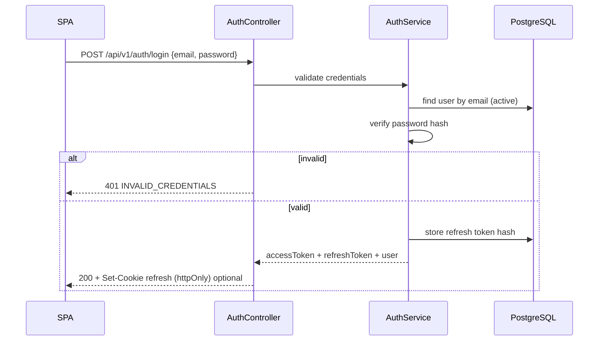
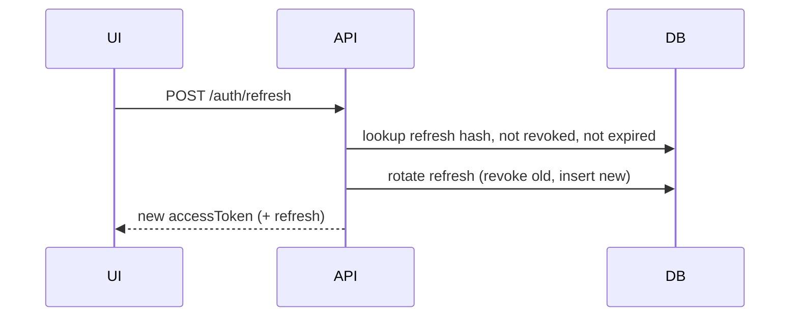
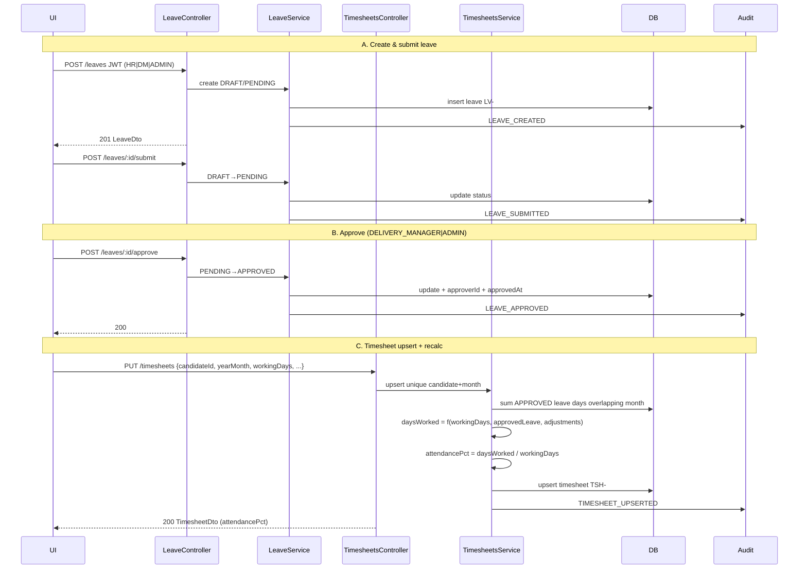
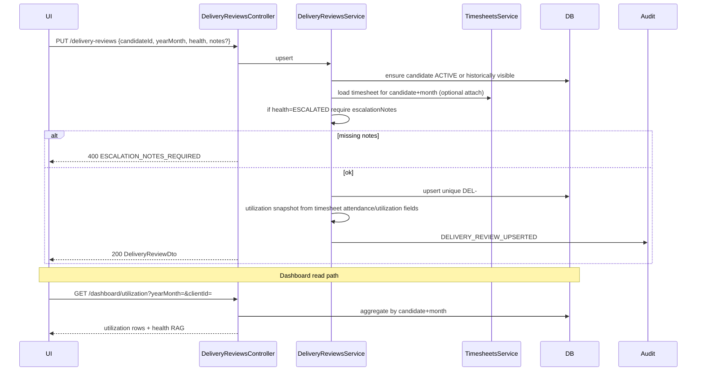
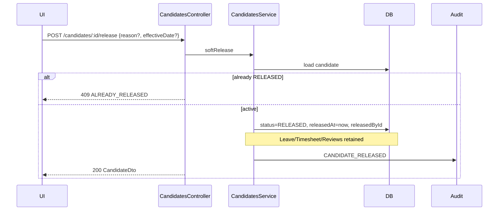
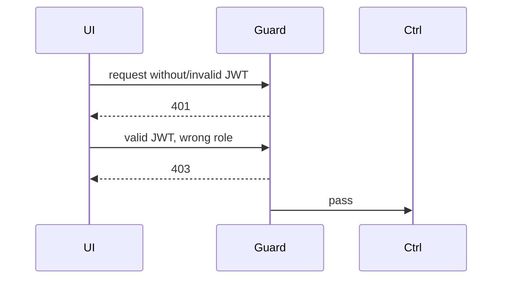

# Sequence Diagrams — CDT

## Purpose

Document key runtime sequences for implementers, QA, and design reviewers.

## Audience

Backend/frontend engineers, QA, tech leads.

## Scope

MVP critical paths: login; leave create → approve → timesheet calc; delivery review utilization; soft-release candidate.

## Definitions

| Term | Definition |
|------|------------|
| Access token | Short-lived JWT (Bearer) |
| Refresh token | Longer-lived, hashed at rest, rotatable |
| yearMonth | Canonical period key `YYYY-MM` |
| Soft release | Set candidate `status=RELEASED` / `releasedAt`; retain rows |

---

## 1. Login

### Refresh (silent)

---

## 2. Create leave → approve → timesheet calculation

### Calculation notes (normative for MVP)

| Input | Source |
|-------|--------|
| `workingDays` | Request body or period config |
| `approvedLeaveDays` | Sum of approved leave intersecting `yearMonth` |
| `daysWorked` | Service-computed (never trust client-only %) |
| `attendancePct` | `daysWorked / workingDays` (0 if workingDays=0 → 400) |

Rejected/draft/cancelled leave **must not** affect the sum.

---

## 3. Delivery review + utilization

Utilization is reported **by candidate + month**. MVP sources primary % from timesheet attendance/utilization fields; review stores judgment + optional snapshot.

---

## 4. Soft-release candidate

Released candidates:

- Excluded from default “active” lists (`status=ACTIVE` filter).
- Still addressable by publicId/UUID for history.
- Blocked from new leave/timesheet/review creates (MVP rule); historical edits per RBAC.

---

## 5. Unauthorized / forbidden (cross-cutting)

## MVP vs Future

| Sequence | MVP | Future |
|----------|-----|--------|
| Login | Password + JWT/refresh | SSO redirect + OIDC |
| Leave→TS | Manual approve + PUT timesheet | Auto-recalc on approve event / queue |
| Review | Sync PUT | Notifications on ESCALATED |
| Release | Soft status | SST/Billing outbound events |

## Trade-offs

| Choice | Why |
|--------|-----|
| Explicit timesheet PUT after approve | Clear audit boundary; simpler MVP transactions |
| Utilization on review/dashboard reads | Avoid dual-write races in MVP |
| Soft release blocks new period docs | Prevents zombie open months |

## Recommendations

- Implement approve and timesheet recalc in separate API calls for MVP; add domain events later if auto-recalc is required.
- Always write audit rows in the same DB transaction as the state change.

## References

- [DATA_FLOW.md](./DATA_FLOW.md)
- [../10-api/API_CATALOG.md](../10-api/API_CATALOG.md)
- [../11-security/AUTH_RBAC.md](../11-security/AUTH_RBAC.md)
- [../07-database/ER_AND_SCHEMA.md](../07-database/ER_AND_SCHEMA.md)
