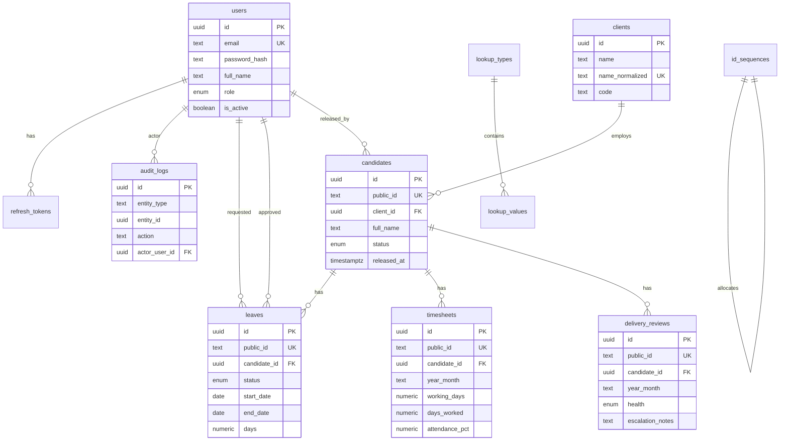

# ER Diagram & PostgreSQL Schema — CDT

## Purpose

Canonical relational design for CDT MVP entities and constraints.

## Audience

Database architects, backend engineers.

## Scope

MVP tables for Client, Candidate, Leave, Timesheet, DeliveryReview, Lookups, User, AuditLog. Half-day/holiday calendars and multi-engagement are Future.

## Definitions

| Convention | Rule |
|------------|------|
| PK | UUID `id` |
| Public business id | `public_id` unique text (`CD-`, `LV-`, `TSH-`, `DEL-`) |
| Soft delete | `deleted_at timestamptz NULL` where applicable |
| Soft release | Candidate `status` / `released_at` (not delete) |
| Period | `year_month` text `YYYY-MM` |
| Percent | `numeric(5,2)` 0–100 |

---

## ER diagram

## Tables

### users

| Column | Type | Notes |
|--------|------|-------|
| id | uuid PK | |
| email | citext/text unique | login |
| password_hash | text | bcrypt/argon2 |
| full_name | text | |
| role | enum | `ADMIN`, `DELIVERY_MANAGER`, `HR`, `INTERNAL_MANAGER` |
| is_active | boolean | default true |
| created_at / updated_at | timestamptz | |
| deleted_at | timestamptz null | soft delete |

### refresh_tokens

| Column | Type | Notes |
|--------|------|-------|
| id | uuid PK | |
| user_id | uuid FK → users | |
| token_hash | text unique | store hash only |
| expires_at | timestamptz | |
| revoked_at | timestamptz null | |
| created_at | timestamptz | |

### clients

| Column | Type | Notes |
|--------|------|-------|
| id | uuid PK | |
| name | text | |
| name_normalized | text unique | lower(trim) |
| code | text null unique | optional |
| is_active | boolean | |
| created_at / updated_at / deleted_at | | |

### candidates

| Column | Type | Notes |
|--------|------|-------|
| id | uuid PK | |
| public_id | text unique | `CD-#####` |
| client_id | uuid FK → clients | |
| full_name | text | |
| email / mobile | text null | |
| role_title | text null | deployed role |
| sst_reference | text null | Future correlation |
| joined_on | date null | |
| status | enum | `ACTIVE`, `RELEASED` |
| released_at | timestamptz null | |
| released_by_id | uuid null FK → users | |
| release_reason | text null | |
| created_at / updated_at / deleted_at | | |

### leaves

| Column | Type | Notes |
|--------|------|-------|
| id | uuid PK | |
| public_id | text unique | `LV-#####` |
| candidate_id | uuid FK | |
| leave_type_code | text | lookup |
| start_date / end_date | date | inclusive MVP |
| days | numeric(5,2) | counted days |
| status | enum | `DRAFT`, `PENDING`, `APPROVED`, `REJECTED`, `CANCELLED` |
| reason | text null | |
| requested_by_id | uuid FK → users | |
| approver_id | uuid null FK | |
| approved_at / rejected_at | timestamptz null | |
| rejection_reason | text null | |
| created_at / updated_at / deleted_at | | |

### timesheets

| Column | Type | Notes |
|--------|------|-------|
| id | uuid PK | |
| public_id | text unique | `TSH-#####` |
| candidate_id | uuid FK | |
| year_month | text | `YYYY-MM` |
| working_days | numeric(5,2) | |
| approved_leave_days | numeric(5,2) | snapshot at calc |
| days_worked | numeric(5,2) | derived |
| attendance_pct | numeric(5,2) | days_worked/working_days*100 or ratio×100 — pick one; API docs say % |
| utilization_pct | numeric(5,2) null | MVP may equal attendance or separate input |
| remarks | text null | |
| created_at / updated_at / deleted_at | | |

**Unique:** `(candidate_id, year_month)` WHERE `deleted_at IS NULL`.

### delivery_reviews

| Column | Type | Notes |
|--------|------|-------|
| id | uuid PK | |
| public_id | text unique | `DEL-#####` |
| candidate_id | uuid FK | |
| year_month | text | |
| health | enum | `ON_TRACK`, `AT_RISK`, `ESCALATED` |
| summary | text null | |
| escalation_notes | text null | **required if ESCALATED** |
| attendance_snapshot_pct | numeric(5,2) null | from timesheet |
| reviewer_id | uuid FK → users | |
| created_at / updated_at / deleted_at | | |

**Unique:** `(candidate_id, year_month)` WHERE `deleted_at IS NULL`.

### lookup_types / lookup_values

Types (MVP): `LEAVE_TYPE`, `CANDIDATE_STATUS` (if not enum-only), `ENGAGEMENT_HEALTH` (if not enum-only), `RELEASE_REASON`.

| lookup_values | |
|---------------|--|
| id, type_id, code, label, sort_order, is_active, timestamps |

Prefer Postgres enums for closed sets (`role`, `leave.status`, `health`, `candidate.status`); lookups for admin-editable lists.

### audit_logs

| Column | Type | Notes |
|--------|------|-------|
| id | uuid PK | |
| entity_type | text | e.g. `CANDIDATE` |
| entity_id | uuid | |
| entity_public_id | text null | |
| action | text | e.g. `LEAVE_APPROVED` |
| actor_user_id | uuid null FK | |
| before_json | jsonb null | |
| after_json | jsonb null | |
| ip / user_agent | text null | optional |
| created_at | timestamptz | append-only |

### id_sequences

| Column | Type | Notes |
|--------|------|-------|
| prefix | text PK | `CD`, `LV`, `TSH`, `DEL` |
| next_value | int | transactional allocate |

## Business constraints (DB + app)

| Rule | Enforcement |
|------|-------------|
| One TS per candidate+month | Unique index |
| One DR per candidate+month | Unique index |
| Escalation notes | App check (+ optional CHECK) |
| Approved leave only in calc | App query filter |
| Soft release | status enum; no cascade delete of children |

## MVP vs Future

| Topic | MVP | Future |
|-------|-----|--------|
| Holiday calendar table | No | Yes |
| Half-day leave | No (full days) | Yes |
| Multi-engagement | 1 candidate↔1 client | Bridge table |
| Attachments | No | `files` + object storage |

## Trade-offs

| Decision | Why |
|----------|-----|
| UUID PK + public_id | Stable FKs + human ops IDs |
| `year_month` text | Simple filters; avoid timezone month bugs |
| Enums for closed workflows | Integrity; fewer invalid codes |
| Soft delete on operational rows | Recoverability |

## Recommendations

- Add CHECK `end_date >= start_date` on leaves.
- Add CHECK `working_days > 0` on timesheets at write time (app) or flexible for drafts.
- Never FK-cascade hard-delete candidates; release instead.

## References

- [PRISMA_DESIGN.md](./PRISMA_DESIGN.md)
- [INDEXING_AND_AUDIT.md](./INDEXING_AND_AUDIT.md)
- [../06-system-design/DATA_FLOW.md](../06-system-design/DATA_FLOW.md)
