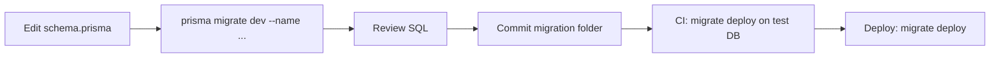
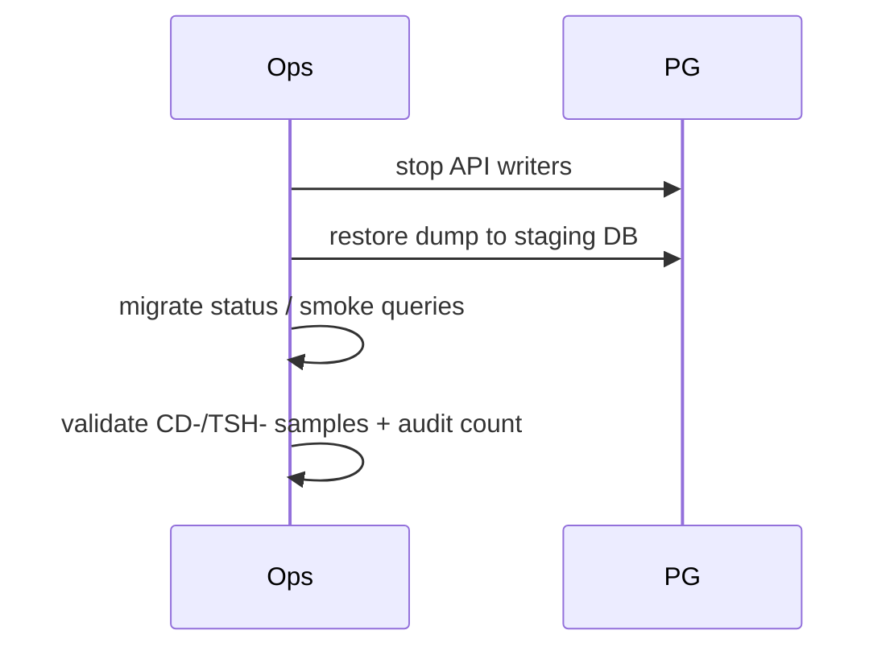

# Migration & Backup — CDT

## Purpose

Define Prisma migration workflow, seed expectations, and backup/restore practices for CDT PostgreSQL.

## Audience

Backend engineers, DevOps, tech leads.

## Scope

MVP local/Compose Postgres. Managed cloud PITR is Future (`19-cloud` / `20-maintenance`).

## Definitions

| Term | Definition |
|------|------------|
| Migrate deploy | Apply committed migrations non-interactively |
| Migrate dev | Create migration from schema diff (dev only) |
| PITR | Point-in-time recovery |
| Seed | Idempotent demo/reference data |

---

## 1. Migration workflow



| Command | Environment | Purpose |
|---------|-------------|---------|
| `prisma migrate dev` | Local | Create + apply |
| `prisma migrate deploy` | CI/Compose/prod-like | Apply only |
| `prisma migrate status` | Any | Drift check |
| `prisma db seed` | Local/demo | Seed |

**Rules**

- Never edit applied migration SQL after share/merge; add a new migration.
- No `db push` on shared environments.
- Migrations run before API readiness.

## 2. Migration naming

```text
YYYYMMDDHHMMSS_add_timesheets
YYYYMMDDHHMMSS_add_unique_candidate_month
YYYYMMDDHHMMSS_add_audit_logs_indexes
```

## 3. Seed contents (MVP)

| Data | Notes |
|------|-------|
| Roles via enum | N/A seed |
| Admin user | Known demo password only in local |
| `id_sequences` | CD, LV, TSH, DEL starting 1 |
| Lookup types/values | LEAVE_TYPE etc. |
| Sample client + candidate | Optional demo |
| Sample leave/TS/DR | Optional for UAT |

Seed must be **idempotent** (upsert by natural keys).

## 4. Backup (MVP)

| Method | When | How |
|--------|------|-----|
| `pg_dump` custom format | Before risky migrate / daily | `pg_dump -Fc cdt > cdt_YYYYMMDD.dump` |
| Volume snapshot | VM hosts | Snapshot `cdt_pg_data` |
| Logical export | Support | CSV of critical tables optional |

```text
# backup
pg_dump -Fc -h localhost -U cdt -d cdt -f backups/cdt_$(date +%Y%m%d).dump

# restore (destructive)
pg_restore -c -h localhost -U cdt -d cdt backups/cdt_YYYYMMDD.dump
```

Store backups off the same disk as Postgres data when possible.

## 5. Restore drill



Quarterly restore drill recommended even for MVP internal apps.

## 6. Destructive changes

| Change type | Process |
|-------------|---------|
| Drop column | Expand/contract: stop reads → migrate → deploy code |
| Change enum | Add value first; remove later |
| Backfill | Data migration SQL in migration or scripted job |
| Unique constraint add | Dedupe query first |

## MVP vs Future

| Topic | MVP | Future |
|-------|-----|--------|
| Backups | Manual/scheduled pg_dump | Managed automated + PITR |
| Multi-env promote | Dev → staging → prod-like | Same with approval gates |
| Online DDL | Accept brief locks | Expand/contract + blue-green |

## Trade-offs

| Decision | Why |
|----------|-----|
| Prisma migrate over raw SQL-only | Typed schema + history |
| Seed not in migrate | Keeps schema history clean |
| Custom-format dumps | Compression + selective restore |

## Recommendations

- Gate production-like deploys on `migrate status` success.
- Keep backup retention ≥ 14 days for MVP demos; longer for real HR data.
- Document who may run restore (ADMIN ops only).

## References

- [PRISMA_DESIGN.md](./PRISMA_DESIGN.md)
- [../06-system-design/DEPLOYMENT.md](../06-system-design/DEPLOYMENT.md)
- [../20-maintenance/](../20-maintenance/) (when authored)
