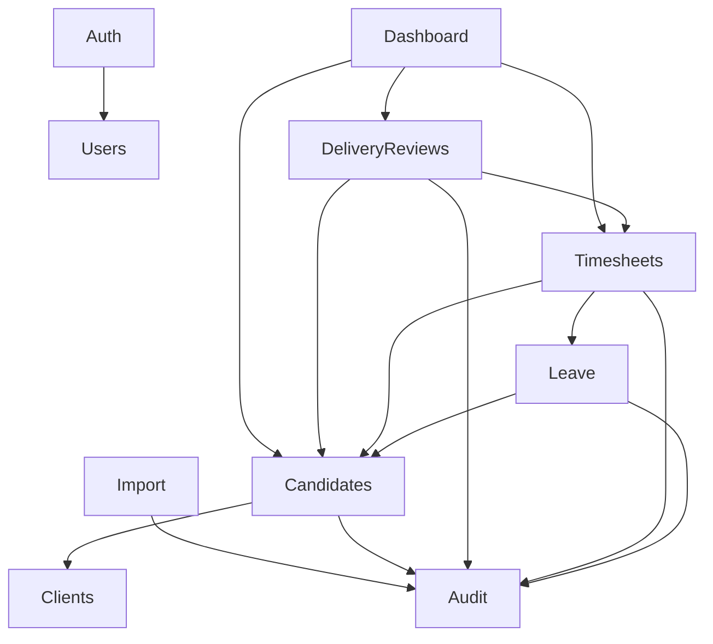

# Module Catalog — CDT API

## Purpose

Catalog Nest modules, responsibilities, HTTP surface, and dependencies for CDT MVP.

## Audience

Backend engineers, reviewers, QA mapping tests to modules.

## Scope

MVP modules listed below. Sync/Notification modules are Future.

## Definitions

See [NESTJS_ARCHITECTURE.md](./NESTJS_ARCHITECTURE.md).

Roles: `ADMIN`, `DELIVERY_MANAGER`, `ACCOUNT_MANAGER`.

**Canonical RBAC:**

| Action | Roles |
|--------|-------|
| Candidate create/update/release | ADMIN, DELIVERY_MANAGER |
| Leave / timesheet approve/reject | ADMIN, ACCOUNT_MANAGER |
| Leave create | ADMIN, DELIVERY_MANAGER |
| Timesheet upsert | ADMIN, DELIVERY_MANAGER |
| Delivery review upsert | ADMIN, DELIVERY_MANAGER |
| Invoice generate | ADMIN, DELIVERY_MANAGER, ACCOUNT_MANAGER |
| Invoice approve/reject | ADMIN, ACCOUNT_MANAGER |

---

## Modules overview

| Module | Responsibility | Depends on |
|--------|----------------|------------|
| AuthModule | Login, refresh, logout, me | Users, Prisma |
| UsersModule | User CRUD, reset password | Prisma, Audit |
| ClientsModule | Client master CRUD | Prisma, Audit |
| CandidatesModule | Candidate CRUD, soft release | Clients, Prisma, Audit |
| LeaveModule | Leave lifecycle + approval | Candidates, Prisma, Audit |
| TimesheetsModule | Monthly timesheet + attendance calc | Leave, Candidates, Audit |
| DeliveryReviewsModule | Monthly health judgment | Candidates, Timesheets (read), Audit |
| DashboardModule | Aggregations / utilization views | Prisma read |
| LookupsModule | Lookup types/values | Prisma, Audit |
| AuditModule | Write helper + ADMIN read API | Prisma |
| ImportModule | Excel/CSV dry-run + commit | Prisma, Audit |
| InvoicesModule | Budget invoice generate + review | Timesheets, Candidates, Audit |
| HealthModule | health/ready/metrics | Prisma |

---

## AuthModule

| Item | Detail |
|------|--------|
| Path | `/api/v1/auth` |
| Endpoints | `POST login`, `POST refresh`, `POST logout`, `GET me` |
| Notes | Public login/refresh; logout authenticated; issue JWT + refresh hash |

---

## UsersModule

| Item | Detail |
|------|--------|
| Path | `/api/v1/users` |
| Roles | ADMIN mutate; authenticated directory read optional |
| Endpoints | `GET /`, `POST /`, `GET /:id`, `PATCH /:id`, `POST /:id/reset-password` |
| Notes | Soft-deactivate via `isActive` / `deletedAt` |

---

## ClientsModule

| Item | Detail |
|------|--------|
| Path | `/api/v1/clients` |
| Roles | Read: authenticated; Mutate: ADMIN, DELIVERY_MANAGER |
| Endpoints | `GET /`, `GET /:id`, `POST /`, `PATCH /:id`, `DELETE /:id` (soft) |
| Notes | Unique normalized name |

---

## CandidatesModule

| Item | Detail |
|------|--------|
| Path | `/api/v1/candidates` |
| Public ID | `CD-#####` |
| Roles | Read: all auth roles; Create/Update/Release: **ADMIN, DELIVERY_MANAGER only** |
| Endpoints | `GET /`, `GET /:id`, `POST /`, `PATCH /:id`, `POST /:id/release` |
| BR | Soft release; block new LV/TS/DR when RELEASED |
| `:id` | UUID or `CD-#####` |

---

## LeaveModule

| Item | Detail |
|------|--------|
| Path | `/api/v1/leaves` |
| Public ID | `LV-#####` |
| Roles | Create: ADMIN, DM, HR; **Approve/reject: ADMIN, HR**; Read: auth roles |
| Endpoints | `GET /`, `GET /:id`, `POST /` (creates Pending), `PATCH /:id`, `POST /:id/approve`, `POST /:id/reject` |
| BR | Status machine Pending→Approved/Rejected; only APPROVED counted in timesheet |
| Notes | MVP: create-as-Pending (no Draft) |

---

## TimesheetsModule

| Item | Detail |
|------|--------|
| Path | `/api/v1/timesheets` |
| Public ID | `TSH-#####` |
| Roles | Upsert/recalc: ADMIN, DM; **Approve/reject: ADMIN, HR**; Read: auth |
| Endpoints | `GET /`, `GET /:id`, `PUT /` (upsert), `POST /:id/recalculate`, `POST /:id/approve`, `POST /:id/reject` |
| BR | Unique candidate+month; attendance = daysWorked/workingDays; approved leave only |
| Notes | Server computes leaveDays and attendancePct; includes `approvalStatus` |

---

## DeliveryReviewsModule

| Item | Detail |
|------|--------|
| Path | `/api/v1/delivery-reviews` |
| Public ID | `DEL-#####` |
| Roles | Upsert: ADMIN, DM; Read: auth roles |
| Endpoints | `GET /`, `GET /:id`, `PUT /` (upsert by candidate+month) |
| BR | Unique candidate+month; At Risk/Escalated ⇒ escalationNotes required |
| Notes | Fields: utilizationPct, clientFeedback, engagementHealth, timesheetMissing |

---

## DashboardModule

| Item | Detail |
|------|--------|
| Path | `/api/v1/dashboard` |
| Roles | All authenticated |
| Endpoints | `GET /summary` (filters: clientId, health, month) |
| Notes | On Leave Today ignores month filter |

---

## LookupsModule

| Item | Detail |
|------|--------|
| Path | `/api/v1/lookups` |
| Roles | Read: auth; Mutate: ADMIN |
| Endpoints | `GET /`, `POST /`, `PATCH /:id` |
| Types | leave_type, work_location, client_feedback, engagement_health, … |

---

## AuditModule

| Item | Detail |
|------|--------|
| Path | `/api/v1/audit` |
| Roles | Read: ADMIN |
| Endpoints | `GET /` filtered by entity/actor/date |
| Notes | Writer service used by other modules |

---

## ImportModule

| Item | Detail |
|------|--------|
| Path | `/api/v1/import` |
| Roles | ADMIN |
| Endpoints | `POST /dry-run`, `POST /commit` |
| Notes | Clients, Candidates, Leave, Timesheets, Delivery Reviews |

---

## HealthModule

| Item | Detail |
|------|--------|
| Path | `/health`, `/ready`, `/metrics` |
| Auth | Public |

---

## Communication rules

- TimesheetsModule **reads** approved leaves; does not change leave status.
- DeliveryReviewsModule **reads** timesheets; does not mutate them.
- DashboardModule must not import write services.
- Avoid circular Nest imports; extract shared helpers to `common/` / `@cdt/shared-utils`.

## Future modules

| Module | Purpose |
|--------|---------|
| SstSyncModule | Ingest Joined candidates |
| BillingExportModule | Push attendance |
| NotificationsModule | Email/Teams on escalation |
| HolidaysModule | Working-day calendars |

## Trade-offs

| Decision | Why |
|----------|-----|
| Separate Leave vs Timesheets | Different lifecycles and RBAC |
| PUT upsert for period docs | Matches unique BR naturally |
| Dashboard module isolation | Prevent analytics side-writes |

## References

- [NESTJS_ARCHITECTURE.md](./NESTJS_ARCHITECTURE.md)
- [../10-api/API_CATALOG.md](../10-api/API_CATALOG.md)
- [../11-security/PERMISSION_MATRIX.md](../11-security/PERMISSION_MATRIX.md)
- [../DOC_REVIEW_FINDINGS.md](../DOC_REVIEW_FINDINGS.md)
