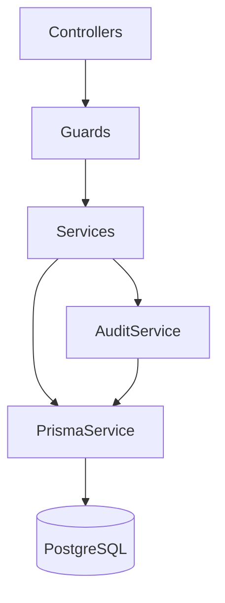

# NestJS Architecture — CDT API

## Purpose

Define layered NestJS architecture, module boundaries, and coding conventions for `apps/api`.

## Audience

Backend engineers, reviewers.

## Scope

MVP modular monolith. Microservice split is Future.

## Definitions

| Term | Definition |
|------|------------|
| Controller | HTTP adapter; no BR |
| Application service | Use-case orchestration + transactions |
| Domain service | Pure BR / transitions |
| Repository | Prisma access wrapper (or PrismaService direct with discipline) |

---

## 1. Layering

```text
HTTP (Controller + DTO)
  → Guards (JWT, Roles)
  → Pipes (validation)
  → Application Service
      → Domain Service / calculators
      → Prisma / repositories
      → AuditService
  → Interceptors (logging, response envelope)
  → Filters (exception → error envelope)
```



## 2. App structure

```text
apps/api/src/
  main.ts
  app.module.ts
  common/           # guards, filters, pipes, decorators, interceptors
  config/
  prisma/
  modules/
    auth/
    users/
    clients/
    candidates/
    leave/
    timesheets/
    delivery-reviews/
    dashboard/
    lookups/
    audit/
    health/
```

## 3. Module rules

| Rule | Detail |
|------|--------|
| One domain module folder | Controllers, services, DTOs colocated |
| Export only facades | Other modules import `XxxModule` public services |
| No cross-Prisma writes | Timesheet may **read** Leave via LeaveService/repo API |
| Dashboard read-only | No mutations |
| Shared enums/types | Prefer `packages/shared-types` |

## 4. Auth wiring

- `PassportModule` + `JwtStrategy` extracting Bearer token
- `@Public()` for login/refresh/health
- `@Roles(Role.ADMIN, …)` on controllers/handlers
- Refresh rotation in AuthService

## 5. Validation & OpenAPI

- Request DTOs: `class-validator` + `class-transformer`
- Shared Zod schemas optional for FE/BE parity in `packages/shared-types`
- `@nestjs/swagger` decorators on controllers; build OpenAPI at `/docs`

## 6. Error handling

Map domain errors to HTTP:

| Domain | HTTP |
|--------|------|
| Not found | 404 |
| Validation / BR | 400 |
| Unique period | 409 |
| Auth | 401 |
| RBAC | 403 |

Envelope: see [../10-api/ERRORS_PAGINATION_FILTERING.md](../10-api/ERRORS_PAGINATION_FILTERING.md).

## 7. Transactions

Use interactive transactions for:

- Public ID allocation + insert
- Leave approve + audit
- Timesheet upsert + audit
- Candidate release + audit

## 8. Logging

- Pino via `nestjs-pino` (or equivalent)
- Correlate `requestId`
- Never log passwords, tokens, refresh raw values

## MVP vs Future

| Topic | MVP | Future |
|-------|-----|--------|
| Modular monolith | Yes | Extract workers for sync |
| Domain events bus | In-process optional | Queue (SQS/Rabbit) |
| CQRS | No | Dashboard read models if needed |

## Trade-offs

| Decision | Why |
|----------|-----|
| Services over heavy DDD factories | Speed for internal CRUD+BR app |
| Prisma in services | Less boilerplate at MVP size |
| Global PrismaModule | Ergonomics; still enforce write ownership by convention |

## Recommendations

- Put attendance math in `AttendanceCalculator` pure functions for unit tests.
- Keep controllers thin (<15 lines per handler ideal).
- Align folder names with [MODULE_CATALOG.md](./MODULE_CATALOG.md).

## References

- [MODULE_CATALOG.md](./MODULE_CATALOG.md)
- [CROSS_CUTTING.md](./CROSS_CUTTING.md)
- [../06-system-design/C4_MODEL.md](../06-system-design/C4_MODEL.md)
