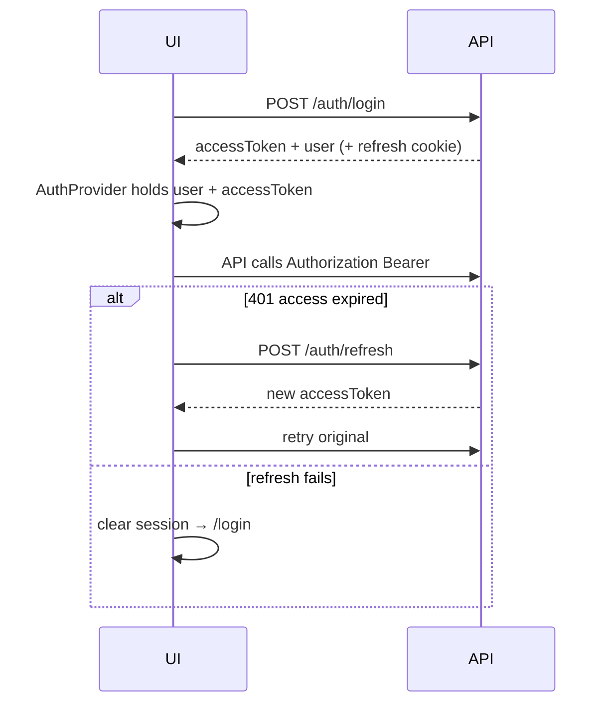

# Auth & Routing — CDT Web

## Purpose

Define SPA authentication session handling and route protection for CDT roles.

## Audience

Frontend engineers, security reviewers.

## Scope

MVP JWT access + refresh flow with React Router guards. SSO is Future.

## Definitions

| Term | Definition |
|------|------------|
| Access token | Short-lived JWT in memory (preferred) |
| Refresh token | HttpOnly cookie (preferred) or rotated body token |
| Route guard | Loader/`Navigate` based on auth+role |

---

## 1. Session lifecycle



## 2. AuthProvider responsibilities

| Duty | Detail |
|------|--------|
| Boot | Try refresh or `/auth/me` |
| Login/logout | Mutations + cache clear |
| Expose | `user`, `role`, `isAuthenticated`, `hasRole(...)` |
| Axios | Attach Bearer; single-flight refresh |

On logout: `POST /auth/logout`, clear QueryClient, redirect `/login`.

## 3. Routing structure

```text
/login                          PublicOnly
/                               RequireAuth → Dashboard
/candidates/*                   RequireAuth + roles
/leaves/*                       RequireAuth + roles
/timesheets/*                   RequireAuth + roles
/delivery-reviews/*             RequireAuth + roles
/clients/*                      RequireAuth + roles
/admin/*                        RequireAuth + ADMIN
/*
```

```mermaid
flowchart TB
  Req[Request route]
  Authed{Authenticated?}
  Role{Role allowed?}
  Login[/login]
  Page[Feature page]
  Forbidden[403 page]

  Req --> Authed
  Authed -->|no| Login
  Authed -->|yes| Role
  Role -->|yes| Page
  Role -->|no| Forbidden
```

## 4. Role → default landing

| Role | Landing |
|------|---------|
| ADMIN | Dashboard (or Users if deep-link) |
| DELIVERY_MANAGER | Dashboard |
| HR | Candidates |
| INTERNAL_MANAGER | Dashboard |

## 5. Nav visibility (UX only)

| Nav item | ADMIN | DM | HR | IM |
|----------|-------|----|----|----|
| Dashboard | Y | Y | Y | Y |
| Candidates | Y | Y | Y | Y (read) |
| Leave | Y | Y | Y | Y (read) |
| Timesheets | Y | Y | R* | Y (read) |
| Delivery Reviews | Y | Y | R* | Y (read) |
| Clients | Y | Y | — | R |
| Users / Lookups / Audit | Y | — | — | — |

\* HR read access per permission matrix; mutate limited.

## 6. Deep links & public IDs

Routes may accept public ids in path (`/candidates/CD-00012`). API resolves UUID or publicId; FE displays publicId in breadcrumbs.

## MVP vs Future

| Topic | MVP | Future |
|-------|-----|--------|
| Password login | Yes | SSO/OIDC |
| Remember me | Refresh TTL only | Configurable |
| Step-up auth | No | For release/approve |

## Trade-offs

| Decision | Why |
|----------|-----|
| Memory access token | Reduce XSS token theft vs localStorage |
| FE role gates | UX; server still enforces |
| PublicOnly on login | Prevent authed users seeing login |

## Recommendations

- Implement axios interceptor with a refresh mutex to avoid stampedes.
- Never store passwords; never log tokens.

## References

- [STATE_AND_DATA_FETCHING.md](./STATE_AND_DATA_FETCHING.md)
- [../11-security/AUTH_RBAC.md](../11-security/AUTH_RBAC.md)
- [../10-api/API_CATALOG.md](../10-api/API_CATALOG.md)
