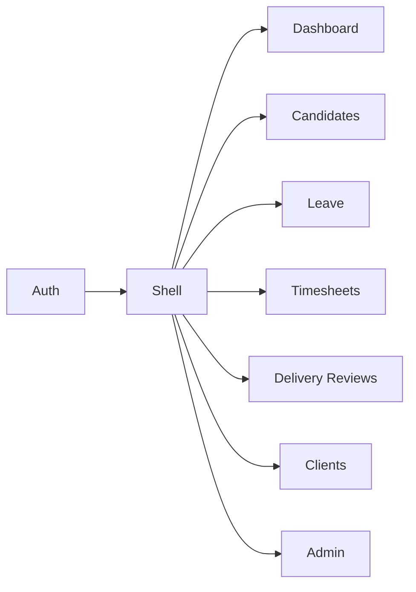

# Feature Modules — CDT Web

## Purpose

Catalog SPA feature areas, primary screens, and their API dependencies.

## Audience

Frontend engineers, UX implementers, QA.

## Scope

MVP screens aligned to Candidate → Leave/Timesheet → Delivery Review → Dashboard.

## Definitions

| Term | Definition |
|------|------------|
| Screen | Routable page |
| Action | Button/mutation gated by role |

---

## Feature map

| Feature | Routes (illustrative) | Primary roles |
|---------|----------------------|---------------|
| auth | `/login` | Public |
| dashboard | `/` or `/dashboard` | All |
| candidates | `/candidates`, `/candidates/:id` | DM, HR, ADMIN |
| leave | `/leaves`, `/leaves/new`, `/leaves/:id` | DM, HR, ADMIN |
| timesheets | `/timesheets`, `/timesheets/:id` | DM, ADMIN |
| delivery-reviews | `/delivery-reviews`, `/delivery-reviews/:id` | DM, ADMIN |
| clients | `/clients` | DM, ADMIN |
| admin/users | `/admin/users` | ADMIN |
| admin/lookups | `/admin/lookups` | ADMIN |

---

## auth

| Screen | Behavior |
|--------|----------|
| Login | Email/password → store session → redirect |
| Session restore | `GET /auth/me` on boot |

---

## dashboard

| Widget | Source |
|--------|--------|
| Summary tiles | `GET /dashboard/summary` |
| Utilization table | `GET /dashboard/utilization?yearMonth=` |
| Health RAG | `GET /dashboard/engagement-health` |
| At risk list | `GET /dashboard/candidates-at-risk` |

Filters: month, client. Read-only.

---

## candidates

| Screen | Actions |
|--------|---------|
| List | Search, filter status ACTIVE/RELEASED, client |
| Create/Edit | Master fields, client select |
| Detail | Tabs: Leave, Timesheets, Reviews |
| Release | Confirm dialog → `POST /candidates/:id/release` |

Show publicId `CD-#####` prominently.

---

## leave

| Screen | Actions |
|--------|---------|
| List | Filter status, candidate, date range |
| Create | Candidate, type, dates, days, reason |
| Submit | DRAFT → PENDING |
| Approve/Reject | DM/ADMIN; reject requires reason |
| Cancel | When allowed by status |

UI must not treat non-approved leave as affecting attendance displays except as “pending impact” hints.

---

## timesheets

| Screen | Actions |
|--------|---------|
| List | Filter yearMonth, client, candidate |
| Upsert form | workingDays, remarks; show approvedLeaveDays + computed attendance |
| Recalculate | Calls `POST /timesheets/:id/recalculate` after late approvals |

Enforce one row per candidate+month in UI (disable duplicate create; use edit).

---

## delivery-reviews

| Screen | Actions |
|--------|---------|
| List | Filter month, health |
| Upsert form | health select; escalationNotes required when ESCALATED |
| Snapshot | Show timesheet attendance if exists |

---

## clients

| Screen | Actions |
|--------|---------|
| List/Create/Edit | Name, code, active |

---

## admin

| Screen | Actions |
|--------|---------|
| Users | CRUD-ish, role, active, reset password |
| Lookups | Manage LEAVE_TYPE, RELEASE_REASON, … |
| Audit (optional MVP UI) | Read-only table |

---

## MVP vs Future

| Feature | MVP | Future |
|---------|-----|--------|
| SST import UI | Manual/CSV optional | Sync status panel |
| Notifications center | No | Escalation inbox |
| Holiday calendar admin | No | Yes |

## Trade-offs

| Decision | Why |
|----------|-----|
| Detail tabs for candidate | Natural chain navigation |
| Separate timesheet vs leave apps areas | Different approvers/cadence |
| Dashboard home | Managers land on oversight |

## Recommendations

- Gate nav items with the permission matrix but still handle 403.
- Use identical yearMonth picker component across TS, DR, dashboard.

## References

- [FRONTEND_ARCHITECTURE.md](./FRONTEND_ARCHITECTURE.md)
- [AUTH_AND_ROUTING.md](./AUTH_AND_ROUTING.md)
- [../11-security/PERMISSION_MATRIX.md](../11-security/PERMISSION_MATRIX.md)
