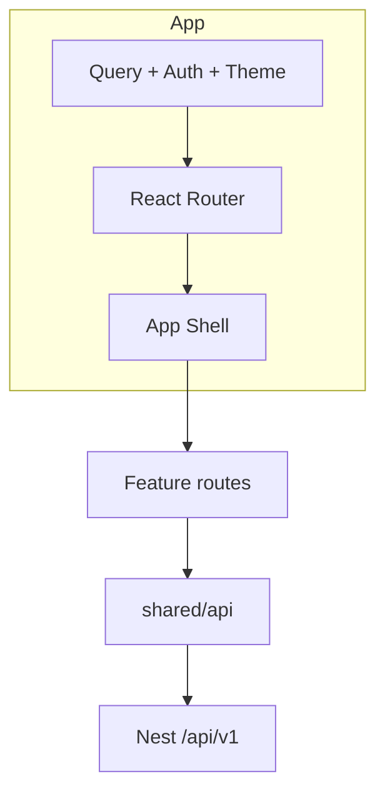

# Frontend Architecture — CDT Web

## Purpose

Describe the React/Vite SPA architecture for CDT (`apps/web`).

## Audience

Frontend engineers, full-stack developers.

## Scope

MVP SPA with ShadCN, TanStack Query, React Router, RHF, Zod, Axios. SSR/Next is out of scope.

## Definitions

| Term | Definition |
|------|------------|
| Feature module | Vertical folder for a domain area |
| Shell | Authenticated layout: nav + outlet |
| Public route | Login (unauthenticated) |

---

## 1. Stack

| Concern | Choice |
|---------|--------|
| Bundler | Vite |
| UI | React + Tailwind + ShadCN |
| Routing | React Router |
| Server state | TanStack Query |
| Forms | React Hook Form + Zod |
| HTTP | Axios instance |
| Auth tokens | Memory access token + httpOnly refresh cookie (or secure storage pattern per security doc) |

## 2. Folder layout

```text
apps/web/src/
  app/                 # providers, router, shell
  features/
    auth/
    dashboard/
    candidates/
    leave/
    timesheets/
    delivery-reviews/
    clients/
    admin/             # users + lookups
  shared/
    ui/                # ShadCN wrappers
    api/               # axios, query keys
    lib/               # utils, formatters
    types/             # re-exports from shared-types
  styles/
```



## 3. Rendering model

- CSR SPA only
- Route-level code splitting via `React.lazy` for heavy feature pages
- Tables for operational lists; forms for create/edit
- Dashboard: charts/tables fed by dedicated endpoints (no N+1 client joins)

## 4. Design system

- ShadCN components as primitives (Button, Table, Dialog, Select, Toast)
- CSS variables for brand tokens (avoid generic AI-default purple theme unless brand mandates)
- Consistent page header: title + primary action

## 5. Environment

| Var | Purpose |
|-----|---------|
| `VITE_API_BASE_URL` | API origin or empty for same-origin proxy |

Dev proxy: `/api` → `http://localhost:3000`.

## 6. Error & loading UX

| State | Pattern |
|-------|---------|
| Query loading | Skeleton / table spinner |
| Mutation error | Toast + field errors from envelope |
| 401 | Auth layer refresh → retry → login redirect |
| 403 | Inline “not authorized” empty state |

## MVP vs Future

| Topic | MVP | Future |
|-------|-----|--------|
| PWA / offline | No | Optional |
| Microfrontends | No | No plan |
| Realtime WS | No | Escalation toasts |

## Trade-offs

| Decision | Why |
|----------|-----|
| Feature folders over type folders | Matches domain chain |
| TanStack Query over Redux | Server-state heavy CRUD app |
| ShadCN | Fast accessible UI without heavy custom kit |

## Recommendations

- Keep business rules display-only; always trust API recalculation for attendance %.
- Colocate route components with feature hooks (`useLeavesQuery`, etc.).

## References

- [FEATURE_MODULES.md](./FEATURE_MODULES.md)
- [AUTH_AND_ROUTING.md](./AUTH_AND_ROUTING.md)
- [STATE_AND_DATA_FETCHING.md](./STATE_AND_DATA_FETCHING.md)
- [../05-ux/](../05-ux/) (when authored)
