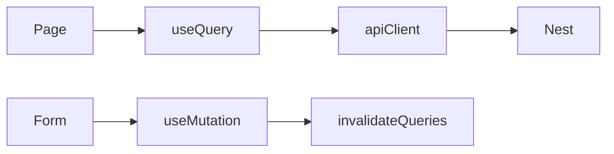

# State & Data Fetching — CDT Web

## Purpose

Define client state strategy: TanStack Query for server state, minimal local UI state, form state via RHF.

## Audience

Frontend engineers.

## Scope

MVP patterns for list/detail/mutations across CDT features.

## Definitions

| Term | Definition |
|------|------------|
| Server state | Data owned by API |
| UI state | Modals, tabs, wizard steps |
| Query key | Stable cache identity |

---

## 1. State split

| Kind | Tool | Examples |
|------|------|----------|
| Server | TanStack Query | candidates, leaves, timesheets, reviews, dashboard |
| Form | RHF + Zod | create leave, upsert review |
| Auth session | React context | user, accessToken |
| Ephemeral UI | useState | dialog open, selected month |

No global Redux for MVP.

## 2. Query key convention

```text
['candidates', { page, q, status, clientId }]
['candidate', id]
['leaves', filters]
['timesheets', filters]
['delivery-reviews', filters]
['dashboard', 'utilization', { yearMonth, clientId }]
['lookups', type]
['me']
```

## 3. Fetching patterns



| Pattern | When |
|---------|------|
| `useQuery` | Lists, detail, dashboard |
| `useMutation` | Create/update/approve/release |
| Optimistic updates | Optional for approve; prefer invalidate for MVP |
| Dependent queries | Review form loads timesheet after candidate+month chosen |

## 4. Invalidation map

| Mutation | Invalidate |
|----------|------------|
| Leave approve/reject | `leaves`, `timesheets` (hints), candidate detail |
| Timesheet upsert/recalc | `timesheets`, `dashboard`, related review |
| Delivery review upsert | `delivery-reviews`, `dashboard` |
| Candidate release | `candidates`, `dashboard` |
| Lookup mutate | `lookups` |

## 5. Axios client

| Concern | Behavior |
|---------|----------|
| Base URL | `VITE_API_BASE_URL` |
| Auth header | Bearer access |
| 401 | Refresh once → retry |
| Errors | Parse envelope `error.code` |
| Timeout | Reasonable default (e.g. 30s) |

## 6. Forms & Zod

- Schema shared from `packages/shared-types` when possible
- Delivery review schema: refine escalationNotes when health === `ESCALATED`
- Timesheet: do not submit client-computed attendance as source of truth; display API result after save

## 7. Pagination

- Use API `page`, `pageSize`, `total`
- Keep filters in URL search params for shareable lists (`?yearMonth=2026-08&page=2`)

## 8. Caching defaults (suggested)

| Query | staleTime |
|-------|-----------|
| Lookups | 5–30 min |
| Dashboard | 30–60 s |
| Lists | 15–30 s |
| Detail | 15 s |

## MVP vs Future

| Topic | MVP | Future |
|-------|-----|--------|
| Normalized client store | No | Only if extreme duplication |
| Websocket invalidation | No | On escalation events |
| Persist query cache | No | Optional |

## Trade-offs

| Decision | Why |
|----------|-----|
| Invalidate over heavy optimism | Safer with BR-derived fields |
| URL filter state | Matches manager sharing habits |
| Context only for auth | Avoid prop-drilling tokens |

## Recommendations

- Centralize API functions in `shared/api/*.ts` per resource.
- Add MSW or contract tests against OpenAPI for critical mutations.

## References

- [FRONTEND_ARCHITECTURE.md](./FRONTEND_ARCHITECTURE.md)
- [../10-api/ERRORS_PAGINATION_FILTERING.md](../10-api/ERRORS_PAGINATION_FILTERING.md)
- [../08-backend/CROSS_CUTTING.md](../08-backend/CROSS_CUTTING.md)
