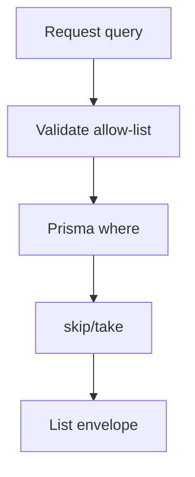

# Errors, Pagination & Filtering — CDT API

## Purpose

Normative error envelope, error codes, pagination, sorting, and filter conventions.

## Audience

Backend, frontend, QA.

## Scope

MVP REST JSON API. GraphQL/cursor pagination Future optional.

## Definitions

| Term | Definition |
|------|------------|
| Error code | Stable machine string (`ESCALATION_NOTES_REQUIRED`) |
| page | 1-based page index |
| pageSize | Page length capped by API |

---

## 1. Success envelopes

### Single resource

```json
{
  "success": true,
  "data": { },
  "meta": { "requestId": "uuid" }
}
```

### List

```json
{
  "success": true,
  "data": [ ],
  "meta": {
    "page": 1,
    "pageSize": 20,
    "total": 135,
    "requestId": "uuid"
  }
}
```

## 2. Error envelope

```json
{
  "success": false,
  "error": {
    "code": "ESCALATION_NOTES_REQUIRED",
    "message": "Human readable summary",
    "details": [
      { "field": "escalationNotes", "message": "Required when health is ESCALATED" }
    ]
  },
  "meta": { "requestId": "uuid" }
}
```

## 3. HTTP mapping

| HTTP | When |
|------|------|
| 400 | Validation, BR violations |
| 401 | Missing/invalid auth |
| 403 | Authenticated but role/policy deny |
| 404 | Entity not found |
| 409 | Unique conflict (period, email, client name) |
| 429 | Rate limit (login) |
| 500 | Unexpected |

## 4. Standard error codes (MVP)

| Code | HTTP | Meaning |
|------|------|---------|
| `VALIDATION_FAILED` | 400 | DTO validation |
| `INVALID_CREDENTIALS` | 401 | Login failed |
| `UNAUTHORIZED` | 401 | No/invalid token |
| `FORBIDDEN` | 403 | RBAC deny |
| `NOT_FOUND` | 404 | Missing entity |
| `UNIQUE_PERIOD` | 409 | Duplicate timesheet/review month |
| `UNIQUE_CONSTRAINT` | 409 | Other unique (email, client) |
| `INVALID_STATE_TRANSITION` | 400 | Leave status machine violation |
| `ESCALATION_NOTES_REQUIRED` | 400 | Review BR |
| `CANDIDATE_RELEASED` | 400/409 | Mutation blocked on released candidate |
| `ALREADY_RELEASED` | 409 | Release idempotency conflict |
| `ZERO_WORKING_DAYS` | 400 | Cannot compute attendance |
| `INTERNAL_ERROR` | 500 | Unexpected |

## 5. Pagination

| Param | Type | Default | Max |
|-------|------|---------|-----|
| `page` | int | 1 | — |
| `pageSize` | int | 20 | 100 |

Out-of-range page → empty `data` with accurate `total`.

## 6. Sorting

| Param | Format |
|-------|--------|
| `sort` | `field` asc or `-field` desc |

Allow-list per resource (reject unknown fields with `VALIDATION_FAILED`).

Examples:

- Candidates: `fullName`, `-createdAt`, `publicId`
- Leaves: `-startDate`, `status`
- Timesheets: `-yearMonth`, `attendancePct`

## 7. Common filters

| Param | Resources | Notes |
|-------|-----------|-------|
| `q` | users, clients, candidates | Name/email/publicId ILIKE |
| `clientId` | candidates, timesheets, reviews, dashboard | UUID |
| `candidateId` | leaves, timesheets, reviews | UUID or publicId |
| `status` | candidates, leaves | Enum |
| `health` | delivery-reviews, dashboard | Enum |
| `yearMonth` | timesheets, reviews, dashboard | `YYYY-MM` |
| `from` / `to` | leaves, audit | ISO dates |
| `actorUserId` | audit | UUID |

## 8. Filtering semantics

- AND across different params
- Soft-deleted rows excluded by default
- Released candidates excluded unless `status=RELEASED` or `includeReleased=true` (if implemented)



## MVP vs Future

| Topic | MVP | Future |
|-------|-----|--------|
| Offset pagination | Yes | Cursor for huge audit |
| Multi-sort | Single field | Multi-field |
| Sparse fieldsets | No | Optional |

## Trade-offs

| Decision | Why |
|----------|-----|
| Stable string codes | FE branching without parsing messages |
| Offset pagination | Simpler for internal tables |
| Allow-listed sort | Prevent SQL injection via Prisma orderBy |

## Recommendations

- Share error code union type in `packages/shared-types`.
- Log `requestId` + code on 4xx/5xx for support.

## References

- [API_CATALOG.md](./API_CATALOG.md)
- [OPENAPI_CONVENTIONS.md](./OPENAPI_CONVENTIONS.md)
- [../08-backend/CROSS_CUTTING.md](../08-backend/CROSS_CUTTING.md)
