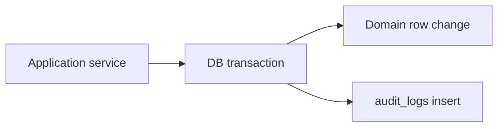

# Audit Logging — CDT

## Purpose

Normative application audit logging for security, compliance, and operational forensics.

## Audience

Backend engineers, security, compliance stakeholders, ADMIN operators.

## Scope

MVP append-only `audit_logs` for authentication and domain mutations. Full SIEM integration is Future.

## Definitions

| Term | Definition |
|------|------------|
| Audit event | Immutable record of who did what to which entity when |
| Actor | Authenticated user id (nullable for failed login) |
| Redaction | Removal of secrets from before/after JSON |

---

## 1. Principles

1. **Append-only** — no update/delete APIs for audit rows  
2. **Transactional** — write with the domain change when possible  
3. **Attribution** — store actor, action, entity ids/public ids  
4. **Minimization** — redact secrets; avoid unbounded blobs  
5. **ADMIN read** — query API restricted to ADMIN  

## 2. Event catalog (MVP)

| Action | Entity | When |
|--------|--------|------|
| `LOGIN_SUCCESS` | USER | Successful login |
| `LOGIN_FAILURE` | USER/null | Bad credentials (limit detail) |
| `LOGOUT` | USER | Logout |
| `TOKEN_REFRESH` | USER | Optional; may sample to reduce noise |
| `USER_CREATED` / `USER_UPDATED` / `PASSWORD_RESET` | USER | Admin user ops |
| `CLIENT_CREATED` / `CLIENT_UPDATED` / `CLIENT_DELETED` | CLIENT | Master changes |
| `LOOKUP_CREATED` / `LOOKUP_UPDATED` | LOOKUP_VALUE | Master changes |
| `CANDIDATE_CREATED` / `CANDIDATE_UPDATED` | CANDIDATE | Master |
| `CANDIDATE_RELEASED` | CANDIDATE | Soft release |
| `LEAVE_CREATED` / `LEAVE_UPDATED` | LEAVE | Draft edits |
| `LEAVE_SUBMITTED` / `LEAVE_APPROVED` / `LEAVE_REJECTED` / `LEAVE_CANCELLED` | LEAVE | Workflow |
| `TIMESHEET_UPSERTED` / `TIMESHEET_RECALCULATED` | TIMESHEET | Period docs |
| `DELIVERY_REVIEW_UPSERTED` | DELIVERY_REVIEW | Period docs |

## 3. Record shape

| Field | Required | Notes |
|-------|----------|-------|
| entityType | Yes | `CANDIDATE`, `LEAVE`, … |
| entityId | Yes when known | UUID |
| entityPublicId | Preferred | `CD-…` etc. |
| action | Yes | From catalog |
| actorUserId | When authed | |
| beforeJson / afterJson | Mutation diffs | Redacted |
| ip / userAgent | Optional | From request |
| createdAt | Yes | Server time |

### Redaction list

- `password`, `passwordHash`
- `accessToken`, `refreshToken`, `tokenHash`
- Any Authorization header material

## 4. API

| Method | Path | Role |
|--------|------|------|
| GET | `/api/v1/audit-logs` | ADMIN |

Filters: `entityType`, `entityId`, `entityPublicId`, `actorUserId`, `action`, `from`, `to`, pagination.

No POST/PATCH/DELETE for clients.

## 5. Correlation with ops logs

| Channel | Use |
|---------|-----|
| Pino request logs | Latency, status, requestId |
| audit_logs | Business forensics |
| metrics | Counts of 401/403 |

Prefer including `requestId` inside `afterJson.meta` or a dedicated column (Future) to join channels.

## 6. Retention & access

| Topic | MVP policy |
|-------|------------|
| Retention | Keep in Postgres; ops-defined purge ≥ business need |
| Access | ADMIN only |
| Export | Manual SQL / Future CSV export |
| Legal hold | Freeze purges if required |

## MVP vs Future

| Topic | MVP | Future |
|-------|-----|--------|
| DB table | Yes | + ship to SIEM/Loki pipeline |
| TOKEN_REFRESH auditing | Optional | Sampled |
| Immutable storage | DB permissions | WORM / append bucket |
| Diff UI | Simple JSON view | Structured field diff |

## Trade-offs

| Decision | Why |
|----------|-----|
| Audit mutations not all GETs | Signal/noise + storage |
| JSON snapshots | Flexible across evolving schemas |
| Same TX as write | Avoid “state changed but unaudited” |

## Recommendations

- Unit-test redaction helper.
- Alert on spike of `LOGIN_FAILURE` (monitoring doc).
- Include publicId in every candidate/leave/TS/DR audit for human support.

## References

- [../07-database/INDEXING_AND_AUDIT.md](../07-database/INDEXING_AND_AUDIT.md)
- [AUTH_RBAC.md](./AUTH_RBAC.md)
- [OWASP_AND_SECRETS.md](./OWASP_AND_SECRETS.md)
- [../08-backend/CROSS_CUTTING.md](../08-backend/CROSS_CUTTING.md)
