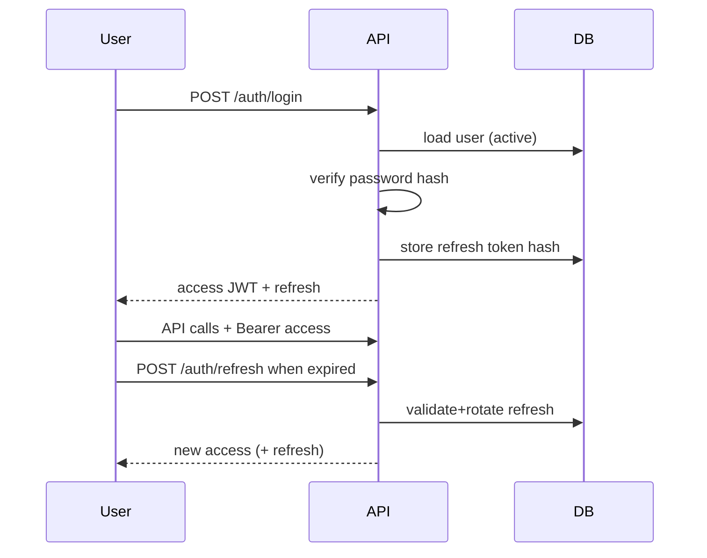

# Auth & RBAC — CDT

## Purpose

Define authentication, session/token handling, and role-based access control for CDT MVP.

## Audience

Backend, frontend, security, QA.

## Scope

MVP local accounts with JWT access + refresh. SSO/OIDC and fine-grained ABAC are Future.

## Definitions

| Term | Definition |
|------|------------|
| AuthN | Prove identity |
| AuthZ | Permit action |
| RBAC | Role-based access control |
| Soft release | Not an auth concept — domain status; still requires AUTHZ to invoke |

Roles:

| Role | Intent |
|------|--------|
| `ADMIN` | Full control: users, lookups, audit, all domain |
| `DELIVERY_MANAGER` | Delivery ops: candidates, timesheets, delivery reviews, dashboard |
| `HR` | Approver: leave/timesheet create as needed + **approve/reject** leave and timesheets |
| `INTERNAL_MANAGER` | Oversight reads: dashboard, candidate/review visibility |

---

## 1. Authentication flow



### Tokens

| Token | Lifetime (suggested) | Storage |
|-------|----------------------|---------|
| Access JWT | 15m | SPA memory |
| Refresh | 7d | HttpOnly Secure SameSite cookie (preferred) |

JWT claims (minimal): `sub` (user id), `role`, `email`, `iat`, `exp`.

Password hashing: bcrypt or argon2id; cost tuned for server.

## 2. Authorization model

1. Authenticate via JWT guard  
2. Authorize via `@Roles` on route  
3. Apply domain rules in service (released candidate, status transitions)  
4. UI gates are non-authoritative  

```text
Request → JwtAuthGuard → RolesGuard → Controller → Service policy checks
```

## 3. Role summaries

| Capability area | ADMIN | DM | HR | IM |
|-----------------|-------|----|----|-----|
| Users / lookups / audit | Full | — | — | — |
| Clients mutate | Yes | Yes | — | — |
| Candidates mutate / release | Yes | Yes | Yes | — |
| Leave approve | Yes | Yes | — | — |
| Leave create/submit | Yes | Yes | Yes | — |
| Timesheet upsert | Yes | Yes | — | Read |
| Delivery review upsert | Yes | Yes | — | Read |
| Dashboard | Yes | Yes | Yes | Yes |

Full matrix: [PERMISSION_MATRIX.md](./PERMISSION_MATRIX.md).

## 4. Public routes

| Route | Reason |
|-------|--------|
| `POST /auth/login` | Obtain session |
| `POST /auth/refresh` | Rotate session |
| `GET /health`, `/ready` | Probes |
| `/metrics` | Lock down in non-dev |

## 5. Account lifecycle

| Action | Rules |
|--------|-------|
| Create user | ADMIN; unique email; initial password |
| Disable | `isActive=false` → login denied; tokens revoked on next refresh |
| Reset password | ADMIN; force logout refreshes |
| Soft delete | Optional; treat like disable |

## 6. Threat-oriented controls (auth)

| Threat | Control |
|--------|---------|
| Credential stuffing | Rate-limit login; lockout Future |
| XSS token theft | Prefer memory access + httpOnly refresh |
| Stolen refresh | Hash at rest; rotate; revoke on logout |
| Privilege escalation | Server role from DB at login; don’t trust client role field on writes |
| CSRF on cookie refresh | SameSite + CORS allowlist |

## MVP vs Future

| Topic | MVP | Future |
|-------|-----|--------|
| Local passwords | Yes | SSO/OIDC |
| Role-only RBAC | Yes | Resource attributes / client-scoped DM |
| MFA | No | For ADMIN |

## Trade-offs

| Decision | Why |
|----------|-----|
| Four coarse roles | Matches org personas; simpler Guards |
| Refresh in DB | Revocation without short access-only model pain |
| No BFF | Shared types; careful cookie CORS setup required |

## Recommendations

- Re-load `isActive` and `role` on refresh (not only at login) to apply disables quickly.
- Never put secrets in JWT claims beyond role/identity.
- Align FE nav with matrix but test 403 paths.

## References

- [PERMISSION_MATRIX.md](./PERMISSION_MATRIX.md)
- [OWASP_AND_SECRETS.md](./OWASP_AND_SECRETS.md)
- [../10-api/API_CATALOG.md](../10-api/API_CATALOG.md)
- [../06-system-design/SEQUENCE_DIAGRAMS.md](../06-system-design/SEQUENCE_DIAGRAMS.md)
