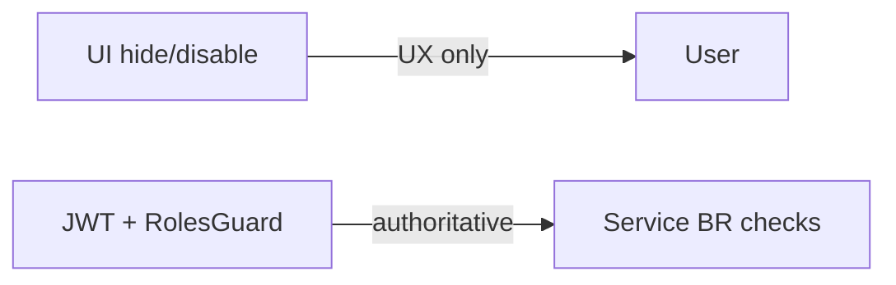

# Permission Matrix — CDT MVP

## Purpose

Map roles to operations for Nest Guards, service checks, and UI gates.

## Audience

Backend, frontend, security, QA.

## Scope

MVP roles: `ADMIN`, `DELIVERY_MANAGER`, `ACCOUNT_MANAGER`.

## Definitions

| Code | Meaning |
|------|---------|
| C | Create |
| R | Read |
| U | Update |
| D | Soft-delete / cancel / disable / release |
| A | Approve / reject (workflow) |
| — | Denied |

Abbreviations: **ADM**, **DM**, **AM**.

---

## Matrix (API)

| Resource / Action | ADM | DM | AM |
|-------------------|-----|----|----|
| Auth me / logout / refresh | R | R | R |
| Users manage (CRUD, reset password) | CRUD | — | — |
| Lookups read | R | R | R |
| Lookups mutate | CRUD | — | — |
| Clients create/update | CU | CU | — |
| Clients read | R | R | R |
| Clients soft-delete | D | — | — |
| Candidates create/update | CU | CU | — |
| Candidates read | R | R | R |
| Candidates soft release | D | D | — |
| Leave create / submit / cancel | CU | CU | — |
| Leave read | R | R | R |
| Leave approve / reject | A | — | A |
| Timesheets read | R | R | R |
| Timesheets upsert / recalculate | CU | CU | — |
| Timesheets approve / reject | A | — | A |
| Delivery reviews read | R | R | R |
| Delivery reviews upsert | CU | CU | — |
| Invoices generate | C | C | C |
| Invoices read | R | R | R |
| Invoices approve / reject | A | — | A |
| Dashboard read | R | R | R |
| Audit logs read | R | — | — |
| Import | C | — | — |

**Source alignment:** Account Manager owns leave/timesheet approval and invoice review. Delivery Manager owns candidates, timesheet entry, delivery reviews, and can generate invoices from approved timesheets.

### Clarified leave actions

| Action | ADM | DM | AM |
|--------|-----|----|----|
| Create / patch Pending | Y | Y | — |
| Approve | Y | — | Y |
| Reject | Y | — | Y |

### Clarified timesheet actions

| Action | ADM | DM | AM |
|--------|-----|----|----|
| Create / update Pending | Y | Y | — |
| Approve | Y | — | Y |
| Reject | Y | — | Y |

### Invoice actions

| Action | ADM | DM | AM |
|--------|-----|----|----|
| Generate (from approved TS) | Y | Y | Y |
| Approve / reject | Y | — | Y |

---

## UI navigation gates

| Nav / Screen | ADM | DM | AM |
|--------------|-----|----|----|
| Dashboard | Y | Y | Y |
| Candidates | Y | Y | Y |
| Leave | Y | Y | Y |
| Timesheets | Y | Y | Y |
| Delivery Reviews | Y | Y | Y (read) |
| Approvals | Y | — | Y |
| Invoices | Y | — | Y |
| Clients | Y | Y | Y |
| Admin Users | Y | — | — |
| Admin Lookups | Y | — | — |
| Audit | Y | — | — |
| Import | Y | — | — |

---

## Row / domain rules (beyond role)

| Rule | Enforcement |
|------|-------------|
| Released candidate | Block new leave/timesheet/review creates |
| Leave status machine | Invalid transitions → 400 |
| One TS / one DR / one Invoice per candidate+month (invoice per TS) | Unique + 409 |
| Escalation notes | Required when health=ESCALATED |
| Approved leave only | Timesheet calc filter |
| Invoice generation | Requires approved timesheet + candidate hourly rate |
| Budget formula | `hourlyRate × hoursPerDay × daysWorked` |

---

## Enforcement

BR-SEC: UI never sole control.

## References

- [AUTH_RBAC.md](./AUTH_RBAC.md)
- [../10-api/API_CATALOG.md](../10-api/API_CATALOG.md)
- [../09-frontend/AUTH_AND_ROUTING.md](../09-frontend/AUTH_AND_ROUTING.md)
