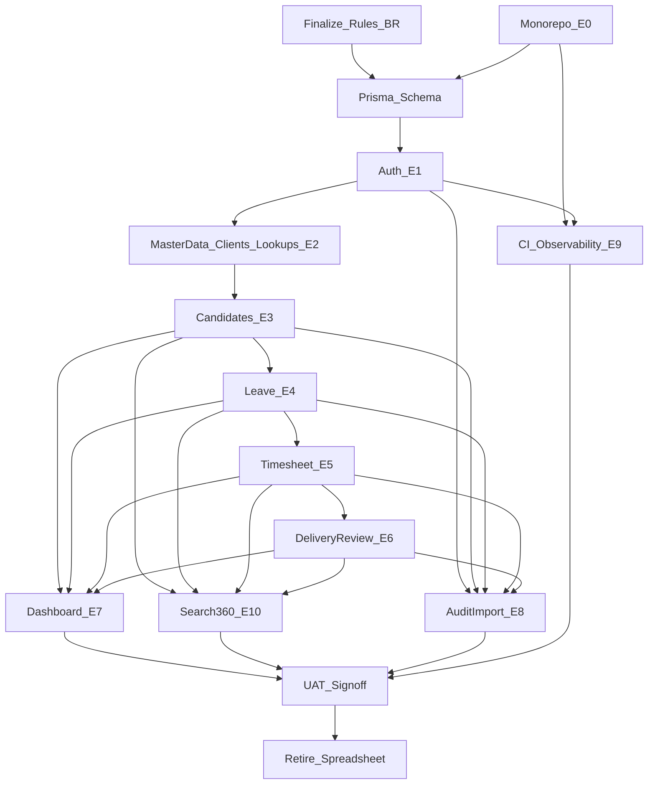

# Dependency Graph — CDT Delivery

## Purpose

Make build order explicit so teams do not start Leave, Timesheet, or Delivery Review before Candidate Master and shared rules are ready.

## Audience

Developers, leads, QA.

## Scope

MVP technical and story dependencies. Future modules (notifications, SST sync, billing) are soft/out-of-band.

## Definitions

| Term | Definition |
|------|------------|
| Hard dependency | Cannot start B until A is done |
| Soft dependency | B can stub until A is ready |

---

## Graph



---

## Hard dependencies (do not violate)

| Upstream | Downstream | Why |
|----------|------------|-----|
| Rules / ADR (BR-01..12) | Schema + services | Prevents rework on leave calc and uniqueness |
| Auth | All mutating APIs | RBAC required |
| Clients + lookups | Candidates | FK + dropdowns |
| Active Candidate | Leave / Timesheet / DR | BR-01 |
| Leave approve API | Timesheet Leave Days | BR-04 / BR-05 |
| Timesheet month data | Delivery Review utilization | BR-07 / BR-08 |
| Entity aggregates | Dashboard KPIs | Read models |
| UAT pass | Spreadsheet retirement | SoR cutover |

---

## Soft dependencies

- UI shell and design tokens can start after auth skeleton.
- Dashboard stub endpoints may return zeros before all entities exist.
- Audit can log auth/master mutations before delivery entities land.
- Import after Candidates + Leave + Timesheet + DR schemas stable.
- Notifications (**Future**) must not block approve/reject flows.

---

## Parallelization

| Track A (API) | Track B (Web) | Track C (Platform) |
|---------------|---------------|--------------------|
| Masters + Candidates | Auth shell + layout + routing | Monorepo, Docker, seed |
| Leave + Timesheet | Candidate + Leave forms | CI workflow draft |
| Delivery Review | Timesheet + DR forms | Observability compose |
| Dashboard aggregates | Dashboard charts/filters | Import tooling |
| Search/360 APIs | Candidate 360 UI | UAT automation hooks |

---

## Critical calculation chain

```text
Approved Leave (overlap) → Timesheet.LeaveDays → Attendance%
Timesheet (Candidate + calendar month) → DeliveryReview.Utilization%
```

Any change to date overlap, attendance formula, or month matching requires coordinated update of:

- Domain rules / RTM  
- API services  
- UAT catalog cases (Leave, Timesheet, DR, Dashboard)  
- Seed fixtures for July example (23 WD / 21 worked → 91.3%)

---

## References

- [SPRINT_AND_MILESTONES.md](./SPRINT_AND_MILESTONES.md)
- [TEAM_SPRINT_PLAN.md](./TEAM_SPRINT_PLAN.md)
- [EPICS_AND_STORIES.md](./EPICS_AND_STORIES.md)
- [../14-standards/adr/0001-mvp-delivery-control-first.md](../14-standards/adr/0001-mvp-delivery-control-first.md)
