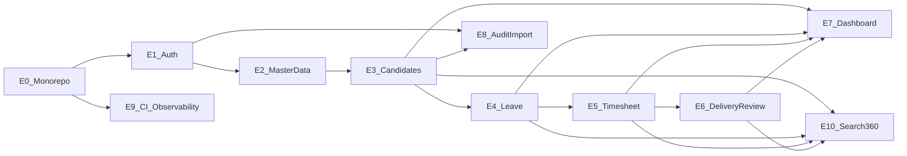

# Epics & User Stories — CDT MVP

## Purpose

Provide an implementable backlog for building **Client Delivery & Resource Tracker (CDT)** from scratch, aligned to the Excel SoR and the agreed build sequence.

## Audience

Engineering manager, developers, QA, product partners.

## Scope

MVP epics only. Notifications, live SST sync, billing companion, half-days/holidays, multi-engagement, and SSO are **Future** placeholders (F-*).

## Definitions

| Term | Definition |
|------|------------|
| Epic | Large delivery theme |
| Story | Independently testable slice |
| Candidate | Deployed person at a client (post-Joined from SST) |
| Public ID | Human-readable ID (`CD-00001`, `LV-00001`, `TSH-00001`, `DEL-00001`) |

---

## Epic map

---

## Build sequence (source-aligned)

| Step | Theme | Epic(s) |
|------|-------|---------|
| 1 | Finalize rules | Docs / ADR / RTM (pre-code) |
| 2 | Master entities Client, Candidate, User/Role, lookups | E1, E2 |
| 3 | Candidate Master + lifecycle | E3 |
| 4 | Leave + approval | E4 |
| 5 | Timesheet + leave calc | E5 |
| 6 | Delivery Reviews + utilization | E6 |
| 7 | Dashboard KPIs | E7 |
| 8 | Reporting / search / 360 | E10 |
| 9 | Audit / overdue; notifications **Future** | E8 (+ F-NOTIFY) |
| 10 | Excel migration | E8 import |
| 11 | UAT | Catalog in `15-testing` |
| 12 | Retire spreadsheet | Ops checklist |

---

## E0 — Monorepo foundation

| ID | Story | Acceptance |
|----|-------|------------|
| E0-S1 | As a dev, I can bootstrap Turborepo + pnpm workspaces | `pnpm install` works |
| E0-S2 | As a dev, I can run `@cdt/api` and `@cdt/web` via Turbo | scripts documented |
| E0-S3 | As a dev, I have shared eslint / typescript-config packages | lint / typecheck run |
| E0-S4 | As a dev, I can build `@cdt/shared-types` and `@cdt/shared-utils` before apps | dependents resolve `dist/` |

## E1 — Auth & users

| ID | Story | FR |
|----|-------|-----|
| E1-S1 | Login with email/password returns access + refresh tokens | FR-AUTH-01/02 |
| E1-S2 | Refresh and logout invalidate/rotate refresh | FR-AUTH-03 |
| E1-S3 | Admin creates/updates users with roles ADMIN, DELIVERY_MANAGER, HR, INTERNAL_MANAGER | FR-AUTH-04 |
| E1-S4 | Protected routes redirect unauthenticated users | — |
| E1-S5 | RBAC guards enforce permission matrix on mutating APIs | FR-AUTH-05 |

## E2 — Master data

| ID | Story | FR |
|----|-------|-----|
| E2-S1 | Seed Setup Lists (leave types, employment status, work location, feedback, health, approval statuses) | FR-MD-01..07 |
| E2-S2 | Admin CRUD Clients; duplicate client names prevented (normalized) | FR-MD-08, BR-11 |
| E2-S3 | Forms consume lookup APIs for dropdowns | FR-MD-12 |
| E2-S4 | Soft-deactivate lookup values without breaking historical rows | FR-MD-13 |

## E3 — Candidate Master + lifecycle

| ID | Story | FR |
|----|-------|-----|
| E3-S1 | Create Active candidate with client, project/account, role, managers, start date, work location | FR-CAN-01 |
| E3-S2 | System assigns non-editable public ID `CD-#####` | FR-CAN-02, BR-02 |
| E3-S3 | List / filter / search candidates | FR-CAN-03 |
| E3-S4 | Update placement fields while Active | FR-CAN-04 |
| E3-S5 | Release candidate: status Released + Contract End Date; history retained; excluded from Active headcount | FR-CAN-05, BR-03 |
| E3-S6 | Active candidates are selectable for Leave / Timesheet / Delivery Review | BR-01 |
| E3-S7 | Candidate 360 detail shows placement + related leave / TS / DR | FR-CAN-06 |

## E4 — Leave + approval

| ID | Story | FR |
|----|-------|-----|
| E4-S1 | Create leave for existing candidate; name/client derived | FR-LV-01 |
| E4-S2 | Number of Days = inclusive calendar days (To − From + 1) | FR-LV-02 |
| E4-S3 | Leave starts Pending; approve / reject with approver + remarks | FR-LV-03 |
| E4-S4 | Only Approved leave affects Timesheet Leave Days; Pending/Rejected excluded | BR-04 |
| E4-S5 | Approval queue filtered by client / status | FR-LV-04 |
| E4-S6 | Public ID `LV-#####` assigned | FR-LV-05 |

## E5 — Timesheet + leave calc

| ID | Story | FR |
|----|-------|-----|
| E5-S1 | Create timesheet for candidate + period; Working Days and Days Worked entered | FR-TS-01 |
| E5-S2 | Leave Days = sum of Approved leave overlapping the period | BR-05 |
| E5-S3 | Attendance % = Days Worked / Working Days (e.g. 21/23 → 91.3%) | BR-06 |
| E5-S4 | Second timesheet for same candidate + calendar month blocked | FR-TS-02 |
| E5-S5 | Approve / reject timesheet | FR-TS-03 |
| E5-S6 | Public ID `TSH-#####` assigned | FR-TS-04 |

## E6 — Delivery Reviews + utilization

| ID | Story | FR |
|----|-------|-----|
| E6-S1 | Create monthly delivery review; name/client/role derived | FR-DR-01 |
| E6-S2 | Utilization % pulled from matching Candidate + calendar month timesheet; blank if missing | BR-07, BR-08 |
| E6-S3 | Record Client Feedback (Good / Average / Poor) and Engagement Health | FR-DR-02 |
| E6-S4 | At Risk or Escalated requires Escalation Notes; Poor + At Risk requires notes | BR-09 |
| E6-S5 | Second review for same candidate + calendar month blocked | FR-DR-03 |
| E6-S6 | Public ID `DEL-#####` assigned | FR-DR-04 |

## E7 — Dashboard KPIs

| ID | Story | FR |
|----|-------|-----|
| E7-S1 | KPI cards: Active Candidates, Pending Leave, Pending Timesheet, Avg Utilization, Health breakdown, Good feedback, Released (month) | FR-DASH-01 |
| E7-S2 | Filters: Client, Engagement Health, Month | FR-DASH-02 |
| E7-S3 | On Leave Today ignores month filter; uses current date | BR-10 |
| E7-S4 | Health chart and top-client chart respect Client + Month | FR-DASH-03 |
| E7-S5 | Release decreases Active headcount; historical records remain queryable | FR-DASH-04 |

## E8 — Audit & Excel import

| ID | Story | FR |
|----|-------|-----|
| E8-S1 | Mutations write audit logs (who/what/when/before/after) | FR-AUD-01 |
| E8-S2 | Admin query audits by entity / actor / date | FR-AUD-02 |
| E8-S3 | Validate + commit Excel/CSV import for Clients, Candidates, Leave, Timesheets, Reviews | FR-IMP-01 |
| E8-S4 | Import dry-run reports row errors without partial commit (unless configured) | FR-IMP-02 |
| E8-S5 | Overdue monthly review listing (no push notifications in MVP) | FR-AUD-03 |

## E9 — CI & observability

| ID | Story | NFR |
|----|-------|-----|
| E9-S1 | GitHub Actions lint / typecheck / test / build | NFR-MAIN |
| E9-S2 | Health + `/metrics` endpoints | NFR-OBS |
| E9-S3 | Compose monitoring stack (Prometheus / Grafana / Loki) documented | — |

## E10 — Reporting / search / 360

| ID | Story | FR |
|----|-------|-----|
| E10-S1 | Global search by public ID / candidate name / client | FR-RPT-01 |
| E10-S2 | Candidate 360 timeline of leave / TS / DR | FR-RPT-02 |
| E10-S3 | Export filtered lists (CSV) for operational reporting | FR-RPT-03 |

## Future placeholders

| ID | Epic |
|----|------|
| F-NOTIFY | In-app / email notifications for pending approvals and overdue reviews |
| F-SST | Live SST Joined → Candidate sync |
| F-BILL | Timesheet & Billing Tracker integration |
| F-HALF | Half-days, holidays, working-day leave calc |
| F-MULTI | Multi-engagement concurrent placements |
| F-SSO | SSO / identity federation |

## References

- [SPRINT_AND_MILESTONES.md](./SPRINT_AND_MILESTONES.md)
- [TEAM_SPRINT_PLAN.md](./TEAM_SPRINT_PLAN.md)
- [DEPENDENCY_GRAPH.md](./DEPENDENCY_GRAPH.md)
- [../03-prd/PRD.md](../03-prd/PRD.md)
- [../01-business-analysis/RTM.md](../01-business-analysis/RTM.md)
