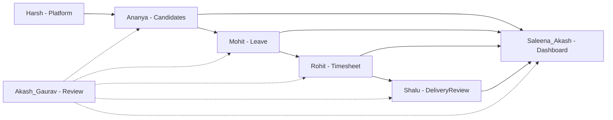

# Team Sprint Plan — CDT MVP

## Purpose

Assign module ownership, break each module into demoable steps, and sequence sprints so the team can develop and showcase progress to management.

## Audience

Engineering manager, module owners, QA/review, developers.

## Scope

MVP delivery control only: Auth / Masters → Candidates → Leave → Timesheet → Delivery Review → Dashboard → Audit / Import / Search. Aligns with [EPICS_AND_STORIES.md](./EPICS_AND_STORIES.md) and [SPRINT_AND_MILESTONES.md](./SPRINT_AND_MILESTONES.md).

Notifications remain **Future** and must not block MVP demos.

## Definitions

| Term | Definition |
|------|------------|
| Step ID | Short id for a demoable slice (e.g. `C-2`, `L-M3`) |
| Handoff contract | Done criteria before the next module owner can start |
| Review | Cross-cutting acceptance and demo prep (not a product module) |

---

## 1. Module ownership

| Module | Member(s) | Primary epics | Demo focus |
|--------|-----------|---------------|------------|
| Platform / Admin | Harsh | E0, E1, E2, E8, E9 | Monorepo, users, clients, lookups, audit, import, CI |
| Candidate Master | Ananya | E3 | Create Active → edit → release; available in Leave/TS/DR |
| Leave | Mohit | E4 | Create → approve/reject; Pending excluded from Leave Days |
| Timesheet | Rohit | E5 | Period entry; leave overlap calc; attendance %; unique month |
| Delivery Review | Shalu | E6 | Utilization pull; feedback/health; escalation notes |
| Dashboard / 360 | Saleena & Akash | E7, E10 | KPIs, filters, On Leave Today, search/360 |
| Review (QA) | Akash & Gaurav | Cross-cutting | UAT catalog, demo checklist, defects |

### Role mapping to product personas

| Product role | Typical module touch |
|--------------|----------------------|
| ADMIN | Platform, masters, audit, import, user admin |
| DELIVERY_MANAGER | Candidates, Delivery Reviews, Dashboard |
| HR | Leave / Timesheet approvals |
| INTERNAL_MANAGER | Candidate visibility, escalation context, read dashboards |

### Dependency rule

Platform → Candidates → Leave → Timesheet → Delivery Review → Dashboard enrichment. Search/360 after entities exist. Review runs every sprint.

---

## 2. Handoff contracts

| From → To | Contract |
|-----------|----------|
| Platform → Candidates | Auth works; Client CRUD; lookups seeded; RBAC stubs |
| Candidates → Leave | Active candidate with public ID; FK-safe create |
| Leave → Timesheet | Approved leave API; overlap query service |
| Timesheet → Delivery Review | Attendance % stored; month match query |
| All → Dashboard | Aggregates endpoint contract frozen |
| All → Review | Seed personas + UAT data pack available |

---

## 3. Step backlog by module

### Platform / Admin

| Step | Description | Sprint |
|------|-------------|--------|
| P-1 | Turbo + pnpm + `@cdt/*` packages | S0 |
| P-2 | Prisma schema skeleton + migrate/seed | S0–S1 |
| P-3 | JWT login / refresh / logout | S1 |
| P-4 | User CRUD + 4 roles | S1 |
| P-5 | Clients + unique normalized name | S2 |
| P-6 | Lookups seed + admin UI | S2 |
| P-7 | Audit middleware on mutations | S7 |
| P-8 | Excel import dry-run + commit | S7 |
| P-9 | GH Actions + health/metrics | S8 |

### Candidates

| Step | Description | Sprint |
|------|-------------|--------|
| C-1 | Create Active candidate | S2 |
| C-2 | List/filter/search | S2 |
| C-3 | Update placement fields | S2 |
| C-4 | Release + end date; history retained | S2 |
| C-5 | Detail shell for 360 links | S2 / S8 |

### Leave

| Step | Description | Sprint |
|------|-------------|--------|
| L-1 | Create Pending leave + day calc | S3 |
| L-2 | Approve / reject | S3 |
| L-3 | Approval queue filters | S3 |
| L-4 | Prove Pending/Rejected excluded from Leave Days (with TS) | S4 |

### Timesheet

| Step | Description | Sprint |
|------|-------------|--------|
| T-1 | Create period entry | S4 |
| T-2 | Leave Days overlap sum | S4 |
| T-3 | Attendance % (21/23 → 91.3%) | S4 |
| T-4 | Block second TS same month | S4 |
| T-5 | Approve / reject | S4 |

### Delivery Review

| Step | Description | Sprint |
|------|-------------|--------|
| D-1 | Create review + derived fields | S5 |
| D-2 | Utilization from matching TS month | S5 |
| D-3 | Escalation notes required for At Risk / Escalated | S5 |
| D-4 | Block second DR same month | S5 |

### Dashboard / 360

| Step | Description | Sprint |
|------|-------------|--------|
| H-1 | KPI cards | S6 |
| H-2 | Client + health + month filters | S6 |
| H-3 | On Leave Today ignores month | S6 |
| H-4 | Charts (health + top clients) | S6 |
| H-5 | Global search + candidate 360 | S8 |

### Review (QA)

| Step | Description | Sprint |
|------|-------------|--------|
| R-1 | Seed test users + July fixture pack | S2+ |
| R-2 | Execute smoke + authz each sprint | Continuous |
| R-3 | Full UAT catalog before sign-off | S8 |
| R-4 | Spreadsheet retirement checklist | S8 |

---

## 4. Sprint-by-sprint board

| Sprint | Must demo | Owners | UAT cases touched |
|--------|-----------|--------|-------------------|
| S0 | Repo boots | Platform | — |
| S1 | Login + users | Platform | TC-AUTH-* |
| S2 | Active candidate + unique clients | Platform, Candidates | TC-MD-*, TC-CAN-001 |
| S3 | Leave approve/reject | Leave | TC-LV-* pending/approved/rejected |
| S4 | July TS 91.3%; uniqueness | Timesheet | TC-TS-* |
| S5 | July DR utilization + notes | Delivery Review | TC-DR-* |
| S6 | Dashboard filters + On Leave Today | Dashboard | TC-DASH-* |
| S7 | Audit + import | Platform | TC-AUD-*, TC-IMP-* |
| S8 | 360 + CI + sign-off | All + Review | TC-SIGNOFF, TC-UI-* |

---

## 5. Manager demo checklist (recurring)

1. Login as each of the four roles (happy path).
2. Show Active candidate available in Leave / Timesheet / DR dropdowns.
3. Show Pending leave does **not** change Leave Days; Approved overlapping leave does.
4. Show July timesheet 23 / 21 → **91.3%**.
5. Show July delivery review utilization pull; Poor + At Risk blocked without notes.
6. Show dashboard Client + Month filters; On Leave Today unchanged when month changes.
7. Release a candidate → Active headcount drops; history still visible.
8. Attempt duplicate client name and second TS/DR same month → blocked.

## References

- [EPICS_AND_STORIES.md](./EPICS_AND_STORIES.md)
- [SPRINT_AND_MILESTONES.md](./SPRINT_AND_MILESTONES.md)
- [DEPENDENCY_GRAPH.md](./DEPENDENCY_GRAPH.md)
- [../15-testing/v1-catalog/README.md](../15-testing/v1-catalog/README.md)
