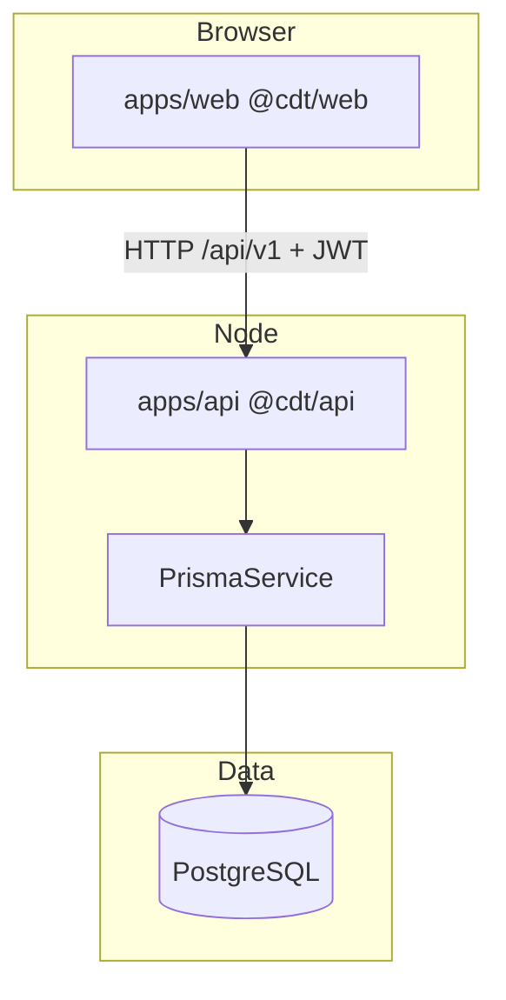

# CDT NestJS + Full-Stack Developer Handbook

## Purpose

One-stop beginner-friendly handbook for building **Client Delivery & Resource Tracker (CDT)** with NestJS, Prisma, and the React SPA — even if you are new to Node/Nest.

This document is **docs-first**: it describes the **intended** repository structure. When `apps/` is scaffolded, keep this handbook in sync.

## Scope

- Backend: NestJS + Prisma + PostgreSQL (`apps/api`, package `@cdt/api`)
- Frontend: Vite React SPA (`apps/web`, package `@cdt/web`)
- Shared: `@cdt/shared-types`, `@cdt/shared-utils`
- Domain: Candidate → Leave → Timesheet → Delivery Review → Dashboard

Out of scope: cloud multi-region, notifications product feature, live SST sync.

## Quick links

- Local setup: `docs/17-local-deployment/LOCAL_SETUP.md`
- Sprint plan: `docs/12-planning/TEAM_SPRINT_PLAN.md`
- Flow walkthrough: `docs/FLOW.md`
- Permissions: `docs/11-security/PERMISSION_MATRIX.md`

---

## Table of contents

1. Orientation: Node / TS / Nest / Prisma  
2. Run CDT locally (target)  
3. Repository map  
4. NestJS fundamentals as used in CDT  
5. Database + Prisma  
6. Walkthrough: Timesheet leave calculation  
7. Auth, JWT, RBAC  
8. End-to-end workflows  
9. Implement a new feature checklist  
10. Frontend integration  
11. Appendices  

---

## 1) Orientation

### 1.1 Node.js

Runtime for the API (`@cdt/api`).

### 1.2 TypeScript

Used in API and Web. Shared DTOs live in `@cdt/shared-types`.

### 1.3 NestJS

Modules + Controllers + Services + DI. CDT uses **one module per domain**.

### 1.4 Prisma

`schema.prisma` → migrate → `PrismaClient` in services.

### 1.5 Mental model



---

## 2) Run locally (target)

Follow `LOCAL_SETUP.md`. Conceptually:

```bash
cp .env.example .env
docker compose -f docker/docker-compose.yml up -d postgres
pnpm install
pnpm --filter @cdt/shared-types build
pnpm --filter @cdt/shared-utils build
pnpm --filter @cdt/api prisma:generate
pnpm --filter @cdt/api exec prisma migrate dev
pnpm --filter @cdt/api prisma:seed
pnpm dev
```

| URL | Purpose |
|-----|---------|
| http://localhost:5173 | Web |
| http://localhost:3000 | API |
| http://localhost:3000/api/docs | Swagger |

---

## 3) Repository map

```text
CDT_v1_monorepo/
  apps/api/                 @cdt/api
  apps/web/                 @cdt/web
  packages/shared-types/    @cdt/shared-types
  packages/shared-utils/    @cdt/shared-utils
  packages/eslint-config/
  packages/typescript-config/
  docker/
  docs/
```

### Planned API modules

`auth`, `users`, `master-data`, `candidates`, `leave`, `timesheets`, `delivery-reviews`, `dashboard`, `audit`, `import`, `health`.

---

## 4) NestJS fundamentals (CDT style)

### Module

```typescript
@Module({
  imports: [PrismaModule, LeaveModule],
  controllers: [TimesheetsController],
  providers: [TimesheetsService],
  exports: [TimesheetsService],
})
export class TimesheetsModule {}
```

### Controller

- Routes under `/api/v1/timesheets`
- Guards: `JwtAuthGuard`, `RolesGuard`
- DTO validation pipe

### Service

- Owns BR enforcement
- Calls `@cdt/shared-utils` for math
- Writes audit via `AuditService`

### Cross-module rule

Timesheets may **call** `LeaveService.findApprovedOverlapping(...)` — they should not scrape leave tables ad hoc from every feature.

---

## 5) Database + Prisma

### Identity

| Concept | Storage |
|---------|---------|
| Primary key | UUID |
| Public ID | `CD-00001`, `LV-00001`, `TSH-00001`, `DEL-00001` |

### Critical unique constraints

- Client normalized name  
- Timesheet `(candidateId, yearMonth)`  
- DeliveryReview `(candidateId, yearMonth)`  

### Employment status

`ACTIVE` → `RELEASED` (retain row). Other setup values exist; transitions beyond Active/Released confirm with product.

---

## 6) Walkthrough: Timesheet Leave Days + Attendance

### Business rules

- BR-04: only Approved leave  
- BR-05: overlap with period  
- BR-06: Attendance % = Days Worked / Working Days  

### Shared util (source of truth)

```typescript
// packages/shared-utils (conceptual)
attendancePct(21, 23); // 0.913... → display 91.3%
sumApprovedLeaveDays(leaves, periodStart, periodEnd);
```

### Service sketch

```typescript
async create(dto, actor) {
  await this.candidates.assertActiveExists(dto.candidateId);
  await this.assertNoTimesheetForMonth(dto.candidateId, dto.periodStart);
  const leaveDays = await this.leave.sumApprovedOverlap(...);
  const attendance = attendancePct(dto.daysWorked, dto.workingDays);
  return this.prisma.timesheet.create({ data: { ...dto, leaveDays, attendance } });
}
```

### Tests you must add

Unit: overlap + 21/23 → 91.3 display helper.  
API: Pending leave excluded; second July blocked.

---

## 7) Auth, JWT, RBAC

### Roles

`ADMIN` | `DELIVERY_MANAGER` | `HR` | `INTERNAL_MANAGER`

### Flow

1. `POST /auth/login` → access + refresh  
2. Bearer access on API  
3. Refresh rotates  
4. Logout revokes refresh  

### Frontend

Axios interceptor attaches token; 401 → refresh → retry; failure → `/login`.

Never trust UI hiding alone — enforce roles on every mutate.

---

## 8) End-to-end workflows

```text
Candidate (Active)
   → Leave (Pending → Approved|Rejected)
   → Timesheet (Leave Days + Attendance %)
   → Delivery Review (Utilization from TS month)
   → Dashboard KPIs
```

Release candidate → Active headcount−−; history remains.

---

## 9) New feature checklist

1. Confirm FR/BR + ADR if scope changes  
2. Zod/DTO in `@cdt/shared-types`  
3. Pure calc in `@cdt/shared-utils` if math  
4. Prisma model + migration  
5. Nest module service + controller + guards  
6. Audit on mutations  
7. Web feature page + React Query hooks  
8. Catalog cases + TRACEABILITY  
9. Demo per TEAM_SPRINT_PLAN  

---

## 10) Frontend integration

| Concern | Approach |
|---------|----------|
| Routing | React Router; role-gated nav |
| Server state | TanStack Query |
| Forms | RHF + Zod |
| UI | Tailwind + ShadCN |
| API | Axios instance → `/api/v1` |

Feature folders: `features/candidates`, `leave`, `timesheets`, `delivery-reviews`, `dashboard`, `admin`.

---

## 11) Appendices

### A. Endpoint map (illustrative)

| Area | Examples |
|------|----------|
| Auth | `POST /auth/login`, `/refresh`, `/logout` |
| Candidates | `CRUD /candidates`, `POST /candidates/:id/release` |
| Leave | `CRUD /leave`, `POST /leave/:id/approve` |
| Timesheets | `CRUD /timesheets`, approve |
| Delivery reviews | `CRUD /delivery-reviews` |
| Dashboard | `GET /dashboard/summary` |
| Master | `/clients`, `/lookups` |
| Audit/Import | `/audits`, `/import` |

### B. Env vars

See `docs/13-monorepo/ENV_AND_VERSIONING.md`.

### C. Glossary

| Term | Meaning |
|------|---------|
| CDT | Client Delivery & Resource Tracker |
| RAG (health) | Visual for engagement health — not SST hiring SLA RAG |
| Public ID | Human display id |

### D. Known MVP gaps

- Notifications Future  
- Live SST sync Future  
- Half-days/holidays Future  

---

## References

- [../FLOW.md](../FLOW.md)
- [../DEVELOPER_GUIDE.md](../DEVELOPER_GUIDE.md)
- [../14-standards/CODING_STANDARDS.md](../14-standards/CODING_STANDARDS.md)
- [../08-backend/NESTJS_ARCHITECTURE.md](../08-backend/NESTJS_ARCHITECTURE.md)
